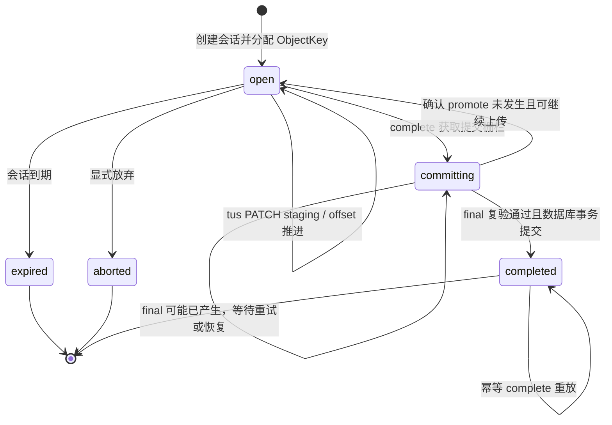
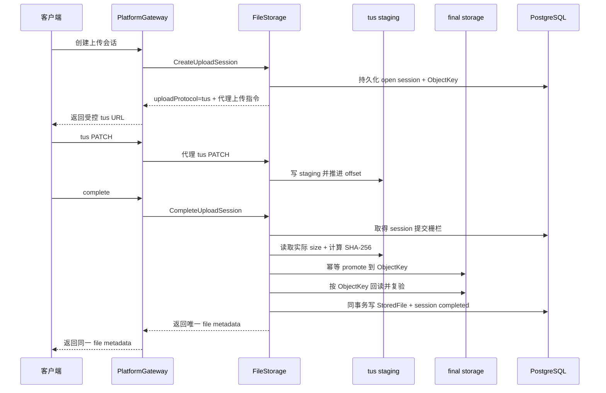

# ADR 0023：FileStorage tus 代理上传、staging/final 落盘与 complete 不变量

- 状态：已接受
- 日期：2026-08-17
- 关联：[Issue #992](https://github.com/Mang-X/Nerv-IIP/issues/992)、[Issue #1617](https://github.com/Mang-X/Nerv-IIP/issues/1617)

## 背景

通用 FileStorage 已拥有上传会话、受 PlatformGateway 保护的 Console 上传入口、PostgreSQL metadata、下载授权和一条可显式启用的本地 tus 字节链路，但传输分类、代理入口与 storage provider 的概念仍然混在一起。默认 `server-proxy` 只生成上传指令，仓库中没有对应的字节 PUT endpoint；当前自研 tus endpoint 也不是目标的 `tusdotnet` 实现。

现有字节在 complete 前后都由 `uploadSessionId` 派生的 `SHA256(uploadSessionId).bin` 原地承载。虽然 PostgreSQL upload session 和 `StoredFile` 已保存 `ObjectKey`，它尚未参与实际读、写、下载或删除，不是当前物理定位符。当前 complete 只对 provider 字符串等于 `tus` 的会话执行部分大小和可选 checksum 校验，其他 provider 可以跳过字节证明；系统也没有 staging 到 final 的 promote、final 回读复验或持久化的 canonical checksum。这些是当前实现事实，不是本 ADR 接受的目标状态。

本 ADR 只在“通用文件上传传输分类”上取代 [ADR 0003](0003-data-and-messaging-baseline.md) 与现有 FileStorage 基线中将 `tus`、`server-proxy`、`S3 multipart` 并列为 Upload Provider 的叙述。FileStorage 的事实所有权、`ObjectKey` 不公开、业务服务只保存 `fileId`/`FileReference` 等边界继续有效。

## 范围与非范围

本 ADR 只决定三件事：通用文件上传的协议与入口拓扑；staging/final 生命周期和 `ObjectKey` 的目标语义；所有 storage provider 共同遵守的 complete 提交不变量。

以下内容不在本 ADR 范围内：

- 不设计或实现 `IStorageProvider`、Local/S3-compatible 适配及其选择、注册或能力矩阵；
- 不定义 Local 的持久 root、路径 canonicalization、防 symlink/reparse、fsync、atomic rename、容量或 mount identity 检查；
- 不编写离线迁移步骤、复制/切换/回滚命令或 runbook，也不裁决存量数据是否需要数据库 migration；
- 不同步 FileStorage 基线、schema catalog、deployment baseline、implementation readiness、公开契约、OpenAPI、generated client 或业务代码；
- 不扩展扫描、加密、多副本、保留、删除、备份恢复、legal hold、WORM 或 residency 语义；
- 不合并或修改独立 `VersionedArchive` 合规归档接口的 API、versioning、object lock 或 legal hold 语义。

## 当前实现事实

| 主题 | 当前事实 | 本 ADR 接受的目标 |
| --- | --- | --- |
| 上传传输 | 默认 `server-proxy` 只生成无对应 PUT endpoint 的 URL；显式配置可启用自研部分 tus `HEAD`/`PATCH` | 唯一公开上传协议为 tus，服务端采用 `tusdotnet` |
| 入口拓扑 | Console/浏览器经 PlatformGateway 鉴权并代理到 FileStorage 自研 tus endpoint | 保持受控 Gateway proxy，且与传输协议、storage provider 分轴描述 |
| 公开分类字段 | `CreateUploadSessionResponse.UploadMode` 与 `Provider` 是两个独立且可观察的 string 字段，当前生产实现恰好返回同值 | 收敛为单一传输分类，例如 `uploadProtocol: "tus"`；兼容和版本演进属于实现工作 |
| 字节定位 | 本地文件名由 `uploadSessionId` 的 SHA-256 派生；complete 前后原地不动 | tus 只写 staging，final 只由内部 `ObjectKey` 定位 |
| `ObjectKey` | 仅生成、持久化并从 session 复制到 `StoredFile`，没有参与字节读写 | provider 无关且不公开的 final 唯一物理定位符 |
| complete | 仅 `tus` 分支校验大小和可选 checksum；非 tus 可跳过；没有 promote 或 final 复验 | 所有 provider 统一证明存在性、size、canonical SHA-256、promote 和 final 回读复验 |
| 持久化 | PostgreSQL 可以原子保存 metadata，但不能覆盖尚不存在的字节提交动作 | final 字节事实先成立，随后同一数据库事务提交 session 与 `StoredFile` 可用事实 |

表中的目标均尚未实现。特别是，当前 `ObjectKey` 的字面格式只是元数据候选，不能据此推导 Local 路径安全、provider 适配已完成或迁移只需切换配置。

## 决策

### 1. 协议、代理拓扑和 storage provider 分轴

1. 通用文件上传的唯一目标协议是 tus，服务端目标实现采用 `tusdotnet`。现有 `ServerProxyUploadProvider` 脚手架和自研 tus endpoint 进入待退役范围，不再作为可扩展的目标架构。
2. tus 是传输协议，PlatformGateway proxy 是外部入口拓扑，storage provider 是字节后端。三个概念必须独立建模，不得继续把 `tus`、`server-proxy` 和 `S3 multipart` 当作同一类 provider 候选。
3. Console/浏览器只访问 PlatformGateway 暴露的受控 tus URL。Gateway 继续完成用户鉴权和代理，FileStorage 负责上传会话、权限、过期、complete 与文件事实；客户端不得取得内部 FileStorage URL、存储地址、`ObjectKey` 或长期存储凭据。
4. `tusdotnet` 只负责 tus 传输、offset 恢复及 staging 写入，不能自行生成 completed/available 文件事实。
5. `CreateUploadSessionResponse.UploadMode` 与 `Provider` 是当前公开兼容面。目标契约应收敛为一个传输分类字段，例如 `uploadProtocol: "tus"`，并通过传输指令返回 URL/headers；字段删除、版本策略及所有调用方同步是显式契约实现工作，不能按零兼容成本的内部清理处理。
6. 下载仍通过受控 download grant content 路径，但内容只能来自已提交的 final，不能读取 staging，也不能按 upload session 身份重新推导长期字节位置。

### 2. staging、final 与 `ObjectKey`

1. 每个 upload session 拥有独立的 staging 身份。tus 只能写 staging；staging 可续传、可过期、不可下载。
2. 创建 upload session 时为目标文件分配内部、provider 无关、相对且不公开的 `ObjectKey`。它只定位 final 字节，是 final 的唯一内部物理定位符；不得指向 tus staging，也不得由 `uploadSessionId` 在下载时重新推导。
3. final 与 staging 属于不同生命周期。final 不可被 tus PATCH 修改，只有 complete 提交成功后才可经已提交 metadata 和受控下载入口读取。
4. complete 通过幂等 promote 将已验证 staging 收敛到同一 `ObjectKey` 对应的 final：
   - final 不存在时，可以建立目标对象；
   - final 已存在且其实际 size 与 canonical checksum 均和本次提交一致时，视为同一次提交的可恢复收敛；
   - final 已存在但内容不一致时失败关闭，不覆盖、不截断未知对象。
5. `StoredFile` 和 completed metadata 只能引用已经按同一 `ObjectKey` 回读复验的 final。
6. staging 清理必须晚于 final 复验和数据库 completed/available 事实提交。失败处理不得删除恢复所需的唯一字节副本。

### 3. complete 通用不变量

以下规则适用于所有 storage provider，不允许按 transport 或 provider 跳过：

1. `ExpectedSizeBytes` 在创建 upload session 时冻结。complete 请求重复提交的 size、checksum、客户端回执或 HTTP 成功响应都不是物理字节证据。
2. complete 必须从实际物理字节证明对象存在，读取实际 size 并由服务端计算 SHA-256。零字节文件也必须有真实存在的对象，不能以不存在对象的默认长度零代替。
3. canonical checksum 格式固定为 `sha256:<64 位小写十六进制>`。服务端必须持久化该值；调用方提供 expected checksum 时，服务端计算值必须与之完全一致，调用方未提供时也仍须计算并持久化。
4. 成功顺序固定为：取得 upload session 的提交栅栏 → 验证 session/context/expiry 与 staging 存在性 → 验证实际 size 并计算 canonical SHA-256 → 幂等 promote 到 `ObjectKey` → 按同一 `ObjectKey` 回读 final 并再次验证存在性、size 和 checksum → 在同一数据库事务中提交 session completed 与唯一 `StoredFile` available 事实。
5. complete 与 tus PATCH 必须互斥。session 进入 `committing` 后不得接受新的 PATCH；校验后的 staging 不能再被修改。
6. 并发 complete 只能有一个提交者建立最终文件事实。其余调用必须读取同一最终结果或得到可明确重试的响应，不能创建第二个 `StoredFile` 或第二个 final。
7. promote 前失败不得产生 completed/available 事实。只有能够确定 final 尚未产生时，session 才能回到可继续上传的 `open`。
8. promote 已成功或可能成功、但数据库尚未提交时，必须保留可恢复的提交意图，session 保持 `committing`。同一 session/context/`ObjectKey`/size/checksum 的重试必须先复验已有 final，再继续提交数据库事实；不得重新开放 PATCH 或覆盖 final。
9. 数据库事务提交后响应丢失时，complete 重放必须返回同一 file metadata，不得重复建立文件、final 或新的业务身份。

## Upload session 状态机

- `open`：允许 tus 向 staging 写入；offset 是 tus store 事实，不新增 `uploading` 领域状态。
- `committing`：持有或等待提交栅栏，禁止 PATCH，只允许 complete 重试或恢复流程收敛。
- `completed`：final 已按 `ObjectKey` 复验，session 与 `StoredFile` 数据库事实已经原子提交，complete 重放返回同一结果。
- `expired` / `aborted`：不可 complete；staging 只能由受治理的清理流程处理。
- 一旦 promote 可能已经成功，状态不得回到 `open`，以免旧上传继续改写提交依据。

## Complete 提交时序

提交时序明确三个恢复边界：

1. promote 前失败：没有 completed/available 文件事实；确认 final 未产生后，允许继续上传或重试。
2. promote 后、数据库提交前失败：final 只能作为不可下载的可恢复提交对象；session 保持 `committing`，重试按同一 `ObjectKey`、size 和 checksum 复验并收敛。
3. 数据库提交后响应丢失：重放 complete 返回同一 file metadata，不重复创建任何文件事实或 final 对象。

## 失败矩阵

| 失败场景 | 必须结果 | 禁止结果 |
| --- | --- | --- |
| staging 不存在 | complete 失败，session 不得 completed | 根据请求体或长度默认值伪造 `StoredFile` |
| staging 小于冻结 size | complete 失败；确认未 promote 时可继续 tus 上传 | 将短文件标为 available |
| staging 大于冻结 size | 失败关闭 | 截断后静默接受 |
| 服务端 SHA-256 与 expected checksum 不匹配 | 失败关闭，保留诊断所需的非敏感事实 | 用客户端 checksum 覆盖服务端结果 |
| complete 与 PATCH 并发 | 提交栅栏使二者互斥；`committing` 拒绝 PATCH | final 在校验后又被 PATCH 改写 |
| 两个 complete 并发 | 只产生一个 `StoredFile` 和一个 final；其他调用读取同一结果或重试 | 产生重复文件身份或对象 |
| promote 前进程崩溃 | 无 completed/available 事实；确认 final 未产生后允许续传或重试 | 先写数据库 ready 事实 |
| promote 后、数据库提交前崩溃 | 保持可恢复提交意图；已有一致 final 经复验后继续提交 | 重新开放 PATCH、覆盖未知 final 或允许下载绕过 metadata |
| 数据库已提交、响应丢失 | complete 重放返回同一 file metadata | 把已完成视为错误并要求调用方新建文件 |
| final 已存在且 size/checksum 相同 | 视为同一提交的幂等恢复，复验后继续收敛 | 无条件创建第二个 final |
| final 已存在但 size/checksum 不同 | 失败关闭，输出不含内容或凭据的诊断 | 覆盖、截断或接受冲突 final |
| 服务重启 | tus offset 可恢复；`committing` 可按提交意图重试收敛 | offset 清零、丢失提交意图或产生假完成记录 |

## 已考虑的替代方案

1. **继续把 `server-proxy` 与 `tus` 作为 sibling provider。** 拒绝。该方案混淆传输协议、代理拓扑和存储后端，且现有 `server-proxy` 没有字节 PUT endpoint。
2. **让客户端直接使用 S3 multipart 或 presigned URL。** 拒绝。它会重新引入第二套公开上传传输和凭据边界，并使 complete 的证据链按后端分叉。
3. **继续扩展自研 tus endpoint。** 拒绝。继续自建协议状态、扩展和互操作边界没有产品收益；目标服务端实现统一采用 `tusdotnet`。
4. **数据库先标 completed，再异步 promote。** 拒绝。该顺序会产生 metadata ready 而 final 字节不存在或未复验的假文件。
5. **把 staging 路径直接当作 final 路径。** 拒绝。该方案让 upload session 身份成为长期物理定位符，并把上传续传、过期清理和下载生命周期耦合在一起。
6. **只相信客户端提交的 size/checksum 或 provider 回执。** 拒绝。调用方声明和回执不能替代服务端对最终物理字节的存在性、size 与 SHA-256 证明。

## 后果

1. 现有 `server-proxy` placeholder、自研 tus endpoint、`UploadMode`/`Provider` 双字段和基于 upload session 的本地字节路径都属于需要显式迁移的兼容面，不能继续扩展为目标架构。
2. complete 成为跨 provider 的统一提交协议；任何后端实现都必须提供足够能力完成 staging 验证、幂等 promote、final 回读复验与冲突检测。
3. final 字节事实先于数据库 ready 事实，避免可下载 metadata 指向不存在或未经证明的内容；代价是实现必须处理字节存储与数据库之间无法由单一事务覆盖的恢复窗口。
4. canonical SHA-256 成为每个 completed 文件的服务端权威事实，增加完整字节读取成本，但获得跨 provider 一致的完整性证明、幂等判定和审计依据。
5. staging 与 final 分离后，上传过期清理、提交恢复和 final 生命周期可以独立治理；清理实现必须遵守“不删除唯一恢复副本”的顺序。
6. 本 ADR 与现有基线和公开契约会暂时并存冲突；权威文档和生成链的机械同步、兼容裁决及运行时代码由 #992 的独立后续层交付，不能从 ADR 已接受推导为实现完成。

## 实施状态声明

本 ADR 接受的是目标架构约束，不是交付证明。截至 2026-08-17，仓库仍使用默认 `server-proxy` placeholder 或显式配置的自研 tus 路径，字节仍按 `uploadSessionId` 定位，`ObjectKey` 仍未定位 final，provider 通用 complete 校验、幂等 promote、final 回读复验、可恢复提交意图和 canonical checksum 持久化均尚未实现。

本 ADR 只完成 #992 四层拆分中的第 1 层文档裁决；#992 继续保持开放。Provider/Local 生产语义、迁移 runbook 与周边文档/契约同步分别由其余独立层完成。本 ADR 不证明代码测试、真实运行、CI、PR 合并或 tracker 完成。
