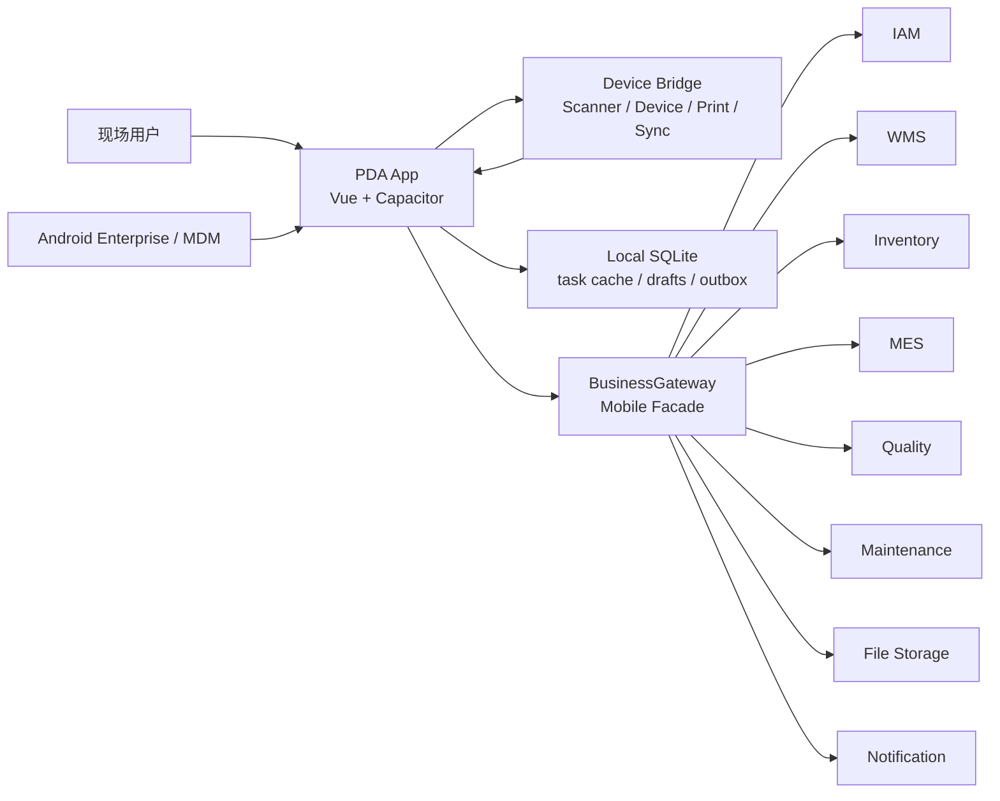
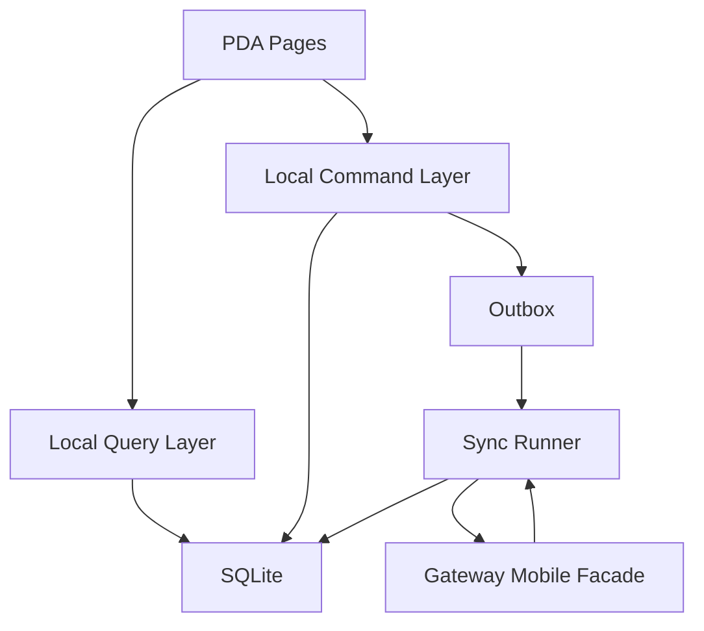
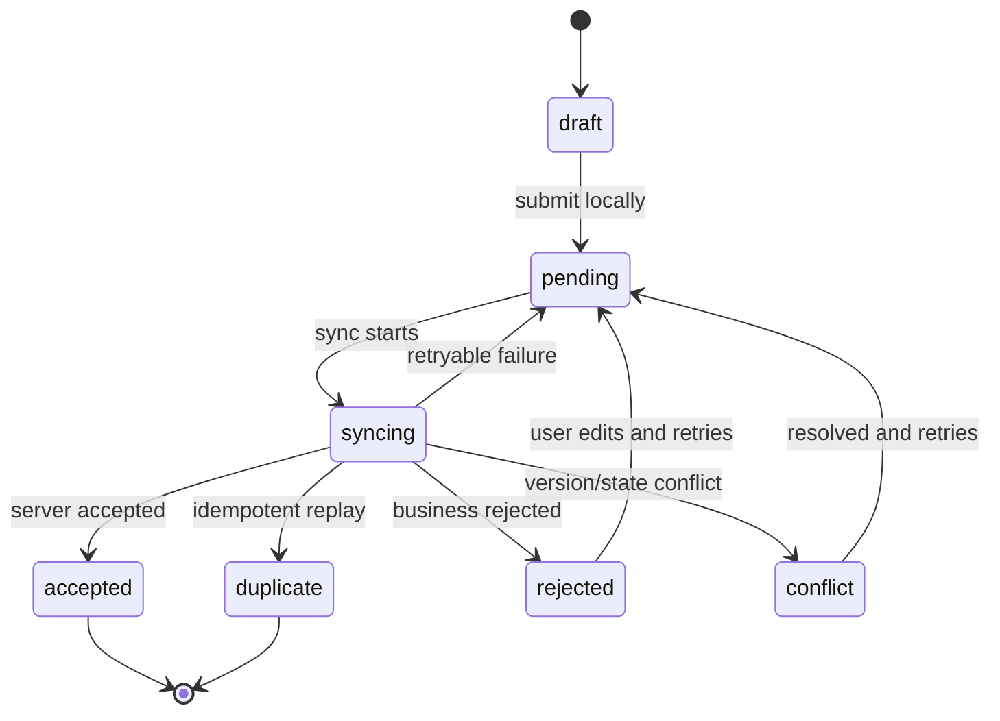

# Mobile PDA Capacitor 架构

本文档定义 Nerv-IIP 移动端 PDA 应用的技术选型、架构边界、目录规划、设备桥接、离线同步、安全、发布和测试策略。产品需求见 [2026-05-21-mobile-pda-capacitor-prd.md](../superpowers/specs/2026-05-21-mobile-pda-capacitor-prd.md)。

## 选型结论

选择 Capacitor 作为移动端 PDA 的推荐技术路线，定位为：

```text
Vue Web App
  + Capacitor native runtime
  + Android PDA native device bridge
  + BusinessGateway mobile facade
  + local SQLite/outbox offline layer
```

该路线适合 Nerv-IIP，因为当前前端技术栈已经稳定在 Vue、TypeScript、Pinia、Pinia Colada、Hey API 和 shadcn-vue token 体系。PDA 的主要业务是扫描驱动的现场执行，UI 和业务编排可以用 Web 技术高效交付；硬件扫描头、厂商 SDK、离线后台同步、设备信息和企业分发等能力通过 Android 原生桥接补齐。

选型不是“纯 Web/PWA”，也不是“零原生代码”。它要求项目明确拥有 Android 适配层。

## 调研依据

截至 2026-05-21，Capacitor 官方文档当前主版本为 v8。关键事实如下：

1. Capacitor 是面向 Web App 的跨平台 native runtime，可创建 Android、iOS 和 PWA 应用，并允许通过插件访问原生能力。
2. Capacitor v8 官方支持 Android、iOS、Web 三类目标；核心要求 Node.js 22+，Android 开发要求 Android Studio 2025.2.1+。
3. Capacitor Android runtime 允许 JavaScript 与 Java/Kotlin 通信，Android 支持 API 24+，并依赖 Chrome 60+ 的 Android WebView。
4. Capacitor v8 为 active 版本，最低 Android 版本为 Android 7/API 24；v7 已进入 maintenance。
5. 官方插件覆盖 Barcode Scanner、Camera、Device、Filesystem、File Transfer、Network、Preferences、Push Notifications、Screen Orientation 等 PDA 相关基础能力。
6. Capacitor 原生插件可以用 Java/Kotlin 编写，支持权限、Android intents、plugin events 和 WebView navigation override。
7. 官方 storage guide 明确 LocalStorage 和 IndexedDB 存在被系统回收的风险；高性能或大规模本地数据应使用 SQLite 类方案。
8. 官方 security guide 建议不在客户端嵌入 secrets，敏感值使用 Keychain/Keystore，OAuth 使用 PKCE，网络走 HTTPS，WebView 设置 CSP。
9. Zebra DataWedge 支持将硬件扫描头、相机、RFID、MSR、串口等输入通过 Android intent 发送给前台应用，扫描内容通过 `com.symbol.datawedge.data_string` 等 extra 提供。
10. Honeywell Mobility SDK for Android 提供 Honeywell 移动电脑、打印机和条码阅读器接口。
11. Android Enterprise 支持通过 EMM 分发 private apps；managed configurations 支持 IT 管理员远程下发应用配置。
12. Android 官方 offline-first guidance 强调本地数据源、同步队列、网络监控和 WorkManager。

参考链接：

1. [Capacitor documentation](https://capacitorjs.com/docs)
2. [Capacitor environment setup](https://capacitorjs.com/docs/getting-started/environment-setup)
3. [Capacitor Android documentation](https://capacitorjs.com/docs/android)
4. [Capacitor support policy](https://capacitorjs.com/docs/main/reference/support-policy)
5. [Capacitor plugins overview](https://capacitorjs.com/docs/plugins)
6. [Capacitor official plugins](https://capacitorjs.com/docs/apis)
7. [Capacitor Android plugin guide](https://capacitorjs.com/docs/plugins/android)
8. [Capacitor Barcode Scanner](https://capacitorjs.com/docs/apis/barcode-scanner)
9. [Capacitor Network](https://capacitorjs.com/docs/apis/network)
10. [Capacitor Filesystem](https://capacitorjs.com/docs/apis/filesystem)
11. [Capacitor Push Notifications](https://capacitorjs.com/docs/apis/push-notifications)
12. [Capacitor storage guide](https://capacitorjs.com/docs/guides/storage)
13. [Capacitor security guide](https://capacitorjs.com/docs/guides/security)
14. [Zebra DataWedge Intent Output](https://techdocs.zebra.com/datawedge/latest/guide/output/intent/)
15. [Zebra DataWedge Barcode Input](https://techdocs.zebra.com/datawedge/latest/guide/input/barcode/)
16. [Honeywell Mobility SDK for Android](https://automation.honeywell.com/us/en/software/productivity-solutions/enabling-software/mobility-sdk-android)
17. [Android Enterprise private app distribution](https://support.google.com/work/android/answer/9495634?hl=en)
18. [Android managed configurations](https://developer.android.com/work/managed-configurations?hl=en)
19. [Android offline-first architecture](https://developer.android.com/topic/architecture/data-layer/offline-first?hl=en)

## 备选方案比较

| 方案 | 优点 | 缺点 | 结论 |
| --- | --- | --- | --- |
| Capacitor + Vue + Android 插件 | 最大化复用现有前端栈；Web 业务 UI 交付快；可按需写原生插件；可保留 PWA/桌面调试能力。 | 需要维护 WebView 兼容性和 Android 桥接；高性能原生 UI 不如原生/Flutter。 | 推荐。适合 PDA 扫码执行类应用。 |
| 原生 Android Kotlin | 硬件、后台、MDM、性能和系统能力最稳。 | 前端技术栈复用低；业务 UI 和 API client 需重建；团队成本更高。 | 只在硬件控制重、后台约束强、客户指定原生时采用。 |
| Flutter | 跨端 UI 一致、性能好、生态成熟。 | 与现有 Vue 栈复用弱；硬件扫描仍需平台通道；Web/Console 体系复用有限。 | 不作为当前主选型。 |
| React Native | 原生能力和生态成熟。 | 与现有 Vue 栈复用弱；仍需原生桥接；引入第二套前端框架。 | 不作为当前主选型。 |
| PWA/浏览器 Web App | 部署简单、无应用商店。 | 难以稳定接入硬件扫描 intent、后台同步、MDM、Keystore、企业分发和设备诊断。 | 不满足工业 PDA 目标。 |

## 架构原则

1. PDA 是业务执行客户端，不是业务事实源。
2. PDA 只访问 BusinessGateway mobile facade，不直连业务服务、数据库、对象存储或消息队列。
3. 扫码、设备、打印、RFID、后台同步等原生能力统一封装在 device bridge 后面，页面不感知厂商 SDK。
4. 离线写入先落本地事实源和 outbox，再同步到服务端；服务端领域模型决定最终业务事实。
5. 所有写操作必须带幂等键、客户端操作 ID、设备 ID、用户 ID、组织、环境和业务上下文。
6. 权限由 IAM 和 Gateway enforcement 统一判断；PDA 不复制授权规则。
7. 移动 UI 独立设计，不复刻桌面 Console 页面。
8. 所有厂商适配必须有真机验收，不以模拟器结果替代 PDA 验收。

## 总体架构



## 仓库放置

当前 PDA v1 已采用 `frontend/apps/business-pda`，早期草案中的 `frontend/apps/pda` 不再作为代码事实。后续新增 native/offline 能力时仍沿用下列分层，但路径以 `business-pda` 为准。

```text
frontend/
  apps/
    business-pda/
      capacitor.config.ts
      android/
      src/
        main.ts
        App.vue
        router/
        pages/
          login.vue
          tasks/
          wms/
          inventory/
          mes/
          diagnostics/
        components/
        composables/
        stores/
        native/
          scanner.ts
          device.ts
          feedback.ts
          sync.ts
        offline/
          schema.ts
          database.ts
          outbox.ts
          sync-runner.ts
        api/
          mobile-gateway.ts
  packages/
    api-client/
    ui/
    app-shell/
```

目录职责：

1. `frontend/apps/business-pda` 是真实移动应用入口，与 `frontend/apps/console` 和 `frontend/apps/business-console` 并列；package name 为 `@nerv-iip/business-pda`。
2. `android/` 保留在 PDA app 内，作为 Capacitor 生成和维护的 Android 工程。
3. `src/native` 提供 TypeScript facade，页面只消费 facade。
4. `src/offline` 管理本地数据库 schema、迁移、outbox 和同步策略。
5. `frontend/packages/api-client` 继续承载 BusinessGateway Mobile OpenAPI 生成；PDA 只消费稳定导出。
6. 如果后续出现第二个移动应用或多个厂商插件复用，再将 `src/native` 和 Android 插件抽取到 `frontend/packages/pda-device-bridge`。

### app-shell 复用策略

PDA 不复用当前 `@nerv-iip/app-shell` 的桌面 `AppShell` 组件。当前 app-shell 是 Console 的 sidebar/topbar chrome，PDA 需要常驻扫描状态、底部动作条、离线队列提示和单手操作布局；强行扩展同一个 shell 会让桌面 Console 与 PDA 的交互边界耦合。

当前首批代码事实是：`frontend/apps/business-pda/src/pages/*` 页面复用 `@nerv-iip/ui-mobile` 的 `AppShellMobile`，PDA app 本地尚未建立 `src/components` 目录，也没有独立 `PdaShell`。作业布局当前由页面、`frontend/apps/business-pda/src/composables/*`、`frontend/packages/business-core` 的任务/SOP 定义和 `frontend/packages/ui-mobile` 组件组合完成。后续如果出现多个页面共享的 PDA 专用 chrome，再在 `frontend/apps/business-pda/src/components` 内抽取 app-local shell；可复用的登录恢复、组织/环境上下文、权限解析、Gateway bearer 注入等非视觉逻辑，如果后续在 Console 与 PDA 之间出现真实重复，应抽到更细粒度的 `frontend/packages/auth`、`business-core` 或独立 composable 包，而不是把它们塞进 `@nerv-iip/app-shell`。

## Capacitor 配置策略

### Runtime

1. 使用 Capacitor v8。
2. Android 为首批唯一必达 native target。
3. iOS target 不在 PDA MVP 内创建；如后续需要手机审批类轻应用，可单独评估。
4. Web/PWA target 只用于开发调试、桌面演示和摄像头扫码 fallback，不作为工业 PDA 正式交付形态。

### Android baseline

| 项 | 基线 |
| --- | --- |
| Capacitor minimum | Android 7/API 24。 |
| PDA 推荐 | Android 10+，WebView 可更新。 |
| Barcode Scanner 插件 | Android minSdk 26。 |
| 开发工具 | Node.js 22+，Android Studio 2025.2.1+。 |
| WebView | Chrome 60+；部署准入应采集实际 WebView/Chrome 版本。 |

### 环境配置

PDA app 不在前端 bundle 中硬编码生产地址。配置来源按优先级：

1. Android Enterprise managed configuration。
2. 管理员扫码配置。
3. 预置测试环境配置。

配置项：

| key | 说明 |
| --- | --- |
| `gatewayBaseUrl` | BusinessGateway mobile facade 地址。 |
| `organizationId` | 默认组织。 |
| `environmentId` | 默认环境。 |
| `deviceProfile` | 扫描模式、厂商、反馈策略。 |
| `syncPolicy` | 离线有效期、批次大小、重试策略。 |
| `logLevel` | 客户端日志级别。 |

## Native Device Bridge

### 统一接口

PDA 页面不得直接调用厂商 SDK 或 `window` 事件。统一通过 `ScannerPort`、`DevicePort`、`FeedbackPort`、`PrintPort` 等接口访问。

```ts
export interface ScannerPort {
  getCapabilities(): Promise<ScannerCapabilities>
  startSession(options: ScannerSessionOptions): Promise<void>
  stopSession(): Promise<void>
  addListener(
    eventName: 'scan',
    listener: (event: ScanEvent) => void,
  ): Promise<{ remove(): Promise<void> }>
}

export interface ScanEvent {
  eventId: string
  rawValue: string
  symbology?: string
  source: 'hardware' | 'camera' | 'keyboard' | 'rfid'
  vendor?: 'zebra' | 'honeywell' | 'urovo' | 'newland' | 'seuic' | 'unknown'
  rawBytes?: string
  scannedAt: string
  deviceId: string
  operationContext?: Record<string, unknown>
}
```

### Scanner adapters

| Adapter | 用途 | 实现方式 | 优先级 |
| --- | --- | --- | --- |
| DataWedge Intent Adapter | Zebra/兼容 DataWedge 设备 | Android BroadcastReceiver 或 Activity intent，转 Capacitor plugin event | P0 |
| Keyboard Wedge Adapter | 多数 PDA 默认键盘模拟模式 | Web input/keydown 捕获，保留焦点策略 | P0 fallback |
| Camera Scanner Adapter | 手机、平板、无硬件扫描头设备 | `@capacitor/barcode-scanner` | P1 |
| Honeywell Adapter | Honeywell PDA 深度适配 | Honeywell Mobility SDK 或 intent API | P1/按设备 |
| Urovo/Newland/Seuic Adapter | 国产 PDA 深度适配 | 厂商 SDK/intent | P2/按客户 |
| RFID Adapter | UHF/RFID 场景 | 厂商 SDK 或 DataWedge RFID source | P2 |

### DataWedge intent 处理

Zebra DataWedge Intent Output 可把扫描数据发送给前台应用。桥接层应：

1. 在 Android manifest 中配置固定 action/category 或通过 DataWedge Set Config API 配置 profile。
2. Activity 使用 singleTop，避免每次扫码创建新 Activity。
3. 优先使用 explicit intent 和 package/signature check，降低扫描数据被恶意应用接收的风险。
4. 读取 `com.symbol.datawedge.data_string` 作为原始文本。
5. 读取 `com.symbol.datawedge.label_type` 作为码制。
6. 需要 GS1、UDI 或特殊字符时读取 `com.symbol.datawedge.decode_data` 原始字节。
7. 将扫描结果转为 Capacitor plugin event，再进入 `ScannerPort`。

### Keyboard wedge fallback

Keyboard wedge 模式作为兼容兜底，但不能作为唯一推荐模式：

1. 页面必须有隐藏或受控输入接收扫描。
2. 按结束符、扫描间隔和字符速度识别扫描输入。
3. 输入法、手工键入、焦点丢失和软键盘弹出要单独处理。
4. 无法稳定提供码制和 raw bytes，因此高要求条码解析仍应使用 intent/SDK。

### Feedback

`FeedbackPort` 统一封装：

1. success/error/warning 三类蜂鸣。
2. 短震动和长震动。
3. 页面 toast 或状态条。
4. 后续支持扫描头 LED 或厂商反馈 API。

## 离线架构

### 原则

1. 本地数据库是 PDA 的离线事实源，但不是业务最终事实源。
2. 页面读本地 projection，写本地 operation，再由 outbox 同步。
3. 服务端返回的 accepted/rejected/conflict/duplicate 结果会回写本地 operation。
4. 同步策略必须可中断、可恢复、可重试。
5. LocalStorage 只保存非敏感轻量偏好，不能保存任务事实、token、outbox 或业务草稿。

### 本地数据层



### 本地表

| 表 | 说明 |
| --- | --- |
| `app_metadata` | schema version、安装 ID、最近迁移时间。 |
| `device_profile` | 设备 ID、型号、WebView、扫描模式、配置来源。 |
| `auth_session` | 非敏感会话摘要；敏感 token 放安全存储。 |
| `mobile_tasks` | 用户任务快照和状态。 |
| `reference_data` | 仓库、库位、物料、条码规则、工位等基础数据缓存。 |
| `scan_events` | 最近扫描事件和业务解释结果。 |
| `operation_drafts` | 未提交草稿。 |
| `outbox_operations` | 待同步写操作。 |
| `sync_results` | 服务端回执、失败原因、冲突详情。 |
| `diagnostic_logs` | 脱敏日志和诊断摘要。 |

### Outbox 状态机



### 同步策略

1. 在线提交：页面写本地 operation 后立即触发同步。
2. 网络恢复：Network plugin 通知后触发同步。
3. App 启动：启动后触发 bootstrap sync。
4. 用户手动：异常队列提供重试按钮。
5. 后台同步：MVP 以 App 前台同步为主；如客户要求后台可靠同步，再增加 Android WorkManager Capacitor 插件。
6. 批量同步：按 operationType、创建时间和依赖关系排序，默认批次 50-200。
7. 幂等：每个 operation 生成稳定 idempotencyKey，重放不产生重复业务事实。
8. 冲突：服务端返回机器可读 errorCode 和用户可读 message。

### 冲突处理

| 冲突 | 处理 |
| --- | --- |
| 任务已关闭 | 标记 conflict，提示刷新任务。 |
| 数量超出 | 标记 rejected，允许修改数量后重试。 |
| 物料/库位不匹配 | 标记 rejected，保留扫描证据。 |
| 权限变化 | 标记 rejected，要求重新登录或联系主管。 |
| 重复提交 | 标记 duplicate，展示已有服务端结果。 |
| 服务端版本过期 | 标记 conflict，拉取最新任务后人工确认。 |

## API 与服务边界

### BusinessGateway mobile facade

PDA v1 已落地 `frontend/apps/business-pda`，当前事实是复用 `BusinessGateway` 现有 `/api/business-console/v1/**` facade 和 `@nerv-iip/api-client` 的 business-console 稳定导出；尚未创建独立 `/api/mobile/v1/**` endpoint、`business-gateway-mobile.v1.json`、`src/generated/mobile/` 或 `src/mobile.ts`。移动专用 facade 的推荐落点仍是 `BusinessGateway`，但应作为后续轨道，只承载 business-console facade 不适合表达的 PDA 专属 bootstrap、个人任务、扫码解释、设备注册、离线 outbox/sync 和诊断上传。

它复用现有 `PlatformGateway` 已验证的 facade 模式、IAM-backed permission enforcement、OpenAPI 生成和错误归一化口径，但部署和职责边界不同：

1. `PlatformGateway` 继续服务主平台 Console、AppHub、Ops、IAM Admin、观测等平台控制面接口。
2. `BusinessGateway` 承载业务平台页面和移动 PDA 的聚合查询与提交入口，包括 WMS、Inventory、MES、Quality、Maintenance 等业务域。
3. PDA 生产 API 不应把 WMS/MES/Inventory 等业务聚合逻辑写入 `PlatformGateway`。
4. 当前 `business-pda` 已通过 BusinessGateway 的 business-console facade 完成 WMS、MES 和设备轻量作业页面；后续 mobile facade 落地时不得把既有业务控制台契约机械复制一份。

PDA 当前只访问 BusinessGateway/PlatformGateway 的受控 facade，不直连业务服务 URL：

```text
PDA -> BusinessGateway /api/business-console/v1/*   # current v1 facts
PDA -> PlatformGateway /api/console/v1/*            # auth/session facade
PDA -> BusinessGateway /api/mobile/v1/*             # future mobile-specific track
BusinessGateway -> IAM / WMS / Inventory / MES / Quality / Maintenance / FileStorage
```

BusinessGateway 职责：

1. Bearer token 校验和权限 enforcement。
2. 组织、环境、设备上下文解析。
3. 移动聚合 DTO。
4. OpenAPI 输出和 api-client 生成。
5. 错误码归一化。
6. 请求限流、幂等头透传、correlationId 注入。

BusinessGateway 非职责：

1. 不承载库存、工单、质检、维修领域规则。
2. 不直接写业务数据库。
3. 不保存 PDA 离线队列。
4. 不绕过 IAM 授权。

### 移动 API 草案

| Route | Method | 说明 |
| --- | --- | --- |
| `/api/mobile/v1/bootstrap` | GET | 用户、组织、环境、权限、设备策略、基础配置。 |
| `/api/mobile/v1/tasks` | GET | 本人任务、最近任务、异常任务。 |
| `/api/mobile/v1/sync/delta` | GET | 基础数据和任务增量。 |
| `/api/mobile/v1/operations/batch` | POST | outbox 批量同步。 |
| `/api/mobile/v1/scans/interpret` | POST | 在线条码解释。 |
| `/api/mobile/v1/devices/register` | POST | 设备或安装实例登记。 |
| `/api/mobile/v1/diagnostics` | POST | 上传诊断摘要。 |

### Mobile OpenAPI 生成链路

当前代码还没有 Mobile OpenAPI 生成链路；`frontend/packages/api-client/openapi/` 只包含 PlatformGateway 与 BusinessGateway business-console 快照，`src/index.ts` 只重新导出 console、business-console、iam 和 auth 稳定入口。Mobile OpenAPI 使用独立 BusinessGateway 契约时，仍应进入现有 `@nerv-iip/api-client` 包，避免 PDA 与 Console 各自维护 transport、auth header、错误模型和 envelope 类型。

后续落地顺序：

1. BusinessGateway 通过 FastEndpoints.Swagger 输出 `/swagger/v1/swagger.json`。
2. 导出脚本保存快照到 `frontend/packages/api-client/openapi/business-gateway-mobile.v1.json`。
3. `frontend/packages/api-client/openapi-ts.config.ts` 增加 mobile input，生成到独立目录 `frontend/packages/api-client/src/generated/mobile/`，避免与现有 `src/generated/` PlatformGateway 代码混杂。
4. 手写稳定入口为 `frontend/packages/api-client/src/mobile.ts`，并从 `src/index.ts` 重新导出必要类型、SDK 和 Pinia Colada online query options。
5. PDA 应用只从 `@nerv-iip/api-client` 稳定入口消费，不深 import `src/generated/mobile/*`。
6. BusinessGateway 与 PlatformGateway 可以在部署层共用公网域名和反向代理，也可以分开域名；前端 transport 必须允许 PDA 的 `gatewayBaseUrl` 指向 BusinessGateway，不假设与 Console `baseURL` 相同。

Mobile operationId 固定使用 lower camelCase 并带 `Mobile` 语义前缀，完整表格见 [api-contract-and-codegen.md](api-contract-and-codegen.md)。

所有写 API 必须支持：

1. `Idempotency-Key` header。
2. `X-Correlation-Id` header。
3. request body 内的 `clientOperationId`、`deviceId`、`occurredAt`。
4. 统一响应结果：`accepted`、`duplicate`、`rejected`、`conflict`、`retryableFailure`。

## 权限与主体

PDA 的主要调用主体仍然是 `user`。设备信息用于额外约束和审计，不替代用户权限。

推荐上下文：

| 字段 | 来源 | 说明 |
| --- | --- | --- |
| `principalType=user` | access token | 员工身份。 |
| `organizationId` | token/context selection | 组织边界。 |
| `environmentId` | token/context selection | 环境边界。 |
| `deviceId` | device profile | 已登记设备。 |
| `warehouseId/workCenterId` | mobile context | 仓库或工位边界。 |
| `permissionCode` | endpoint declaration | 业务动作权限。 |

首批复用 [authorization-matrix.md](authorization-matrix.md) 中的业务权限码。若后续引入平台级设备台账，再新增移动设备权限：

| 权限码 | 建议 scope | 说明 |
| --- | --- | --- |
| `mobile.devices.read` | organization/environment + resource | 查看 PDA 设备、版本、最近同步状态。 |
| `mobile.devices.manage` | organization/environment + resource | 登记、停用、解绑 PDA 设备。 |
| `mobile.diagnostics.write` | environment + resource | PDA 上传诊断摘要。 |

`mobile.*` 是平台级移动设备管理权限命名空间，已在 [authorization-matrix.md](authorization-matrix.md) 预留；新增权限码必须先进入 authorization matrix，再进入 IAM seed、BusinessGateway enforcement 和测试。

## 安全架构

### Token 与敏感数据

1. access token 仅在内存和必要的安全存储中使用。
2. refresh token 使用 Android Keystore 或成熟安全存储插件保存。
3. 本地 SQLite 如保存业务敏感数据，应启用加密 SQLite 或文件级加密策略。
4. 设备丢失时，管理员可撤销会话、解绑设备或吊销 refresh token。

### 网络

1. 生产环境只允许 HTTPS。
2. App 配置 Gateway allowlist，禁止 WebView 任意跳转。
3. CSP 限制资源加载域。
4. 需要客户内网证书时，通过企业 CA 和 MDM 分发信任链，避免在 app 中硬编码证书私钥。
5. 证书固定可以作为高安全客户选项，但必须设计证书轮换机制。

### Auth flow

1. 首批可复用现有 IAM 登录 facade。
2. 后续如引入 OIDC/SSO，移动端必须使用 Authorization Code + PKCE。
3. 深链回调只携带 code/state，不携带 token。
4. 离线授权必须有到期时间和可撤销策略。

### WebView 安全

1. 禁止加载非受信任远程页面作为主应用。
2. 禁止把 secret 注入 Vite env 并打包到前端 bundle。
3. 禁止把 native bridge 暴露成任意命令执行通道。
4. 原生插件方法必须验证参数、权限和当前 app 状态。

## 设备与企业分发

### 分发方式

| 方式 | 适用 | 说明 |
| --- | --- | --- |
| Managed Google Play private app | 标准 Android Enterprise | 推荐生产路径，可通过 EMM 安装和测试轨灰度。 |
| MDM 直接 APK/AAB 分发 | 私有化/无 Play 环境 | 需要客户 MDM 支持签名包分发。 |
| USB/ADB 安装 | 开发和试点 | 不作为规模生产交付方式。 |

### Managed configuration

PDA app 应支持 Android managed configurations，用于远程下发：

1. Gateway 地址。
2. 默认组织/环境。
3. 设备角色或仓库范围。
4. 扫描模式。
5. 日志级别。
6. 同步策略。
7. 强制升级策略。

### 设备准入

设备进入生产前必须记录：

1. 厂商、型号、Android 版本。
2. WebView/Chrome 版本。
3. 扫描输入模式。
4. DataWedge/SDK 版本。
5. MDM/OEMConfig 能力。
6. 电池、网络、屏幕和物理按键测试结果。

## UI 架构

PDA UI 与 Console 共用设计 token，但不复用桌面页面。

### 页面结构

| 区域 | 说明 |
| --- | --- |
| 顶部状态条 | 用户、环境、仓库/工位、在线状态、待同步数量。 |
| 主作业区域 | 当前任务步骤、扫描结果、目标数量、已完成数量。 |
| 底部动作条 | 提交、挂起、异常、返回任务中心。 |
| 扫描状态浮层 | 成功、失败、重复、离线暂存。 |
| 异常抽屉 | 展示失败原因、冲突详情和重试入口。 |

### 交互规则

1. 页面围绕“下一步要扫什么”组织，而不是围绕表格。
2. 主要动作按钮高度不小于 PDA 触控建议尺寸。
3. 高频页面避免多层弹窗。
4. 离线状态必须持续可见。
5. 错误必须落在当前动作附近，避免用户回头找提示。
6. 条码字段应区分扫描录入和手工录入。

### 状态管理

| 层 | 技术 | 说明 |
| --- | --- | --- |
| UI state | Vue composables | 当前步骤、输入框、局部 loading。 |
| Client state | Pinia | 登录摘要、上下文、设备信息、布局偏好。 |
| Server state online | Pinia Colada | 在线查询、失效、重试、缓存。 |
| Offline state | SQLite + local query layer | 任务快照、草稿、outbox、同步结果。 |
| API client | `@nerv-iip/api-client` | BusinessGateway Mobile OpenAPI 生成。 |

### Pinia Colada 与 SQLite 边界

PDA 数据流明确拆成在线查询和离线事实源两条路径，组件通过业务 composable 消费统一的 view model，但底层职责不混用：

1. Pinia Colada 只用于在线 read query，例如 bootstrap、任务列表、任务增量拉取、在线条码解释和设备策略刷新。
2. 离线期间组件直接消费 SQLite local query layer 的 projection，不让 Colada query fallback 读取 SQLite。
3. Outbox 写入完全绕过 Colada mutate，固定走 `LocalCommand -> SQLite -> Outbox`。
4. Sync Runner 是唯一把 outbox operation 提交到 BusinessGateway 的组件；同步成功后回写 SQLite，并按需触发 Colada invalidation 或在线增量刷新。
5. Colada cache 可以被清空、失效或重拉，不作为离线事实来源；SQLite schema 和迁移才是 PDA 本地事实源。
6. 页面级 composable 负责把 online query、local projection、sync status 合成 UI 状态，避免页面组件直接同时操作两套数据流。

## 数据一致性策略

### 写入模式

```text
User action
  -> Local command validation
  -> Write operation to SQLite
  -> Enqueue outbox
  -> Sync to BusinessGateway
  -> Domain service validates
  -> BusinessGateway returns normalized result
  -> Local DB records final state
```

### 幂等键

幂等键建议格式：

```text
{organizationId}:{environmentId}:{deviceId}:{clientOperationId}
```

服务端应保存幂等键与业务结果映射，重复提交返回同一结果摘要。

### 时间

1. 客户端时间只用于用户操作发生时间和排序提示。
2. 服务端时间是业务事实确认时间。
3. 设备时间偏差超过阈值时，App 应提示并在诊断中记录。

### 附件

1. PDA 拍照附件先写本地文件，再通过 File Storage 上传。
2. outbox operation 保存 fileId 或上传会话引用。
3. 业务服务只引用 fileId，不保存对象存储 key 或预签名 URL。

## 可观测性

### 客户端事件

| 事件 | 字段 |
| --- | --- |
| `pda.app.started` | appVersion、deviceId、webViewVersion。 |
| `pda.scan.received` | source、symbology、operationContext、latency。 |
| `pda.operation.enqueued` | operationType、idempotencyKey、queueSize。 |
| `pda.sync.completed` | batchSize、accepted、rejected、conflict、duration。 |
| `pda.sync.failed` | errorCode、retryable、queueSize。 |
| `pda.device.diagnostics_uploaded` | appVersion、deviceModel、logWindow。 |

### 链路追踪

1. 每个 mobile API 请求带 `X-Correlation-Id`。
2. 服务端日志必须记录 deviceId、organizationId、environmentId、operationType、idempotencyKey。
3. 客户端诊断包只上传脱敏日志和摘要。

## 构建与发布

### 开发命令草案

当前 `business-pda` package 已提供以下命令：

```powershell
pnpm -C frontend --filter @nerv-iip/business-pda dev
pnpm -C frontend --filter @nerv-iip/business-pda typecheck
pnpm -C frontend --filter @nerv-iip/business-pda test
pnpm -C frontend --filter @nerv-iip/business-pda build
pnpm -C frontend --filter @nerv-iip/business-pda cap:sync
pnpm -C frontend --filter @nerv-iip/business-pda cap:open
```

最终命令以 `frontend/apps/business-pda/package.json` 和 Vite+ workspace task 为准。

### 发布包

| 环境 | 包类型 | 说明 |
| --- | --- | --- |
| Dev | debug APK | 开发真机调试。 |
| Test | signed APK/AAB | 测试环境，允许日志增强。 |
| Preprod | signed AAB/APK | 预生产，接近生产配置。 |
| Prod | signed AAB/APK | 生产分发，日志脱敏，禁用调试。 |

### 版本

1. App semantic version 与 build number 分离。
2. native bridge API 需要独立版本标识。
3. 后续独立 BusinessGateway mobile facade 使用 `/api/mobile/v1` 路径版本；当前 PDA v1 仍复用 `/api/business-console/v1/**`。
4. 破坏性 API 变更必须提升 mobile facade 主版本。

## 测试策略

### 自动化测试

| 层 | 工具 | 目标 |
| --- | --- | --- |
| TypeScript unit | Vitest | 条码解析、outbox 状态机、同步策略。 |
| Vue component | Vitest + Vue Test Utils | 页面步骤、错误状态、离线提示。 |
| API contract | OpenAPI generated tests | DTO 与 BusinessGateway mobile facade 对齐。 |
| Android unit/instrumented | Android Studio/Gradle | native bridge、intent parsing、permissions。 |
| E2E smoke | Playwright Web target | 非硬件路径和 UI 主流程。 |
| Hardware acceptance | 真机脚本和人工用例 | 扫描头、物理按键、弱网、休眠恢复。 |

### 真机矩阵

MVP 最低矩阵：

| 设备 | Android | 扫描模式 | 验收 |
| --- | --- | --- | --- |
| Zebra 或兼容 DataWedge PDA | Android 10+ | DataWedge intent | 必须。 |
| 目标客户主力 PDA | 实际版本 | 厂商推荐模式 | 必须。 |
| 普通 Android 手机 | Android 12+ | Camera scanner | fallback。 |

扩展矩阵：

1. Honeywell PDA。
2. Urovo/东集 PDA。
3. Newland/新大陆 PDA。
4. Seuic/销邦 PDA。
5. 蓝牙扫描枪。
6. 蓝牙/网络标签打印机。

### 场景测试

1. 连续扫描 100 次。
2. 扫描包含 GS1 分隔符或特殊字符的条码。
3. 收货提交后断网、重试、重复提交。
4. 离线盘点 500 条后恢复网络。
5. App 杀进程、重启、设备休眠、低电量。
6. token 过期、权限撤销、设备解绑。
7. WebView 版本过低告警。
8. MDM 下发配置变更。

## 实施切片

### Slice 0. Architecture freeze

1. 冻结 PRD 和架构文档。
2. 确认首批设备型号和扫描模式。
3. 确认 BusinessGateway mobile facade 项目、本地启动入口和反向代理口径。
4. 确认离线动作白名单。

### Slice 1. Technical spike

1. 扩展 `frontend/apps/business-pda`。
2. 接入 Capacitor Android。
3. 实现 DataWedge intent 或目标设备扫描 adapter。
4. 实现 camera fallback。
5. 实现最小 SQLite/outbox。
6. 打通一次 mock mobile operation 同步。

### Slice 2. Mobile foundation

1. 登录、上下文、设备注册、诊断页。
2. 任务中心和离线状态。
3. BusinessGateway mobile bootstrap/tasks/sync API。
4. api-client 生成和 Pinia/Pinia Colada 接入。
5. 权限 enforcement。

### Slice 3. WMS MVP

1. 收货、上架、拣货、复核、盘点页面。
2. outbox 批量同步。
3. 异常队列和冲突处理。
4. 标签补打 Lite。
5. 设备矩阵验收。

### Slice 4. MES/Quality/Maintenance

1. MES 报工 Lite。
2. Quality 检验和照片附件。
3. Maintenance 点检/故障/维修工单。
4. 诊断、观测和发布流程增强。

## 决策记录

1. 选择 Capacitor v8 作为 PDA app native runtime。
2. Android PDA 是首批唯一必达 native target。
3. 硬件扫描优先通过厂商 intent/SDK 桥接；官方 Barcode Scanner 用作摄像头 fallback。
4. 离线事实源使用 SQLite/outbox，不把 LocalStorage/IndexedDB 作为业务事实存储。
5. PDA 只访问 BusinessGateway mobile facade。
6. 设备 bridge 首批 app-local，出现复用需求后抽取 package。

## 开放问题

1. 首批验证设备型号、Android 版本和 DataWedge/厂商 SDK 版本。
2. 本地数据库使用的 SQLite 插件或自研 Capacitor plugin。
3. 是否需要 SQLCipher/加密 SQLite 作为默认能力。
4. 标签打印是先走服务端 PDF/图片，还是直接接蓝牙/网络打印 SDK。
5. MDM 选型和客户是否允许 Managed Google Play。
6. 离线执行白名单与授权时长。
7. 是否需要 mobile device registry 独立服务，或先由 IAM/BusinessGateway 承载设备登记。
