# MAN-698 演示操作手册（从订单到发货）

> **第三轮定稿** · 栈 `nerv-0416-6b5e76` · commit `3086a776` · 2026-08-01
>
> 本手册由三轮角色化端到端走查产出（GitHub #1266）。每一步都在真机上实操过，
> 截图为当轮实拍。走查过程中发现的问题以 GitHub issue 跟踪，正文中的「台账 #NN」
> 指走查问题台账编号，对应的 issue 号在各章注记里给出。
>
> **本手册的验收标准是「他人照着能复现」**——若某一步照着做不出预期结果，
> 那是手册的缺陷，请开 issue。

## 0. 演示前必读（第三轮实测得出，逐条都踩过）

1. **起栈必须用 `nerv.ps1 demo`，不能用 `nerv.ps1 dev`。**
   `dev` 栈不设 `NERV_IIP_LEADER_DEMO`，L0 世界主数据与 L1 历史块都不激活——业务伙伴 0、物料 0、
   MES 工单 0，销售订单只剩一张冒烟夹具 `SO-DEMO-001`，**第 1 棒在「选客户」就走不下去**。
   起栈后先核一眼数据量再开讲：销售订单应 4400+、MES 工单 4700+、待检 103、业务伙伴 22。
2. **单号日期跟随演示世界的 asOfDate（2026-07-31），不是操作系统当天。**
   当天新建的单据是 `QUO-20260731-*` / `SO-20260731-*` / `WO-20260731-*`，按 `20260731` 前缀搜。
3. **只用 `WO-2026-*` 号段。** `WO-SCALE-*`（约千张）与 `WO-DEMO-Q01` 存在但逐工序按钮全被拦
   （MES 校验器不覆盖该号段，已知且已接受），**不要点开，也不要排进任何步骤**。
4. **三处现场不要点**（第三轮实测必失败，详见各章）：
   - 质检「提交检验记录」——按钮恒禁用，录不进去（台账 #79/#80）
   - 仓储「完成复核」——必 422（台账 #81）
   - 甘特图**演示前先处理 DHTMLX 评估版水印**（台账 #84），否则大屏上挂着厂商邮箱
5. 本手册每章开头的注记写明该章**第三轮有没有真机重走**。标「沿用第二轮」的章节步骤仍可信
   （数据同种子），但未在第三轮栈上逐步复核。

## 1. 销售：录入客户订单（报价 → 批准 → 转订单）

> **第三轮已真机重走 ✅ 零绕行**（栈 nerv-0416-6b5e76 · 2026-08-01）：本轮实例
> QUO-20260731-000001 → **SO-20260731-000001**（已下达 ¥10,200）。单位自动带出「件（pcs）」、
> 无任何信用额度补录，两条二轮结论均复现。
> ⚠️ 新增须知：创建报价的接口回执**只回内部 id、不回报价单号**（台账 #87），所以下面第 4 步
> **要回列表按 `QUO-20260731` 前缀找当天的新报价**，别指望创建提示里给单号。
> 下文单号为第三轮实例，演示当轮以实际生成为准。

角色背景：销售接到长三角整车一厂的采购需求——E1 平台前滑柱总成（右）120 件，期望 8 月 21 日交货。要把这笔生意落进系统，并给客户一个交期承诺。

1. **登录业务控制台**（admin）。为什么：所有单据操作都要在登录态、org-001/env-dev 范围内进行。
   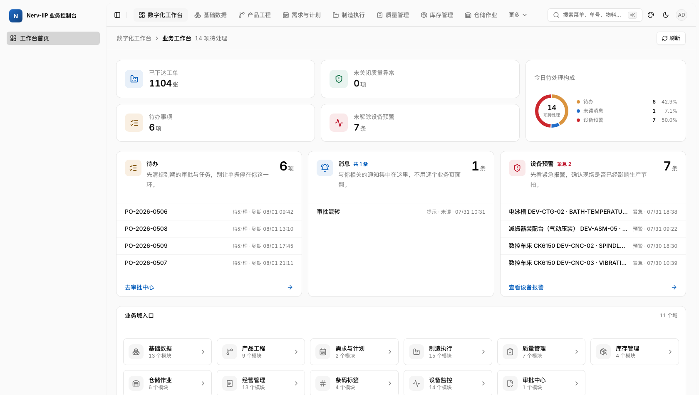
2. **顶部「更多」→ 经营管理 → 销售 → 销售订单**，浏览历史订单（4400+ 张，SO-2026-*、SO-SCALE-*，客户均为中文名）。为什么：录单前先确认客户过往合作与在手订单。注意：关键字框只认单号/客户编码，输中文客户名搜不到（台账 #31）。
   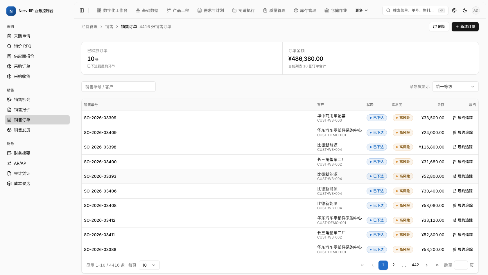
3. **销售 → 销售报价 →「新建报价」**：选客户「长三角整车一厂」→ 有效期至 2026-08-31 → 选物料（搜索 FG-QJ-E1-R）→ **单位自动带出「件（pcs）」**（跟随物料基本单位，无需手选；改卖包装单位时才手动换）→ 需求日期 2026-08-21 → 数量 120 → 单价 85。为什么：报价把客户的需求（SKU/数量/交期/价格/计价单位）第一次固化成单据。
   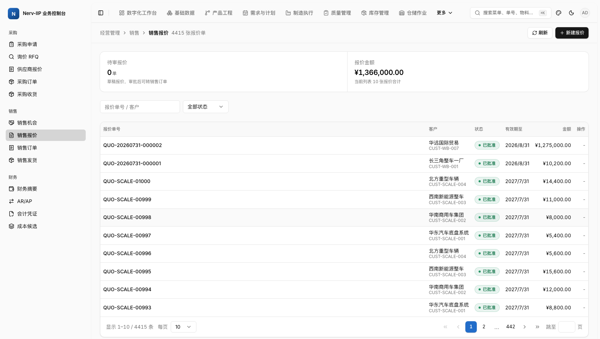
   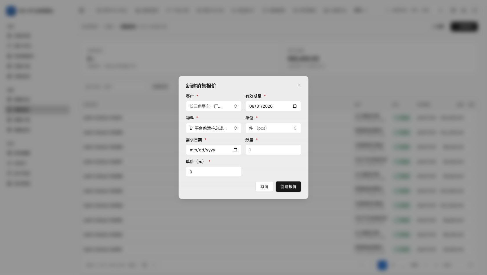
   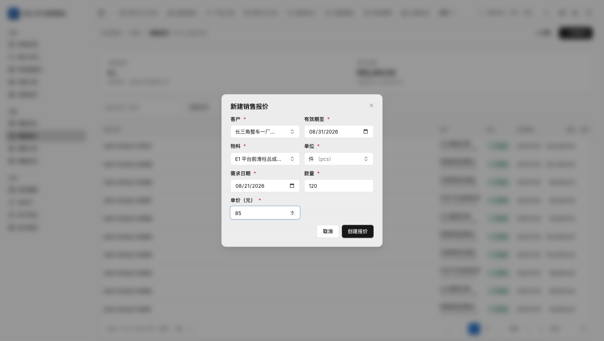
4. **创建报价**，toast「销售报价已创建」。**回列表在关键字框输 `QUO-20260731`**（当天前缀）找到新报价，
   状态「待审」（本轮 QUO-20260731-000001）。为什么要搜：创建回执不带单号（台账 #87），列表是唯一拿到单号的地方。
   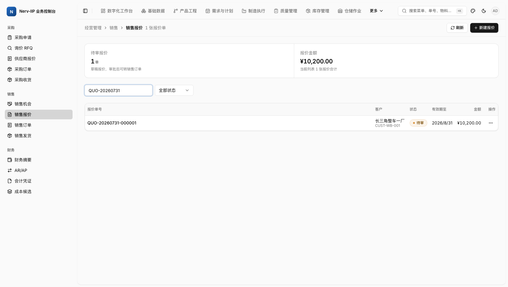
5. **行尾「报价单操作」菜单 →「审批通过」**，状态变「已批准」。为什么：只有已批准的报价才能转订单（演示中由同一账号直接批）。
   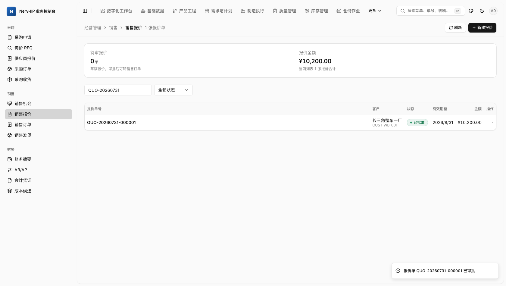
6. **销售订单 →「新建订单」**：填报价单号 → 选履约工厂「一号工厂 SITE-001」→ 单号留空自动编号 → 创建。toast「销售订单已创建」。客户信用档案种子已带齐，**不需要任何主数据补录**；信用检查在此步自动执行。
   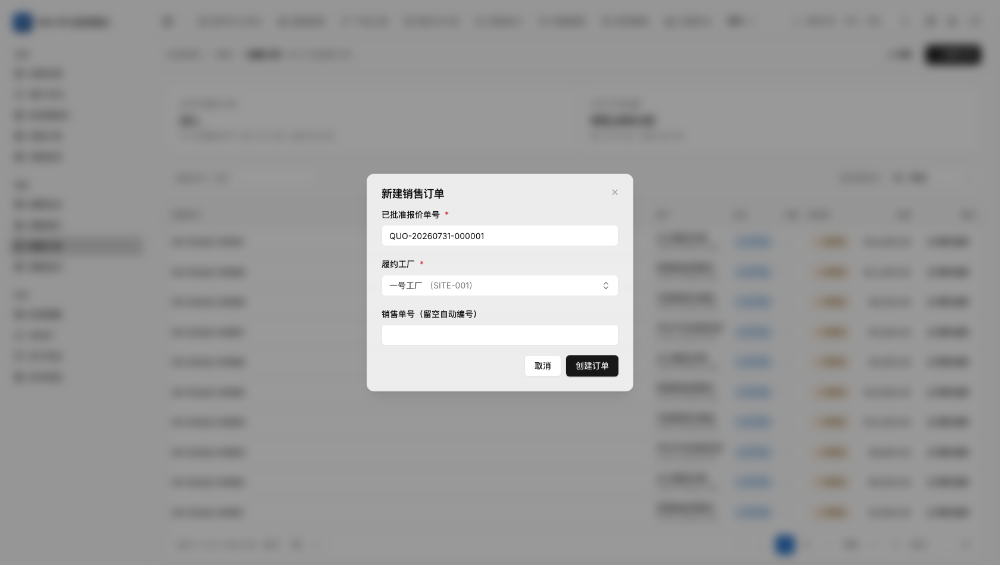
   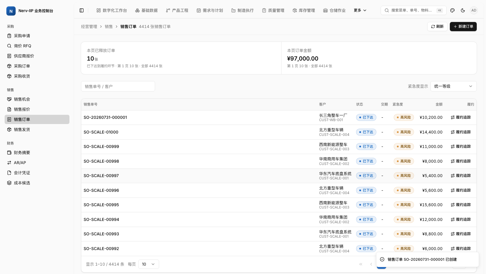
   ✅ 重复转单已根治（#1314）：对同一张报价再点一次创建，会返回**同一张**订单并提示「已为你带回既有订单」，
   不再产生第二张单和双份需求（二轮台账 #30 已修）。
7. **搜索当日单号前缀 `SO-20260731`** 找到新单，状态「已下达」（本轮主链单 SO-20260731-000001，¥10,200）。
   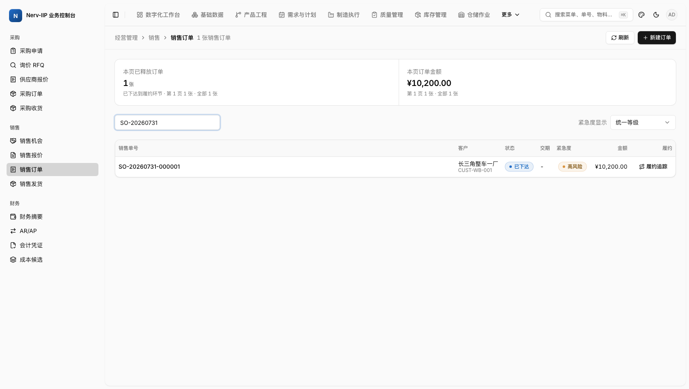
8. **打开新单的「履约追踪」**记录初始状态：销售订单=已下达、生产需求=已生成（sourceReference 关联）、APS 紧急度已点亮；MRP/工单/报工等下游为「尚未产生/尚未建立关联」。抽屉顶部另有「对该单排产」入口（交排程棒次验证）。为什么：这是后续角色（计划/生产/质量/仓储）接力的起点快照。
   
9. **"能不能按期交？"**：点行内「高风险」徽标看紧急度解释（业务优先级 P2 · authoritative-default，支持设人工优先级并留审计），但 CR/Slack 仍为 —，且界面没有 ATP/可承诺交期能力、订单列表没有交期列。销售当前只能承诺"需求日期已登记，待排程反馈"。
   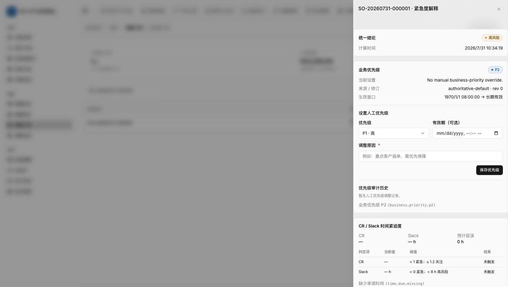

### 1a. 信用冻结与解冻复核（低额度客户）

角色背景：华远国际贸易（种子额度 80 万）突然要一张 ¥127.5 万的大单。销售照单全录——系统会替你把信用风险拦下来，再走审批把它放行。

1. **按 §1 步骤 3~6 为华远国际贸易录一张大额报价并转订单**（本轮 15,000 pcs × ¥85 = ¥1,275,000）。订单创建成功但状态为**「信用冻结」**——超出客户信用额度，系统自动冻结而不是拒单。为什么：单子先落系统，风险走审批，不逼销售改数量。
   
   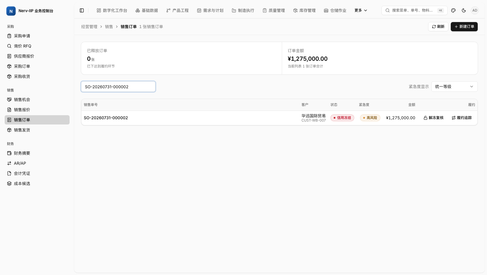
2. **冻结行行尾出现「解冻复核」按钮**，点开弹窗：写明冻结原因（超出客户信用额度）与后果（发起「信用解冻」审批，通过后自动恢复已下达）。点「提交解冻复核」，toast 确认已发起审批。
   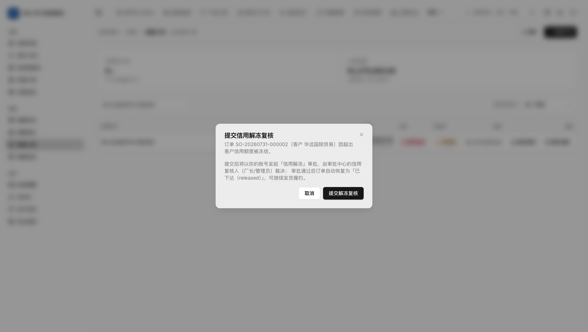
   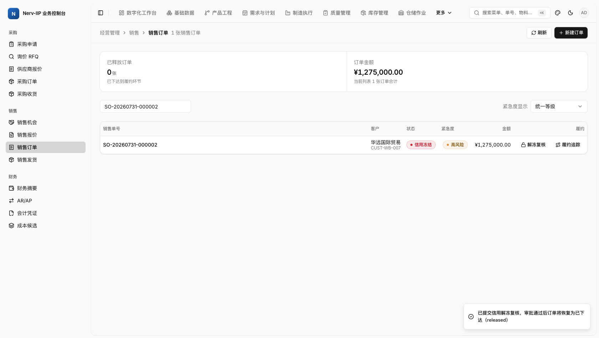
3. **顶部搜索/更多 → 审批中心**：「我的任务」出现「业务单据 · SO-…　信用解冻复核」任务。为什么：信用放行是厂长/管理员级决策，不能销售自己点掉。
   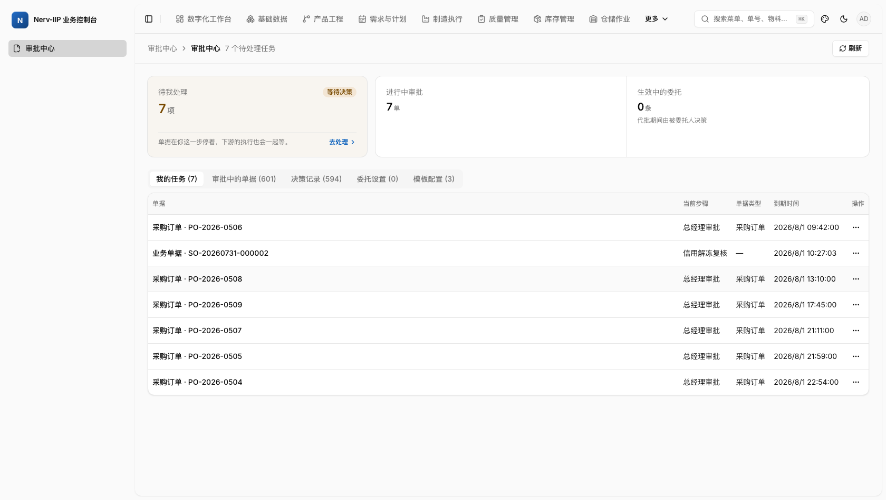
   ⚠️ 已知阻断（台账 #28）：行操作「通过/驳回」当前必报「审批处理失败」（前后端 decision 大小写不匹配），修复前演示需避开现场裁决或提前用 API 裁决。
4. **裁决通过后**：任务从「我的任务」消失，「决策记录」留痕；回销售订单页搜该单，状态已恢复**「已下达」**，可继续发货履约。
   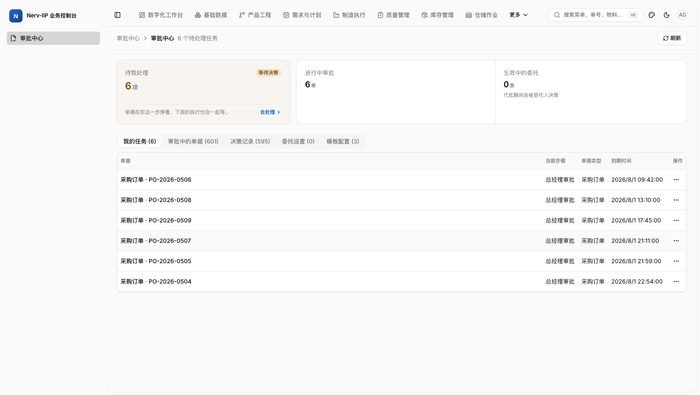
   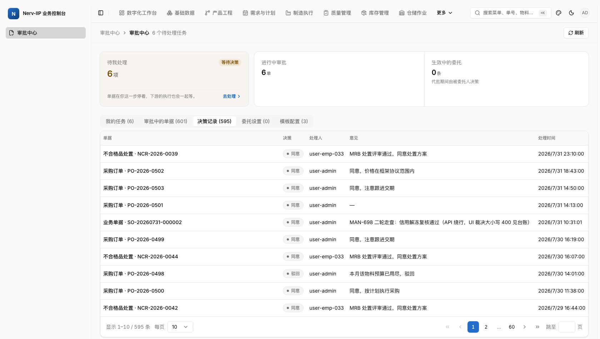
   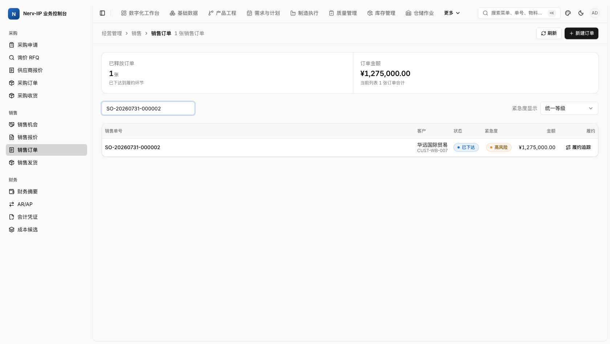

## 2. 计划员：需求与 MRP（需求池 → 运行 MRP → 接受建议 → 工单/请购单）

> **第三轮已真机重走 ✅**（2026-08-01）：MRP run `019fb966-1b6f`——提交→受理 **0.56 秒**、
> 提交→完成 **13.9 秒**、**927 条建议**，需求覆盖率 **33% → 100%**（24/24 物料）。
> 承接得到 **WO-20260731-000001**（120 pcs，**齐套阻塞 4 项缺料**——注意不再是二轮的 11 项）
> 与 **PR-20260731-000001**。
> ✅ 本轮新增能力：**需求池有搜索框了**（「搜来源单号 / 物料 / 客户 / 工厂」，二轮台账 #15 已修），
> 不必再把每页 100 行翻着找。下文单号为第三轮实例。

角色背景：销售的新订单 SO-20260731-000001（FG-QJ-E1-R × 120 pcs，需求日 2026-08-21）已下达。计划员要回答两件事：**要生产什么**（生产建议 → MES 工单）、**要买什么**（采购建议 → ERP 请购单）。

1. **顶部「需求与计划」→ 需求与物料计划**，进入计划工作台。顶部 KPI 卡（需求覆盖率 / 主计划行 / 最近一次 MRP / 待评审建议），下方页签：需求池 / MPS 主计划 / 时段视图 / MRP 运行 / 计划建议。为什么：计划员的一切决策从"需求进来了没有"开始。
   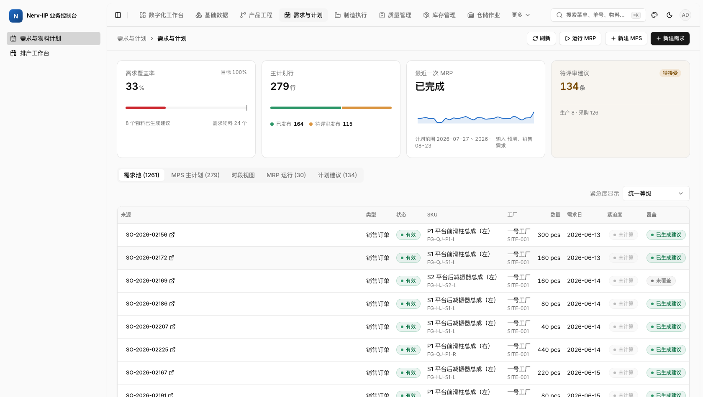
2. **在需求池确认新订单的生产需求已进池**：切到「需求池」页签（本轮 1260 行），
   **在搜索框输入 `SO-20260731-000001`**（占位符「搜来源单号 / 物料 / 客户 / 工厂」，#1354 新增），
   一行直达：类型 销售订单 / 有效 / **120 pcs** / 需求日 2026-08-21 / 覆盖状态「已生成建议」。
   为什么：这一步是确认「销售那笔生意确实变成了计划要算的需求」。单位随物料主档自动为 pcs。
   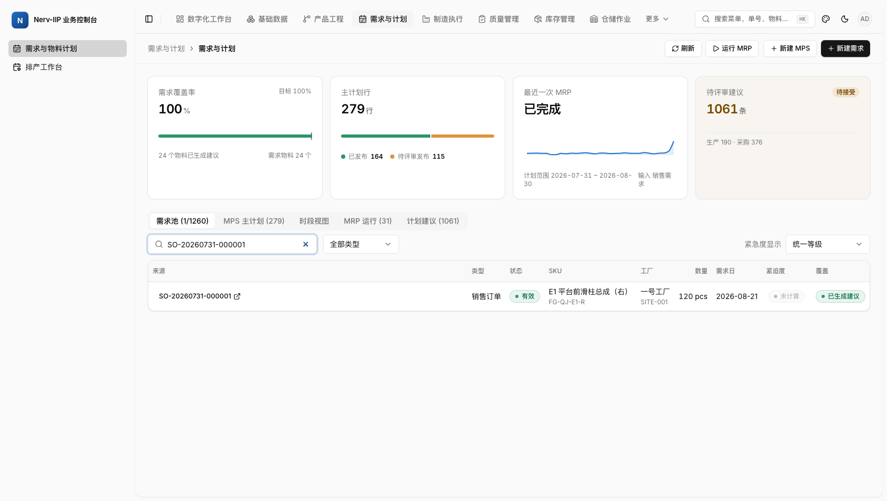
3. **点右上「运行 MRP」**，弹框只收计划范围两个日期（默认 今天 ~ +30 天，本轮 2026-07-31 ~ 2026-08-30，覆盖 8/21 需求日）。
   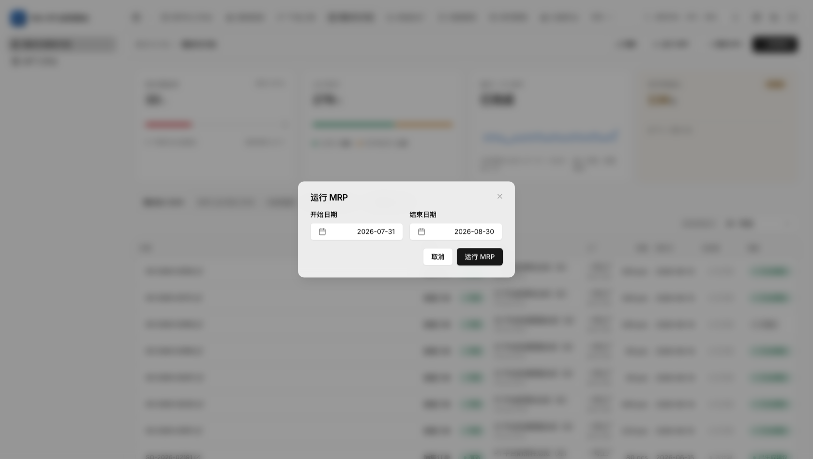
4. **点「运行 MRP」提交 → 立即受理（异步任务模式，#1310）**：弹框内约半秒出现「已受理，排队等待计算…可关闭此窗口，后台继续执行，完成后自动刷新」（第三轮实测受理 **0.56 秒**）。**弹框全程可点「关闭」收起**，页面每 ~2 秒轮询运行状态；完成后无论弹框开关都会 toast「MRP 计算完成，共生成 N 条计划建议」（**第三轮实测 927 条，提交到完成 13.9 秒**）。不再有同步等待，也不再撞网关 10 秒超时（一轮台账 #27 的环境敏感阻断被根治）。若计算失败，toast 透传服务端 failureReason。
   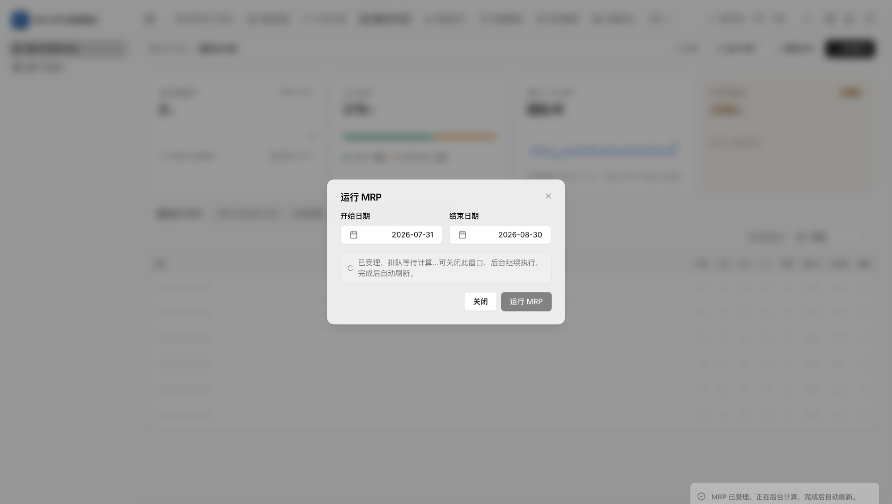
   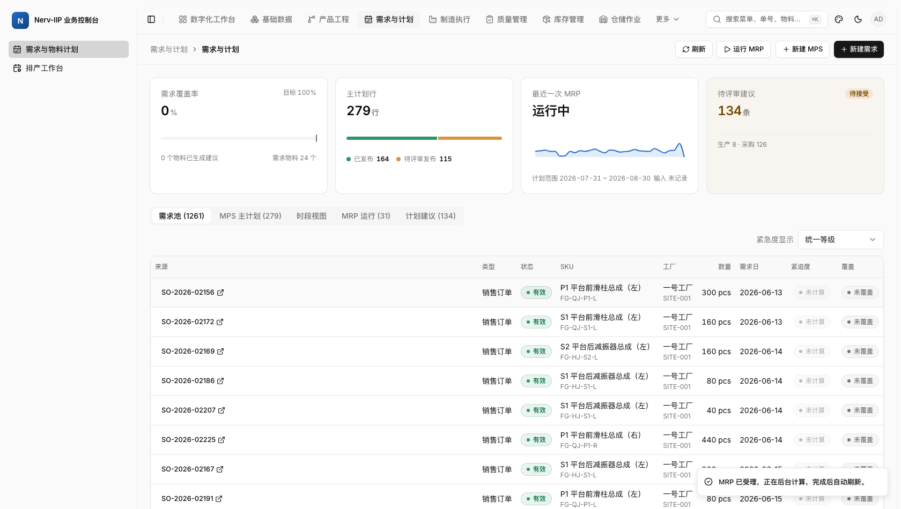
   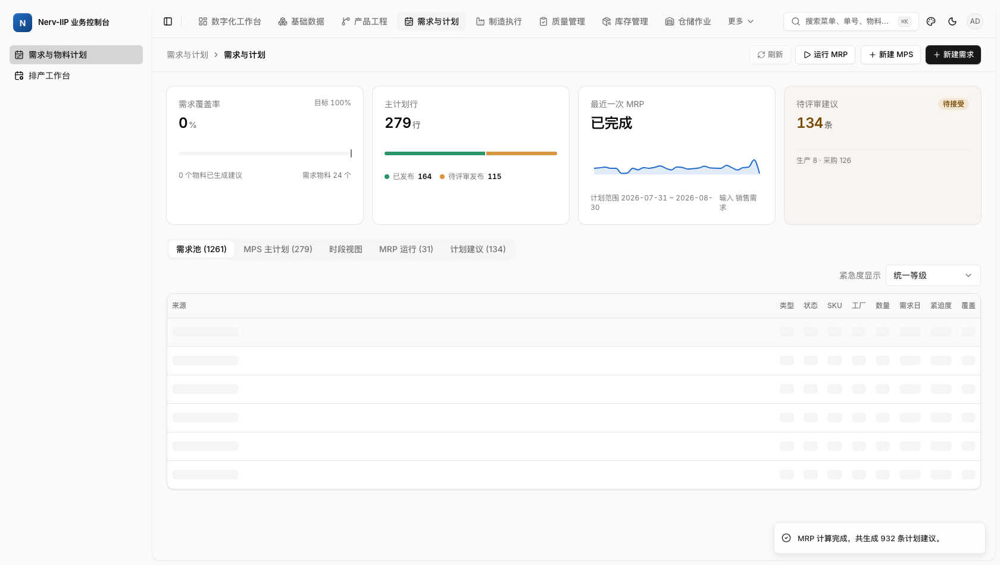
5. **完成后工作台自动刷新**：「最近一次 MRP」卡显示本次运行（已完成 · 计划范围即本次窗口），需求覆盖率由 33% 变 **100%**（24/24 物料），待评审建议卡给出 生产/采购 分项计数（本轮 生产 189 · 采购 375）。
   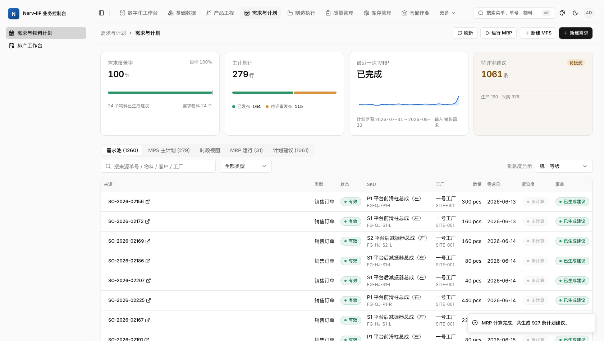
6. **计划建议页签 → 类型筛选「生产建议 (→MES)」**，找到 FG-QJ-E1-R / 需求日 2026-08-21 一行（**本轮 120 pcs**，不再有二轮的合批翻倍；行上有净需求公式卡：`120 - 0 - 0 = 120`，总需求/现有库存/预留/在途/安全库存逐项摊开）。点「接受」。为什么：接受生产建议=把计划意图转成 MES 工单。注意：建议列表只有类型/状态筛选，历史运行的过期建议混排在内，认需求日和数量（台账 #33）。
   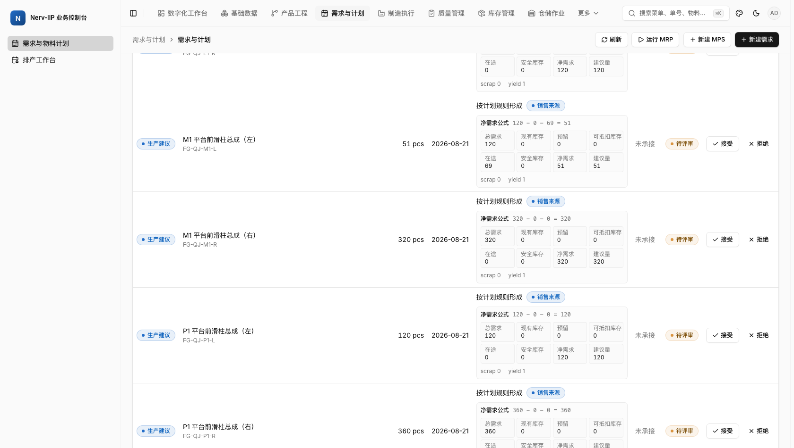
7. **toast 承接成功并自动跳转工单详情页**（本轮 `WO-20260731-000001`）。落点页**满载**：工单状态 已创建、计划数量 120、工序完成 0/8 道、用料齐套「阻塞 · **4 项缺料**」+ 开工阻塞逐项给出「物料缺料 / 在工单详情『用料齐套』发起领料；物料到线边后确认收料」。页面顶部有「对该单排产 / 报工记录 / 完工入库 / 质量检验 / 取消工单」入口。
   ⚠️ **这张主链工单因 4 项缺料开不了工**——第 5 棒要演示「逐工序开工」请改用已齐套的种子工单（见 §5）。
   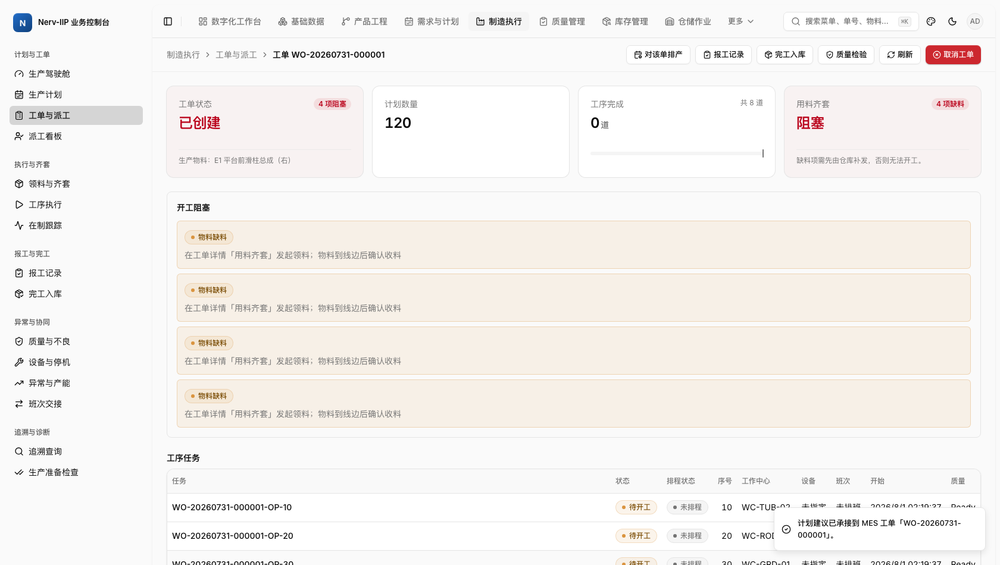
8. **回到计划建议 → 筛选「采购建议 (→ERP)」**，接受一条本批展开的组件采购建议（第三轮实例：RM-OIL-01 减振器专用油 10#，建议量 40 l，净需求公式 `39 - 0 - 0 = 39`，含 2% 损耗）。toast 承接成功并跳转 ERP，请购单生成（本轮 **PR-20260731-000001**），状态 待询价/转单。
   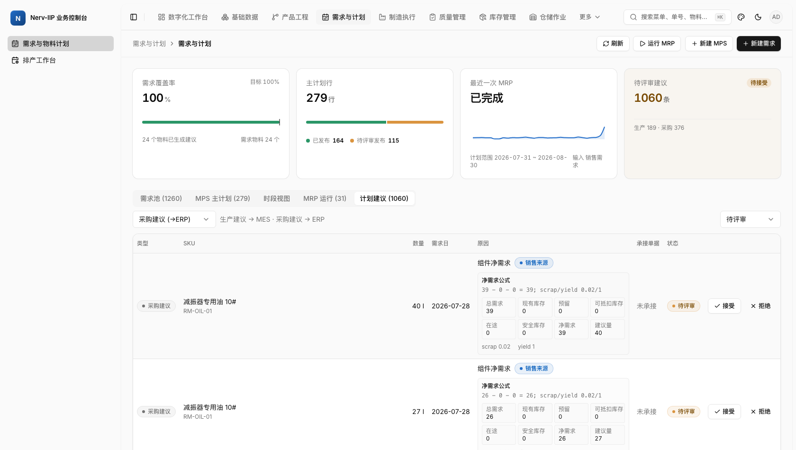
   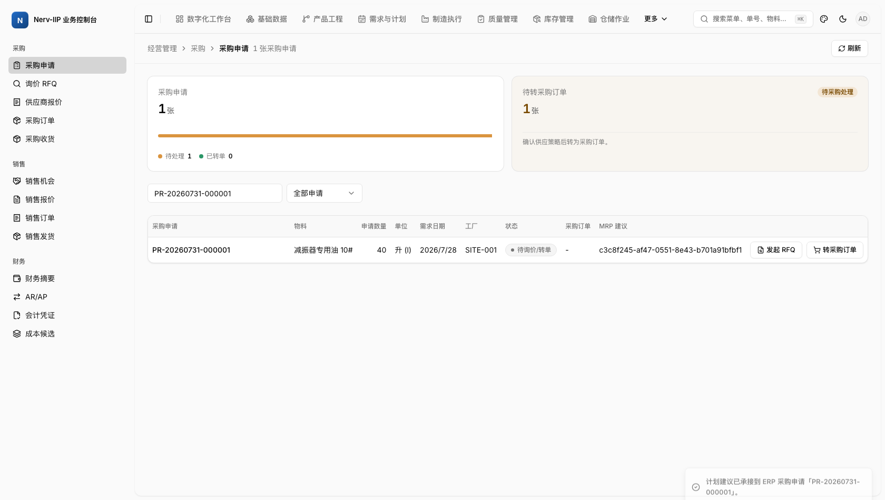
9. **在 MES 工单列表核对新工单**：制造执行 → 工单与派工，工具栏左侧是**作业范围选择器**（#1296 新增，admin 自动选定「当前组织（组织）」，多授权范围时在此切换），搜索框输入工单号直达新工单（240 pcs、交期 2026/8/21、OP-10~OP-80 全部排队中）。
   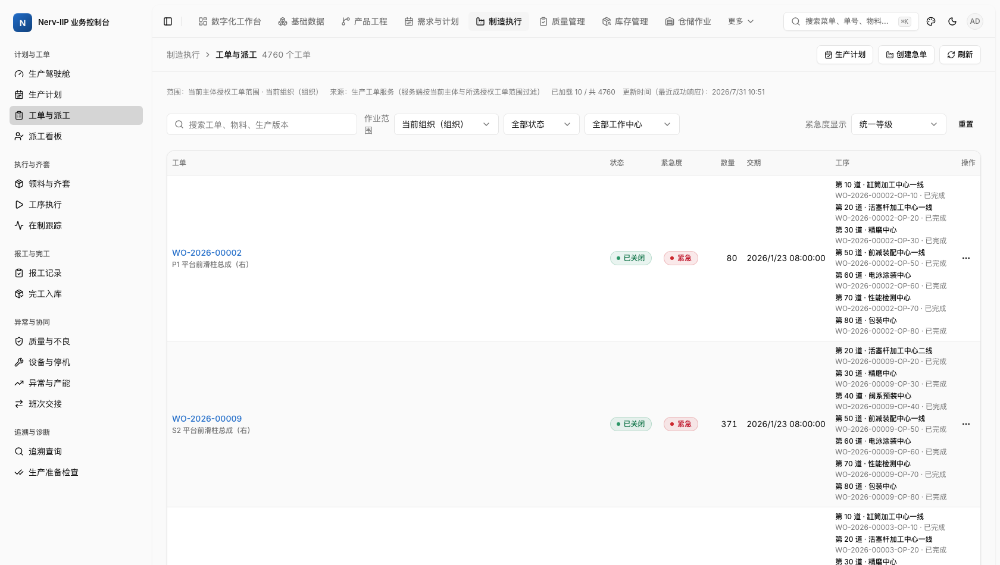
   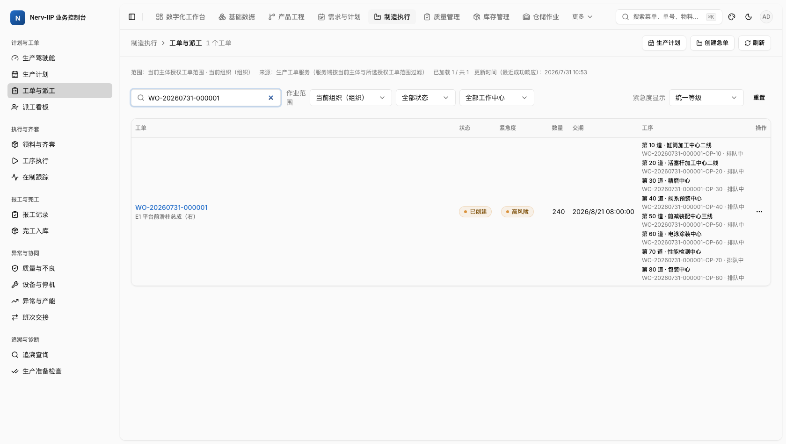
10. **回订单履约追踪复查**（销售订单列表 → 主链单 → 履约追踪）：销售订单 ✅ / 生产需求 ✅ / APS 紧急度 ✅，但 **MRP 建议与 MES 工单两个环节仍显示「尚未建立关联」**。这已不是后端缺口：#1295 后关联键已逐单持久化（MES 追溯 API 对合批工单同时输出两张销售订单的 DemandSource 节点），是抽屉前端尚未接线（#1304 跟进）。演示时勿以追溯抽屉判断链路是否打通，可改讲工单详情页与承接 toast。
    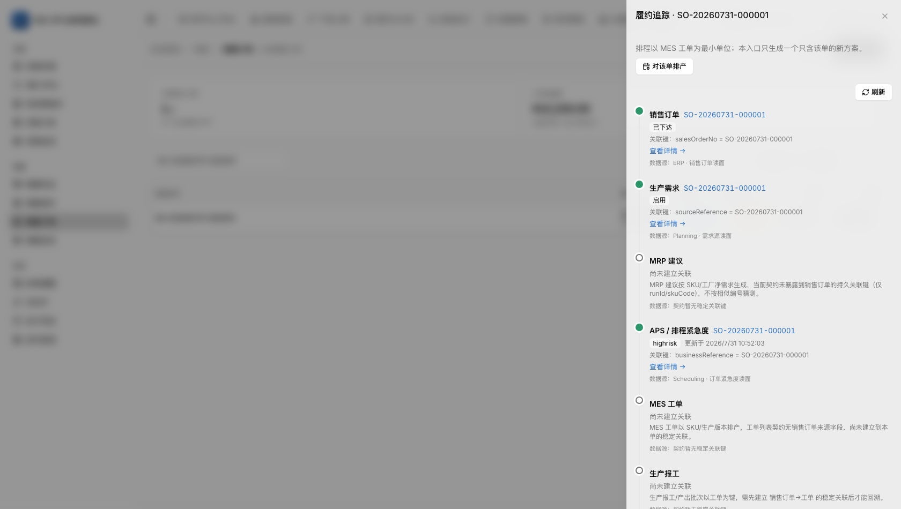
11. **拒绝一条无关建议并核对 KPI 口径**（#1273 统一口径回归）：筛选采购建议，拒绝一条与本单无关的建议（本轮 RM-OIL-02 239 l，后减振器族用油）。拒绝弹框强制填写原因（≤128 字，输入框在弹框正中）。确认后：待评审建议 KPI 与页签计数同步 -1（本轮 1064 → 1063，采购 379 → 378），被拒建议退出待评审列表。
    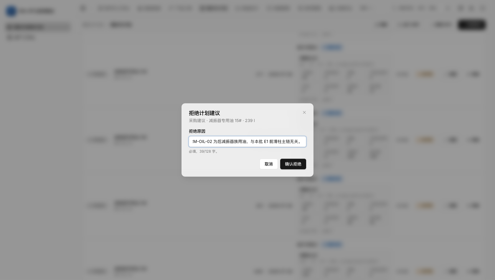
    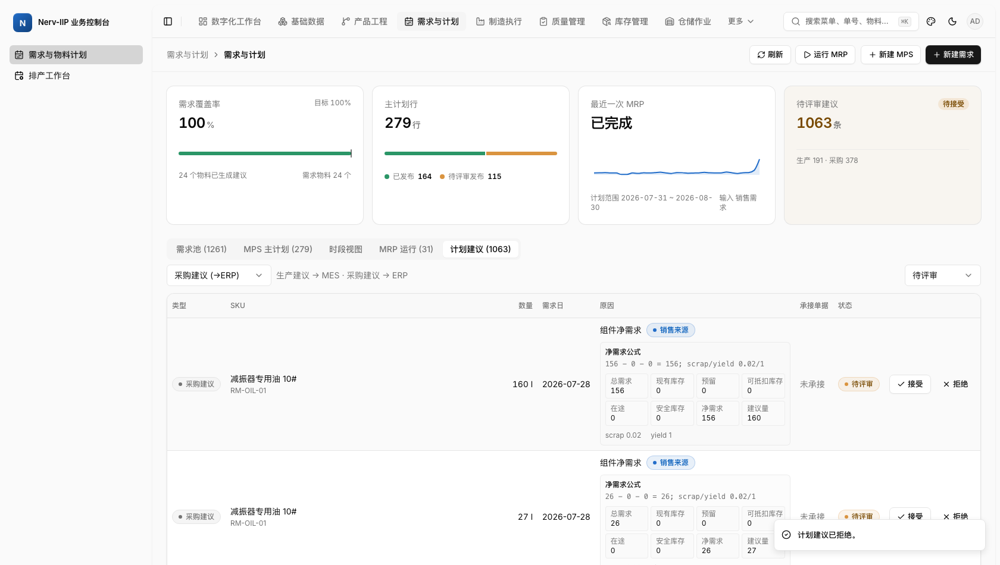

交接给下一棒（生产/车间）：MES 工单 **WO-20260731-000001**（FG-QJ-E1-R，240 pcs=主链 120+重复单 120 合批，交期 2026-08-21，状态 已创建，8 道工序 OP-10~OP-80 全部排队中；齐套阻塞：11 项物料全部报缺口，含 RM-OIL-01——MRP 与 MES 齐套库存口径差异（台账 #16/#24）留给生产棒次按备料/领料流程核实）；ERP 请购单 **PR-20260731-000001**（PK-LBL-03，4741.98 pcs，待询价/转单）交采购棒次。追溯请用工单详情页/承接 toast 讲，履约抽屉计划环节未接线（#1304）、追溯查询页选不到新工单（台账 #32）。

## 3. 工艺/产品工程师：工程与生产准备（主档核对 → 工程文档 → 工程变更 → 口径核查）

> **第三轮未重走 ⊘ · 沿用第二轮结论**（时间用于 6 项修复回证）。本章数据与第三轮栈同一套种子，
> 步骤仍然可信，但未在第三轮栈上逐步复核。两处已知阻断（工程变更无法创建 #21、文档无上传通道 #19）
> 第三轮未复验，演示前请按第二轮结论准备。
> 唯一需按当轮改的数字：交叉验算请用**当轮工单数量 120**（不是二轮的 240）。

角色背景：主链销售订单已转成 MES 工单（FG-QJ-E1-R 合批，OP-10~OP-80；**工单号/数量以当轮 state.md 登记为准**，二轮为 WO-20260731-000001 · 240 pcs）。投产前工程师要确认：工程资料（物料/MBOM/路线/版本）齐备且与计划口径一致、作业文档在位、变更通道可用。

1. **顶部「产品工程」→ 工程物料**，搜索框输入 FG-QJ-E1-R：1 条修订（修订 1，「E1 平台前滑柱总成（右）」，已发布）。点「查看」看修订明细。为什么：物料修订已发布是 BOM/路线可引用的前提。注意：详情抽屉只有名称/状态/两个时间戳，无规格、图号，也不联动 BOM/路线/文档——查全一个产品要跑 5 个页面各搜一遍（见台账 #25）。
   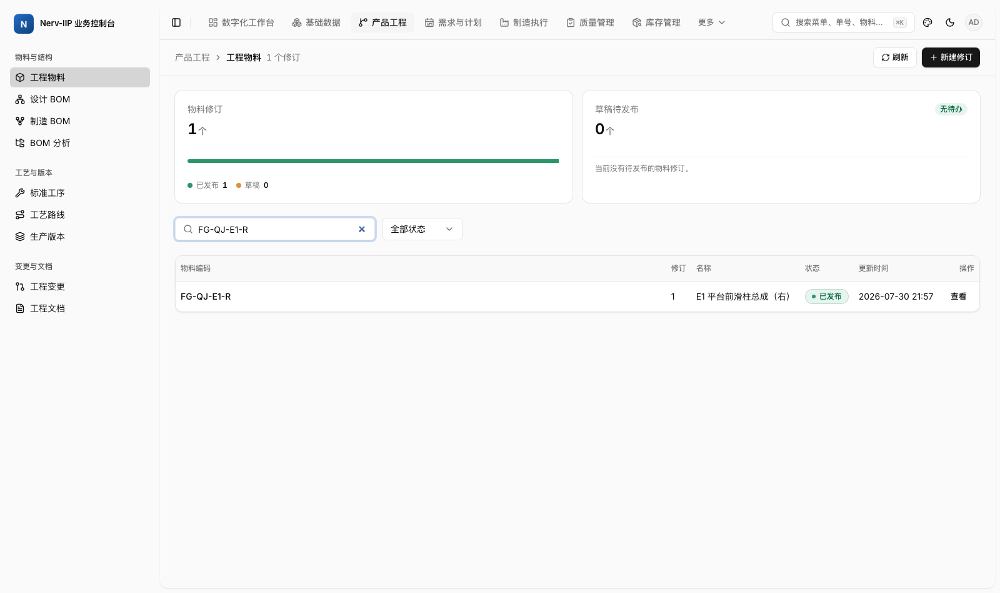
   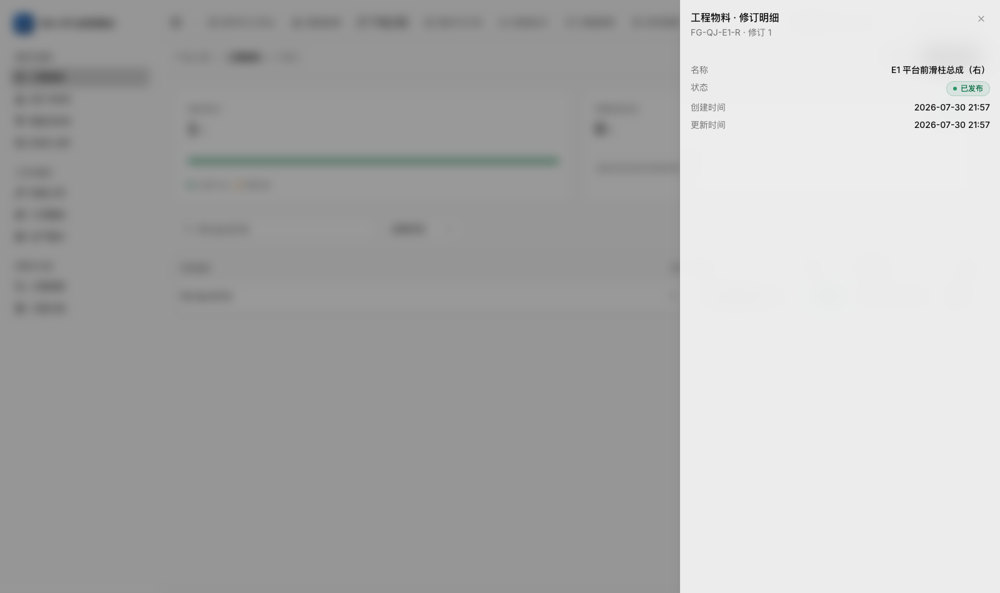
2. **制造 BOM 页，按产出物料筛 FG-QJ-E1-R → 「查看物料」**：MBOM-FG-QJ-E1-R 修订 1、已发布、生效 2026-01-05，**11 个物料行**：PK-BOX-02 0.25 件/损耗 1%、PK-LBL-03 1 件/2%、RM-ACC-03 2 件/0.5%、RM-ACC-06 1 件/0.5%、RM-ACC-08 4 件/1%、**RM-OIL-01 0.65 升/2%**、RM-SEL-02 2 件/1%、RM-SPR-02 1 件/0.5%、SF-ROD-06/SF-TUB-06/SF-VLV-06 各 1 件/0%。**用当轮工单数量做交叉验算**（单耗×损耗×工单数量应等于工单齐套/缺口数）：二轮 240 pcs 实测 PK-LBL-03 240×1×1.02=244.8、RM-ACC-03 240×2×1.005=482.4、RM-OIL-01 240×0.65×1.02=159.12，与工单齐套表逐项吻合 ✓。
   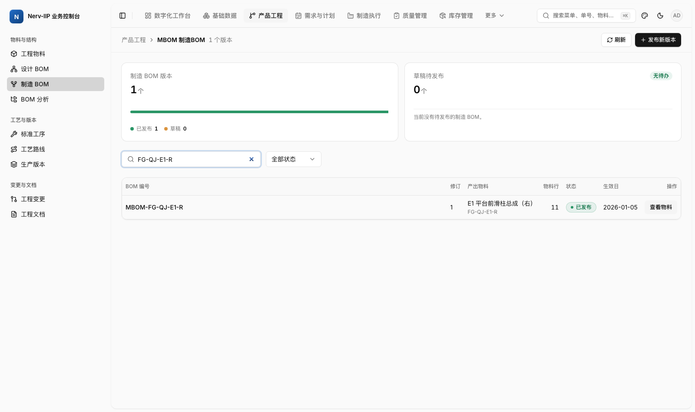
   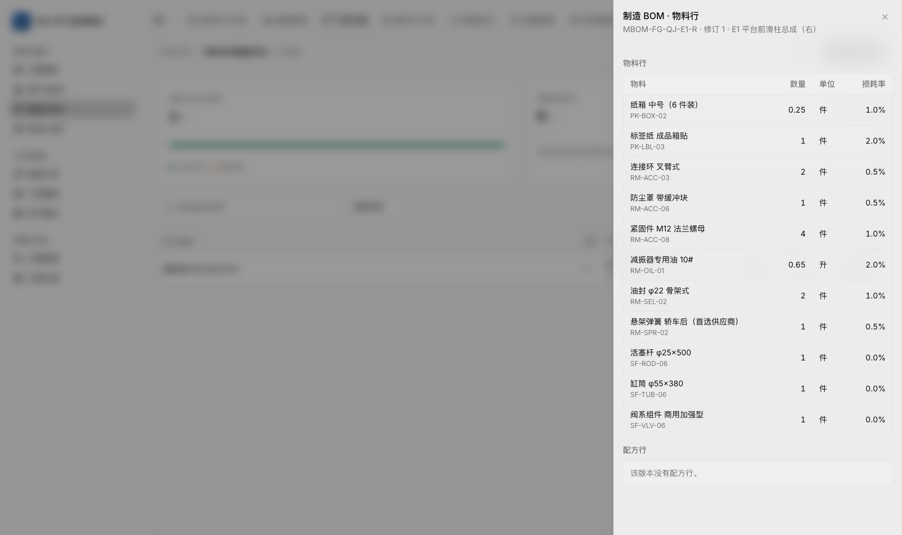
3. **工艺路线页筛 FG-QJ-E1-R → 「查看」**：ROUTING-FG-QJ-E1-R 修订 1、已发布，8 道工序＝工单的 OP-10~OP-80：10 下料（缸筒加工中心二线 22 分）、20 CNC 精车（活塞杆二线 31）、30 精磨（20）、40 阀系预装（14）、50 总装（前减装配三线 19）、60 电泳涂装（36）、70 性能终检（10）、80 包装（8）——与工单工序/工作中心一致 ✓。**标准工序**页另有 8 个 OP-WB-* 标准工序库（含准备/加工工时与报工/质检控制），路线工序名与其一一对应。
   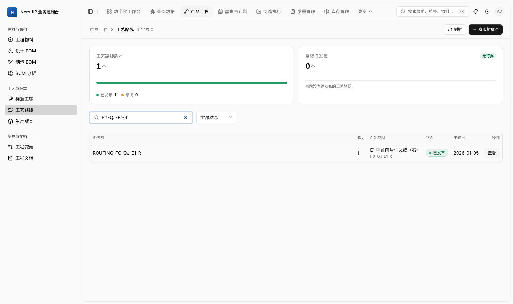
   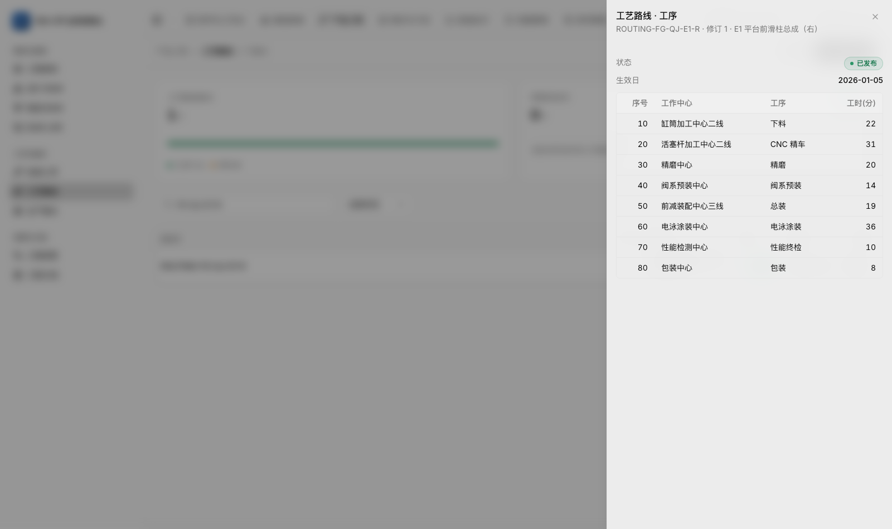
   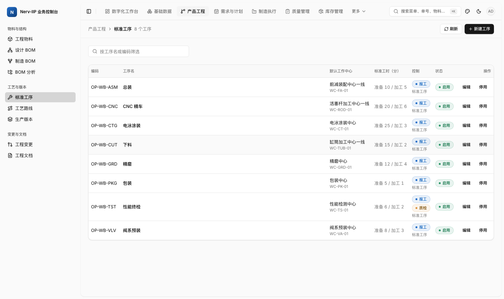
4. **生产版本页筛 FG-QJ-E1-R**：1 个版本，绑定 MBOM-FG-QJ-E1-R:1 + ROUTING-FG-QJ-E1-R:1，2026-01-05 起长期有效、批量不限、默认、有效。页面还有「版本解析」器（选物料+生效日+批量查该用哪个版本）。**结论：四件套（物料修订/MBOM/路线/生产版本）齐备一致，投产工程数据无缺口。**
   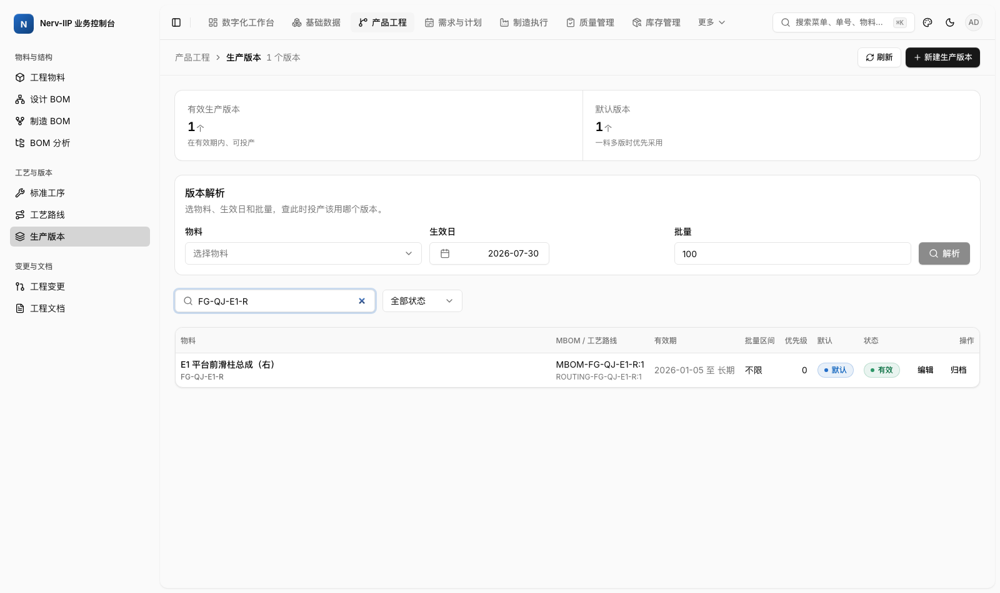
5. **打开工单工程视图核对工艺/物料（#1296 修复后行为）**：MES → 工单与派工，工具栏的**作业范围选择器**（「当前组织（组织）」）会自动选定 admin 的授权范围，列表直接可见全部工单（二轮 4760 单）；搜索框输入当轮工单号直达。进详情页：工单状态/计划数量/工序（OP-10~OP-80 共 8 道）/用料齐套表全部满载，可与第 1~4 步的四件套逐项对照。为什么：这是工程师核对「工单用的就是我发布的那套 BOM/路线」的唯一读面。注意：开工阻塞区的原因以英文生码「\<物料\> shortage \<数\>」直出且被截断，完整缺口数值在下方「用料齐套」表看（台账 #35）。
   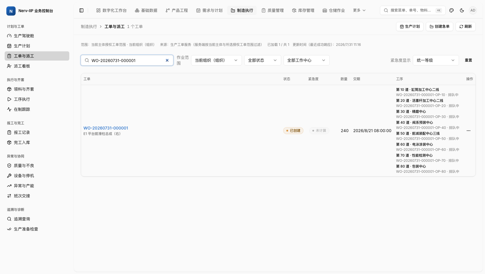
   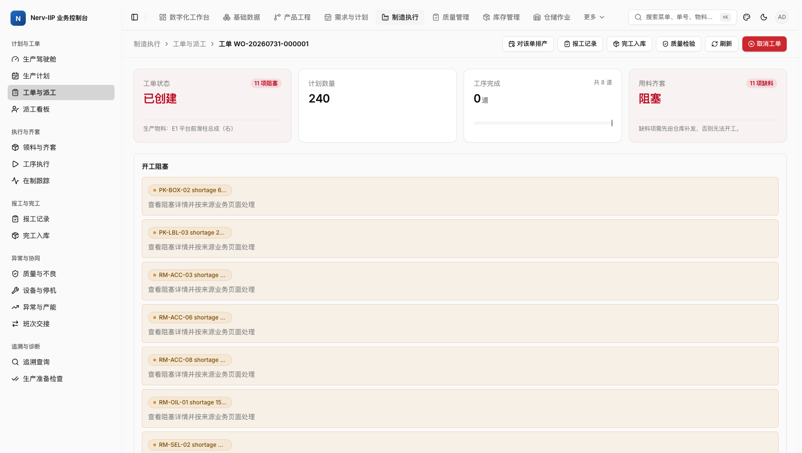
   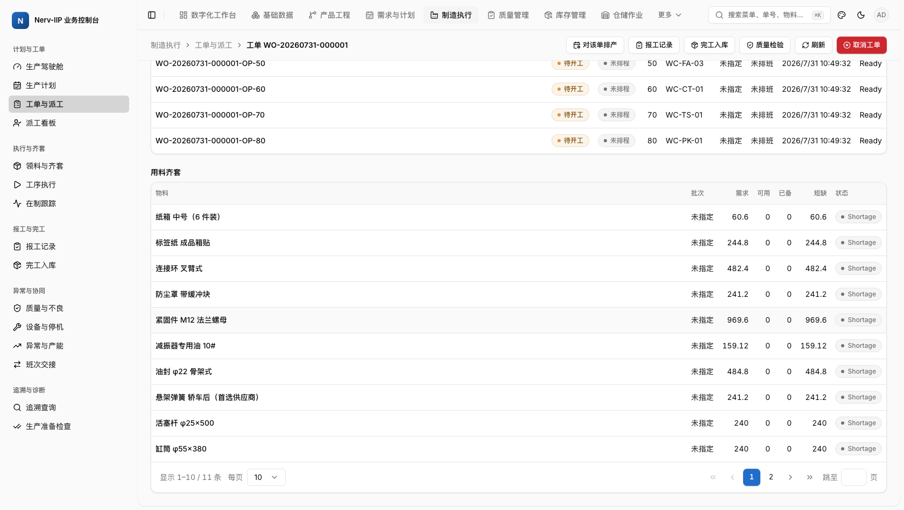
6. **工程文档：查产品挂的图纸/SOP**。工程文档页按关联物料筛 FG-QJ-E1-R：**只有 1 份**（DOC-2026-0087 检验规范），无图纸、无作业指导书——投产文档不齐（台账相关）。点「登记文档」补一份作业指导书：类型「作业指导书」、文件名 E1平台前滑柱总成右_总装作业指导书_Rev1.pdf、内容类型 application/pdf、关联物料 FG-QJ-E1-R。**文档号别照抄本手册**：号段纯手填、无自动取号，种子已占到 DOC-2026-0108，撞号会 400 且 toast 只报「请稍后重试」（真实原因被吞，台账 #34）——选一个明显靠后的号（二轮用 DOC-2026-0201）。**注意：表单没有文件上传控件**，「文件引用 ID」是手填文本（后端无上传通道，二轮复现，台账 #19）——真实 PDF 传不上去。提交 toast「已登记」，回列表筛 FG-QJ-E1-R 现在 2 份 ✓。
   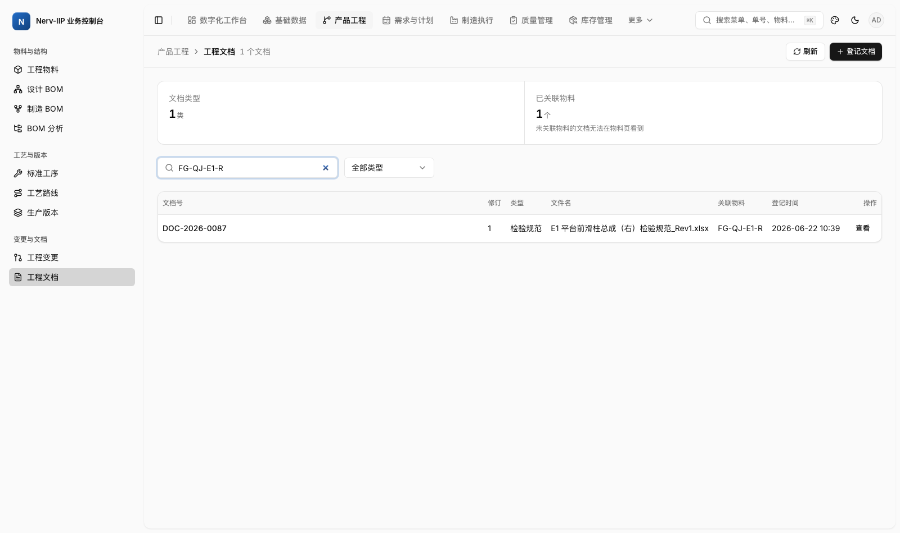
   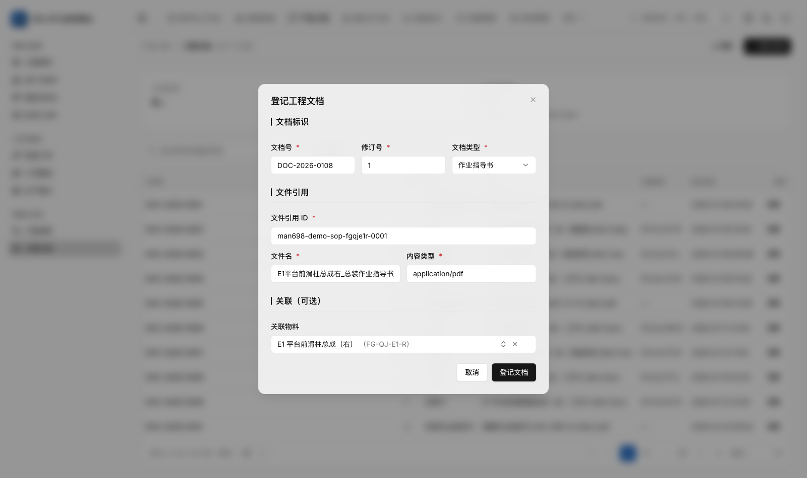
   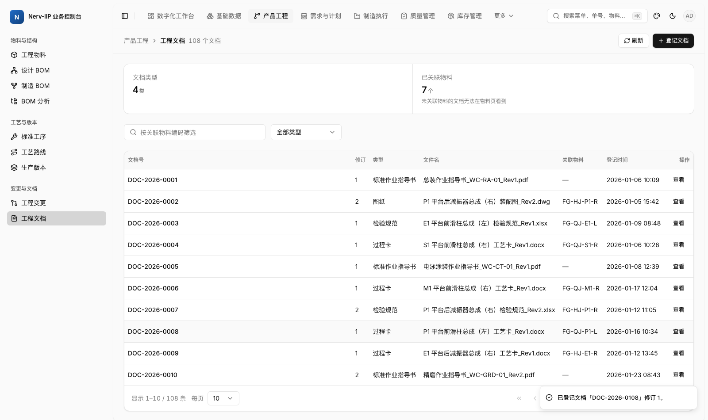
   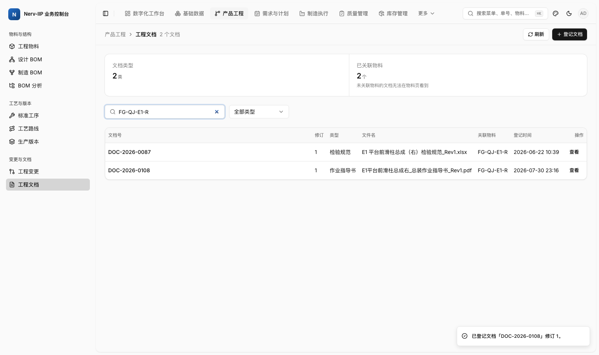
7. **工程变更：先看现状**。工程变更页 58 条变更（质量纠正/图纸升版/供应商替换等，草稿/待生效/已发布俱全）。打开 ECO-2026-0058 详情：受影响版本 3 条（EBOM/MBOM/ROUTING-FG-QJ-S1-R:1）；但审批链面板拉取 APR-2026-0058 报 400「ChainId must be a valid GUID」，同屏又显示「当前单据还没有审批链」——种子审批引用与审批服务契约不符（台账 #22）。
   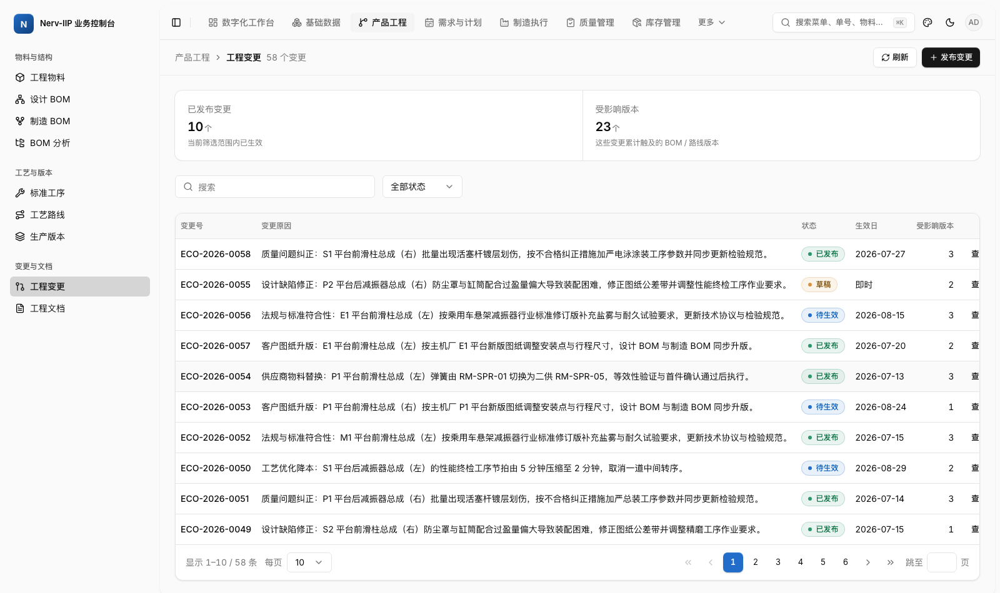
   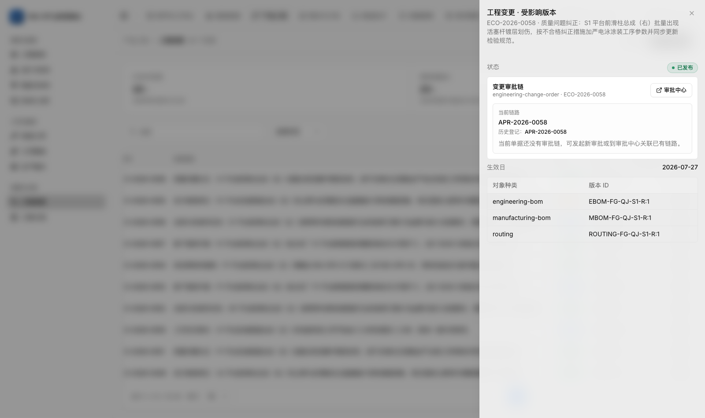
8. **【实测阻断】发起演示级变更走不通**。点「发布变更」，填变更原因（FG-QJ-E1-R 的 RM-OIL-01 用量 0.65→0.60 升提案）、受影响版本选「制造 BOM（MBOM）」+ MBOM-FG-QJ-E1-R:1。点「预览影响」——**影响链真实产出**：MBOM（直接）→ 工艺路线（派生）→ 生产版本（下游）→ APS 排程/MES 工单/MRP 重算（候选），并给出 warning 风险提示（引用真实生产版本 ID），这是本页最亮的演示点。但**提交被硬校验拦死**：「请先关联一条真实审批链，再发布工程变更」，而 (a) 弹框审批面板不允许发起新审批（allow-start=false）；(b) 新变更尚无单号本也发不了；(c) 审批中心「模板配置」只有 不合格品处置、采购订单 2 个模板，没有工程变更模板；(d) 无任何现成链可关联——**UI 无法发起任何新工程变更**，58 条历史全是种子（台账 #21；二轮复现，已立案 MAN-711/#1293 未修）。另：发布弹框整高 970px 超出 950px 视口且无内部滚动，底部按钮被裁切（台账 #23）。
   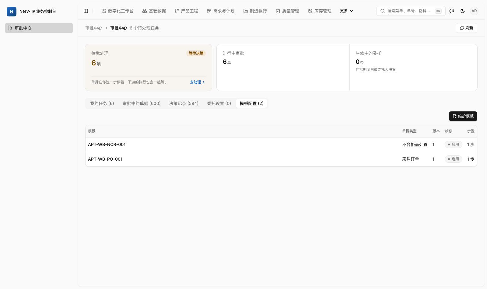
   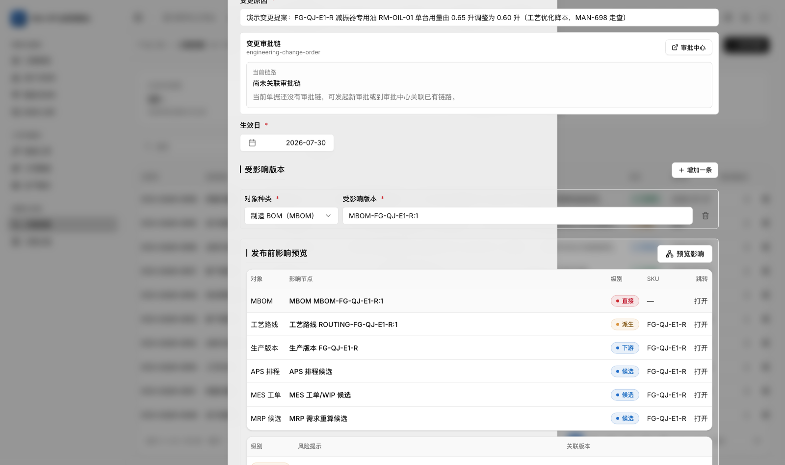
   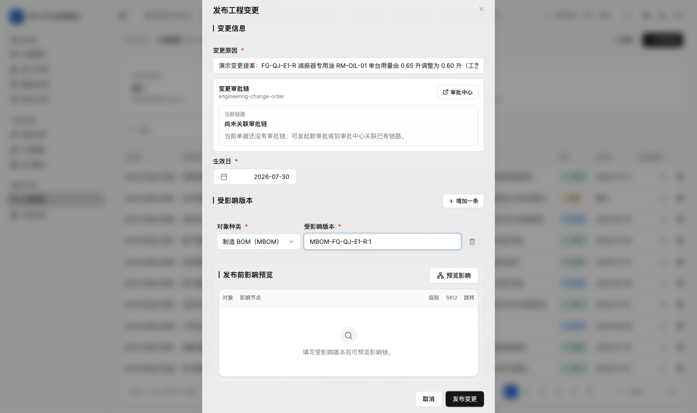
   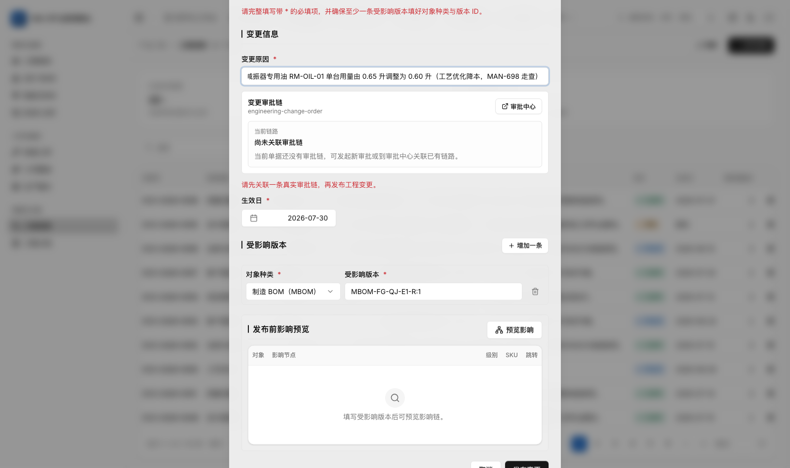
9. **【复核台账 #16】RM-OIL-01「计划说不缺、车间说缺」的两侧证据**。工程侧：MBOM 单耗 0.65 升 × 损耗 2% × 工单数量 = **MES 齐套报的缺口数**（一轮 220 台=145.86 升，二轮 240 台=159.12 升，逐轮吻合），即 MES 把可用量按 0 计、缺口=毛需求。库存侧：库存可用量页选 RM-OIL-01——**现存 26,100 升全部在原料仓 WH-WB-RM-01（56 条批次明细），可用 26,100、预留 0、冻结 0**，MRP 读的就是这份全厂库存所以判定充足。结论：齐套检查不认「在仓未预留」的原料（疑似只看线边/已备料口径），原料没配送到线边就整单报缺——11 项组件全数报缺与此一致。是否属预期语义留给生产棒次按领料/备料流程验证（台账 #24）。
   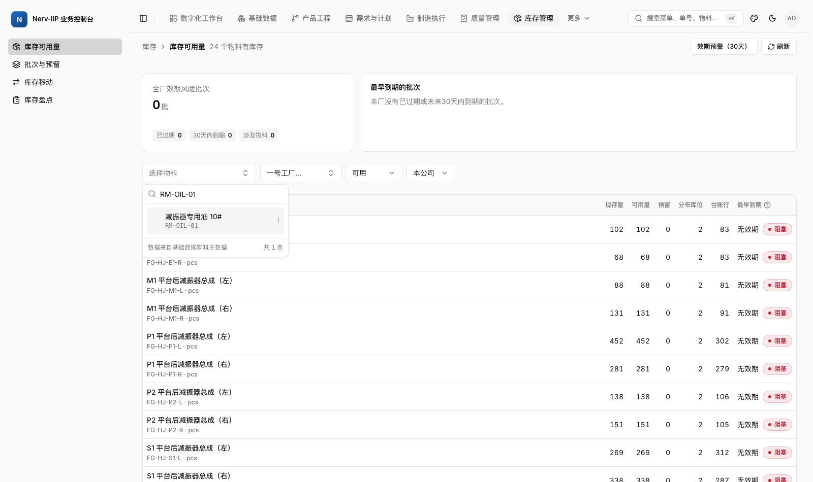
   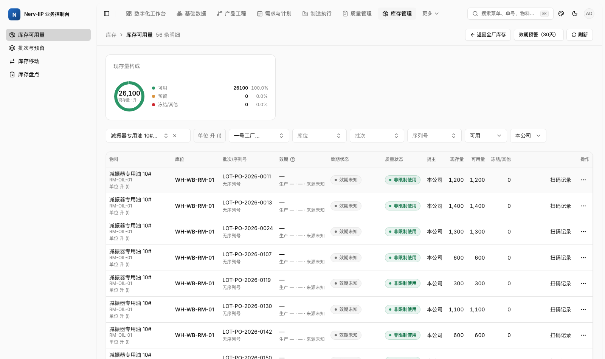

交接给下一棒：工程四件套齐备一致，可放心讲「工程数据就绪」；作业指导书元数据已登记并挂 FG-QJ-E1-R（文档号见当轮 state.md，二轮为 DOC-2026-0201）；工程变更仍无法创建（UI 阻断，台账 #21，已立案 MAN-711/#1293）；工单读面已可用（#1296），生产棒次直接按 #24 的口径结论验证备料/领料后齐套是否转绿。

## 4. 调度员：排产工作台（待排池 → 排程窗口 → 生成首版 → 查看方案）

> **第三轮已真机重走 ✅ 二轮的阻断消失了**（2026-08-01）：
> ✅ **台账 #40 已修复**——二轮「设备可用性 ID 错配 → 任何新方案 0 排 N 未排」不再复现。
> 本轮新方案 **plan-019fb97793c479ba950ada13eeb20aa4**：**1 道工序真排进去了**，
> 契约指标 `equipmentRiskOperationCount: 0`（设备风险归零）、`materialRiskOperationCount: 1`。
> ✅ **#1329 风险 chip 回证通过**：甘特图上工序条渲染出橙色 **「缺料待备」** chip，图例含
> 「未排工序 / 锁定分配 / 缺料待备」。注意「设备数据风险」chip 本方案**不出现是对的**——
> 该方案设备风险数为 0，无风险即无 chip，不是缺失。**chip 只有新生成的方案才有**（迁移前的历史方案补不回来）。
> ⚠️ **演示前必做**：甘特图区会浮出 **DHTMLX 评估版水印**（含厂商邮箱与链接，台账 #84），
> 大屏演示前先处理掉。

角色背景：计划员已把生产建议承接为 MES 工单 **WO-20260731-000001**（FG-QJ-E1-R 120 pcs，交期 2026-08-21，OP-10~OP-80 排队中，4 项缺料）。调度员今天要把它排进产线计划。

1. **顶部「需求与计划」→ 右上「排产工作台」**（路由 `/scheduling`）。落点是「排程总览」页签（挑工单 → 生成 → 锁定 → 发布的主线），页头计数「N 个方案」说的是历史排程方案数（本轮起始 42）；另有「表格」（历史方案只读查阅）与「甘特图」两个页签。
   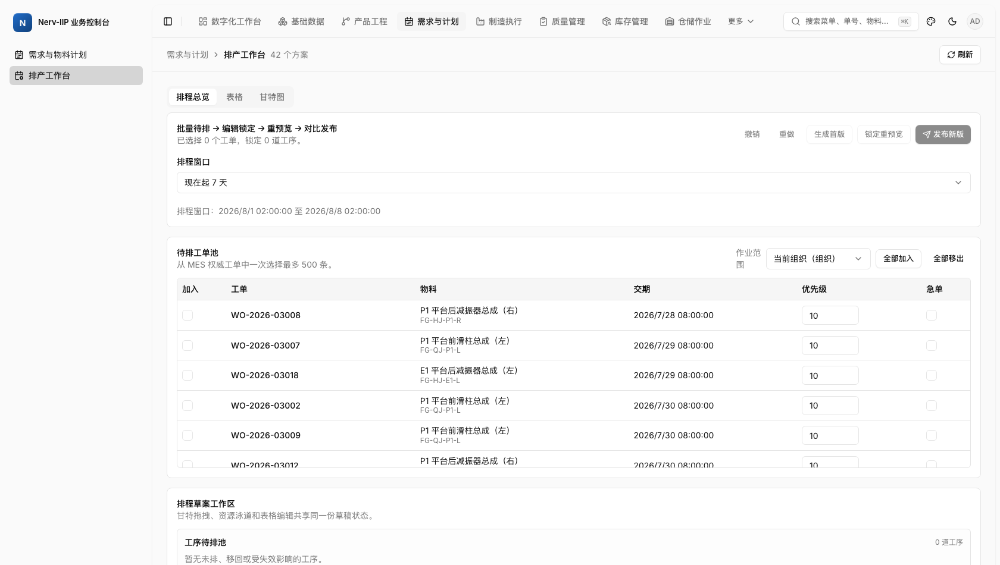
2. **在「待排工单池」找到主链工单**：池子从 MES 权威工单拉取（一次最多 500 条），带作业范围选择器（与 MES 工单页共享，admin 自动选定「当前组织（组织）」）。列表按交期升序，WO-20260731-000001（E1 平台前滑柱总成·右 / FG-QJ-E1-R / 交期 2026/8/21）在列——#1296 修复后这里是真列表，不再假空态。⚠️ 池子无搜索框，2026/8/21 交期附近同日工单多时只能滚动找（UX 台账见 reports/24-scheduler.md）。
   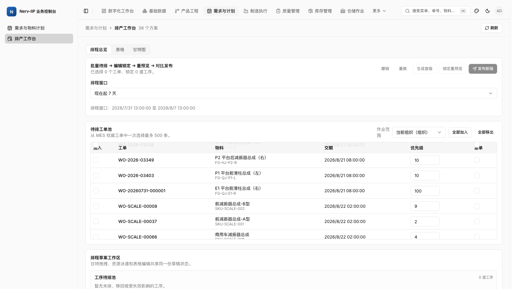
3. **勾选该工单**（行首「加入」复选框；可顺手在同一行设优先级数字与「急单」勾选）。勾选前顶部「生成首版」是灰的，hover 显示原因「还没有选中工单：先在待排工单池里勾选要排的工单」（#1271/#1278）；勾选后按钮变可用，hover 变为「按当前勾选的工单生成首版排程方案（窗口起止）」。
   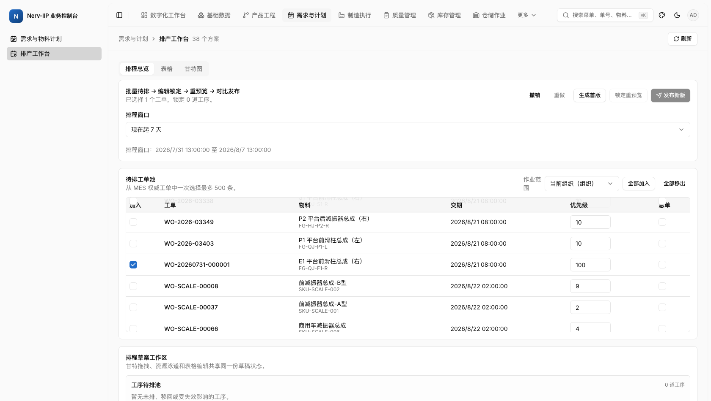
4. **设排程窗口**（#1279）：下拉预设「现在起 1/3/7/14/30 天」或「自定义起止时间」（两个 datetime-local），下方摘要实时显示解析后的窗口；窗口非法（起止倒置/缺值/超上限）时摘要变红且「生成首版」直接灰掉并在 hover 里说明改哪里。本轮先试预设 7 天（窗口到 8/7，**盖不住 8/21 交期**），再改自定义 2026-07-31 08:00 ~ 2026-08-22 20:00 覆盖交期。
   
   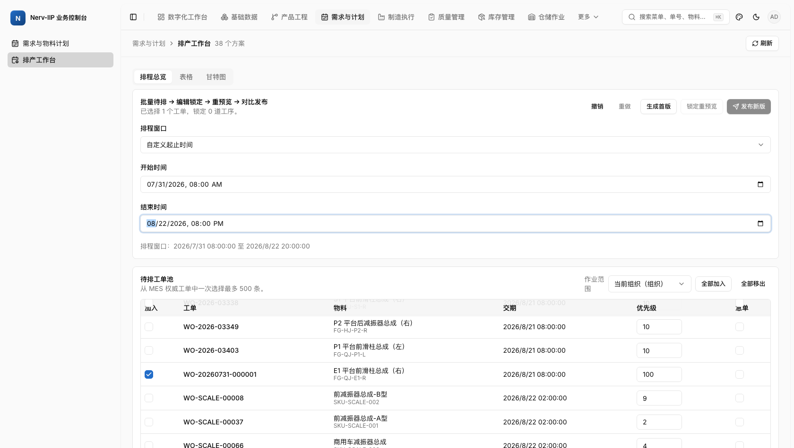
5. **点「生成首版」**：同步 POST 返回后方案立即落库（第三轮实例 **plan-019fb97793c479ba950ada13eeb20aa4**，页头方案计数 42→43）。
   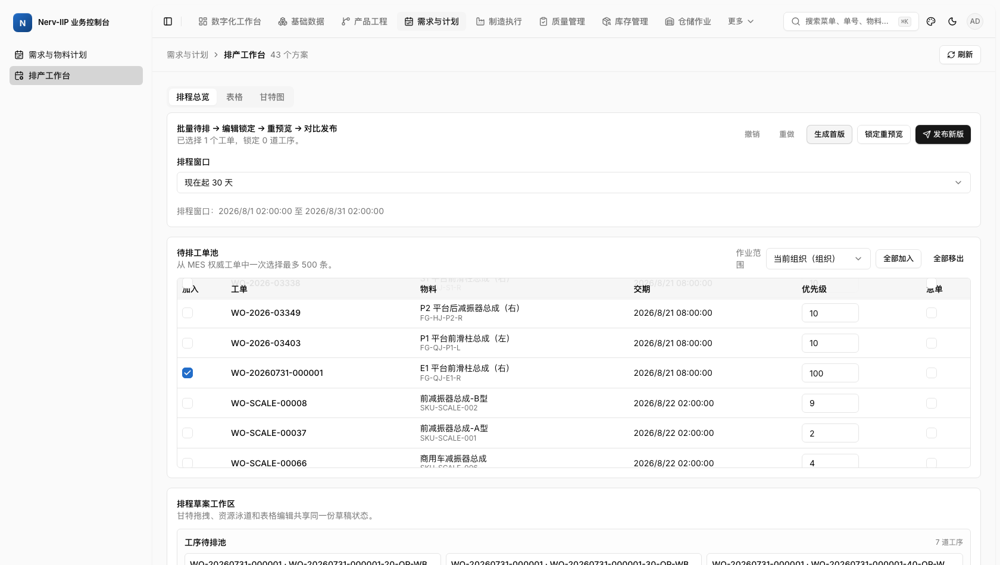
6. **「表格」页签核对方案**：新方案一行可见（已生成 / 工序数 / 冲突摘要 / 创建时间），行操作有「明细」（右侧抽屉：概览/资源分配/资源负荷/冲突与不可排原因）与「发布」；表格顶部有只读边界说明（改排程回草案工作区）。
   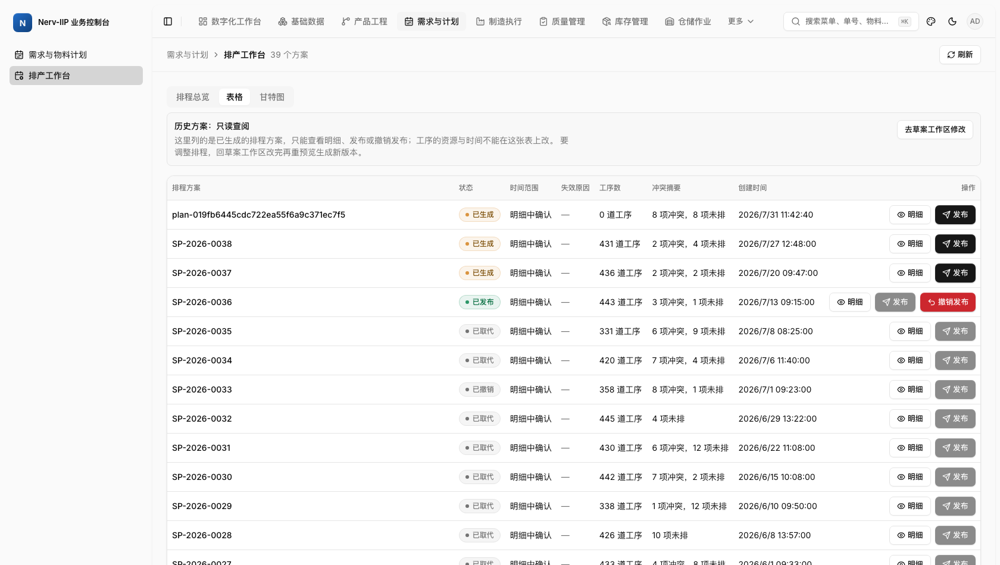
7. **第三轮真实结果：OP-10 排进去了，其余 7 道因缺料待备未排**：表格页该方案显示「已生成 · 1 道工序 · 8 项冲突，7 项未排」。这正是可讲的故事——**约束是真的在算**：主链工单还有 4 项缺料，所以只有不受缺料影响的首序排得进，后续工序标「缺料待备」等备料。二轮那种「一道都排不上」的设备误判（台账 #40）已经消失。
8. **切到「甘特图」页签看 chip 与图例**（#1329 的正题）：工序条上挂着橙色 **「缺料待备」** chip，条上方 KPI 给出 可视工序 1 / 资源 1 / 冲突 8 / 未排工序 7 / 锁定分配 0；图例区列出「未排工序 / 锁定分配 / 缺料待备」。为什么要讲这个：**风险不再只存在于后台指标，而是画在图上让调度员一眼看见哪道工序卡在什么上**。
   ⚠️ 截图右上角那块 DHTMLX 评估版提示是第三方甘特库的水印（台账 #84），演示前请处理。
   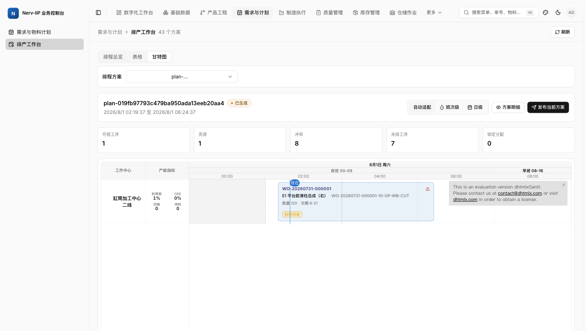

8. **甘特验收（用种子历史方案，如 SP-2026-0038）**：甘特图页签 → 方案下拉选中。图面语言（#1274）：非工作时段底纹（周末 nerv-weekend / 夜间 nerv-offwork）、**班次边界虚线只在「班次级」缩放下出现**（日级看不到属正常，台账 #41）、维护/停机/换线/换型为泳道单元格上的**斜纹底纹**（恒在卡片之下）、泳道头带 利用率/OEE/切换/待料 读数与「瓶颈」标记，图例分组（工序分色/卡片/状态/日历）且工序分色只列本方案实际用到的族。
   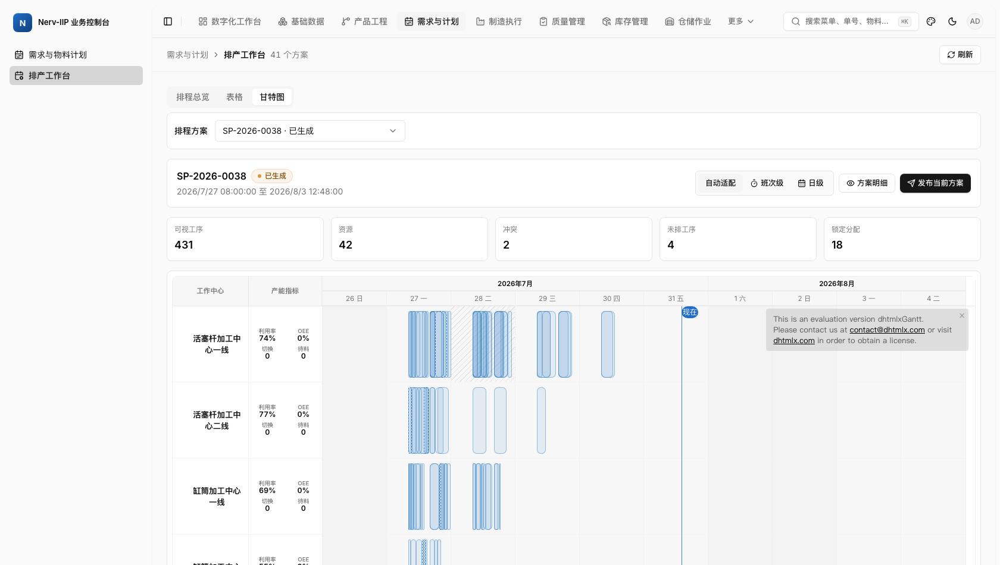
   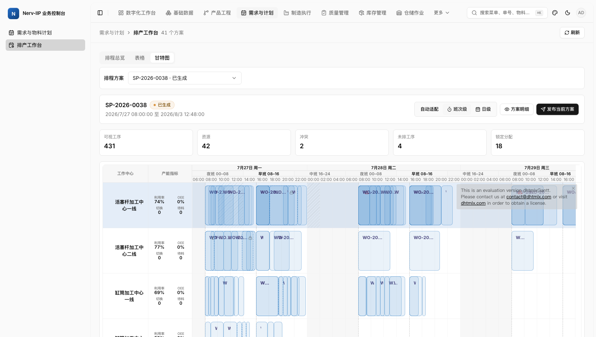
   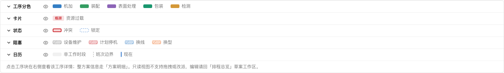
9. **点一个工序块**：右侧**并排**展开工序详情（不是遮罩，甘特变窄仍可见可点，#1272）——物料名/数量/交期（取自 MES 工单）、资源、起止、工时、工作中心人话名（「活塞杆加工中心一线（WC-ROD-01）」）、工序号、锁定状态，以及"齐套率请去物料齐套页核对，此处不估算"的诚实指引。注意：资源视图里泳道行与斜纹格不是任务条，点它们不会开侧板（工单汇总行粒度在草案工作区的「工单甘特」页签才有）。
   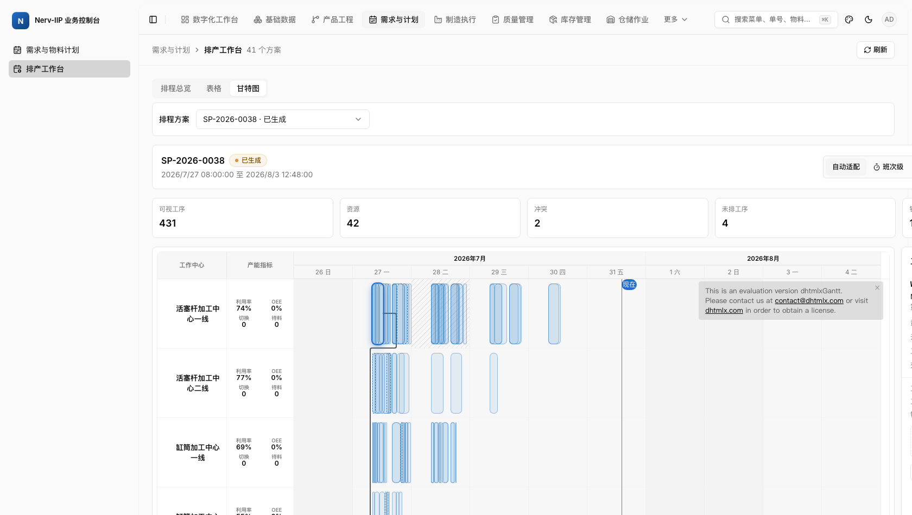
10. **锁定 → 重预览 → 发布**（在草案工作区）：表格编辑页签每行有「锁定/解锁」「持久锁定」「移回待排」；顶部「锁定重预览」灰时 hover 给原因（无草案/有未锁定修改），可用时 hover「保持已锁定工序不动，重排其余工序生成新版本」（实测 200，产出候选版本+版本对比区）；「发布新版」对含错误冲突/未排工序的方案会被后端守卫拒绝（400「Schedule plan cannot be released…」）。发布成功后可在表格对已发布方案「撤销发布」（二次确认，说明 MES 回流后果）。
    ⚠️ 第三轮的新方案仍有 7 项未排（缺料待备），**发布守卫会拒**——想演示「发布」请选一张已排满的种子方案，不要用现场新生成的这张。
11. **单单排产（#1279）**：MES 工单详情页头「对该单排产」→ 弹框先声明语义（**新建一个只含该单的方案，不改动现有方案**；"插入现有方案"能力待 MAN-674）→ 目标工单只读带出 → 同一套排程窗口控件（预设/自定义）→「生成只含该单的方案」→ toast + 自动跳转排产工作台 `?planId=…&orderReference=…`：方案明细抽屉自动打开并显示「正在定位订单 <工单号>」。
    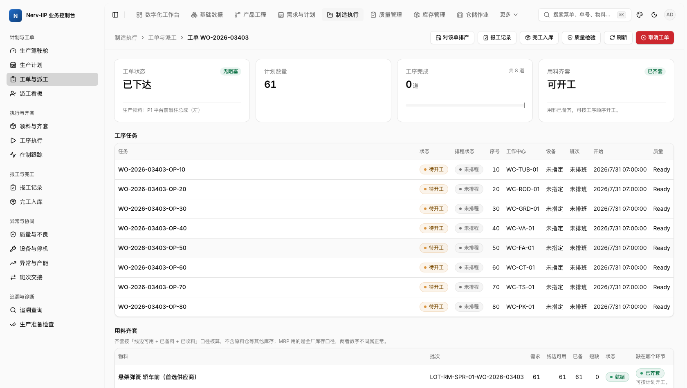
    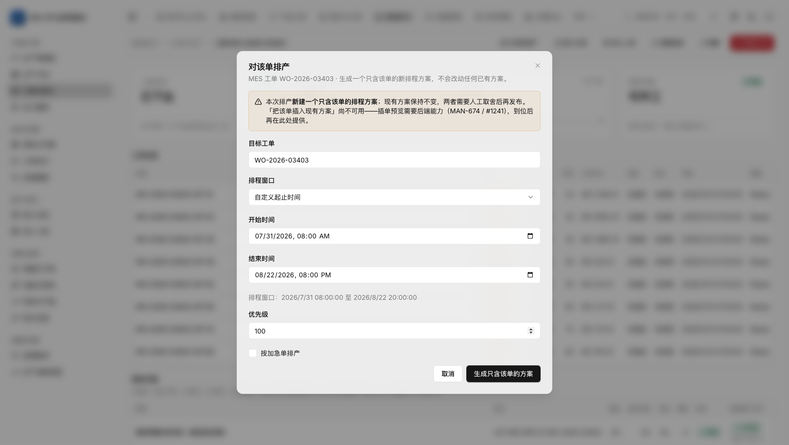
    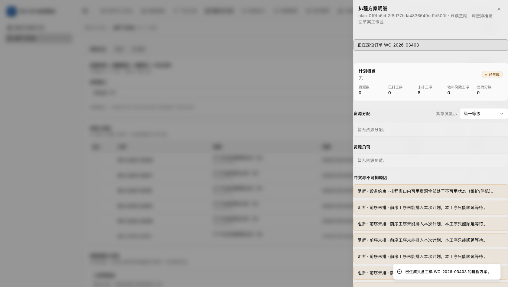
12. **回主链订单看履约追踪**（销售订单 → SO-20260731-000001 → 履约追踪）：#1315 后时间线点亮 销售订单 ✅ / 生产需求 ✅ / MRP 建议 ✅（FG-QJ-E1-R × 120 pcs · 已受理）/ APS 排程紧急度 ✅（随 10 分钟一轮的紧急度刷新更新时间戳）/ MES 工单 ✅（WO-20260731-000001 · 已创建）；抽屉内也有「对该单排产」直达入口。生产报工及以后环节仍「尚未建立关联」（契约无键，面板自述数据源与原因）。
    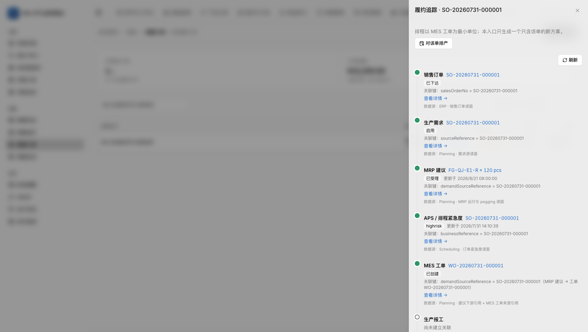

交接给下一棒（生产/车间）：主链工单 WO-20260731-000001（120 pcs，4 项缺料）**首序已排进方案、其余 7 道标缺料待备**——二轮的设备误判阻断（#40）已消失。本棒新生成的方案为「已生成」态草案，未发布，不影响车间执行面。

## 5. 班组/生产：为什么开不了工 → 顺序门 → 报工 → 完工 → 下一道开工

> **第三轮已真机重走 ✅ 本章第一次跑通了「报工 → 完工 → 下一道开工」全链**（2026-08-01）。
> ✅ **#1373 回证通过**：齐套工单的**每一道工序**都带「可执行」证明位（不再只有首序），
> 非首序也能真开工——实测在 `WO-2026-03002` 上完工 OP-60 后**开工 OP-70 返回 200，状态转「加工中」**。
> 唯一会被拒的是**正当的顺序门**：前序没完就开下一道，会中文透传「前序工序尚未完成（WO-2026-03002-OP-60）」。
>
> **演示分两条线讲，别混**：
> - **主链工单 WO-20260731-000001 讲「为什么开不了工」**——它有 4 项缺料，齐套页会说清缺在哪个环节。
> - **齐套的种子工单讲「怎么开工、怎么报工」**——用 `WO-2026-*` 里状态「已开工」且齐套为
>   「用料已备齐」的单（第三轮用的是 WO-2026-03002）。**不要用 `WO-SCALE-*` / `WO-DEMO-Q01`**（§0 第 3 条）。
>
> ⚠️ 第三轮实测两点须知：①报工弹框里勾「本工序已完成」提交后，工序**没有**转已完工
> （回执 `stateConfirmed:false`，台账 #88 待确认）——要让工序完工，请走行菜单里的**「完工」**；
> ②`WO-2026-03002` 已被第三轮消耗到 OP-70「加工中」，演示前请另挑一张齐套单。

角色背景：班组长要把今天的活派下去。注意：**未排程不拦开工**（实测排程/派工均非开工硬门），"先执行后排程"的边界是通的。

### 5a. 先讲「开不了工的单」——主链工单 WO-20260731-000001

1. **制造执行 → 工单与派工**，搜索框（占位符「搜索工单、物料、生产版本」）输入 `WO-20260731-000001` 直达，进详情页。头部四卡（工单状态 已创建 / 生产物料 / 计划数量 120 / 工序完成 0 道，共 8 道）+「**用料齐套：阻塞 · 4 项缺料**」一眼给出"能不能开工"的结论。为什么先看它：让观众明白**系统不是不让你干活，是料没到**。
   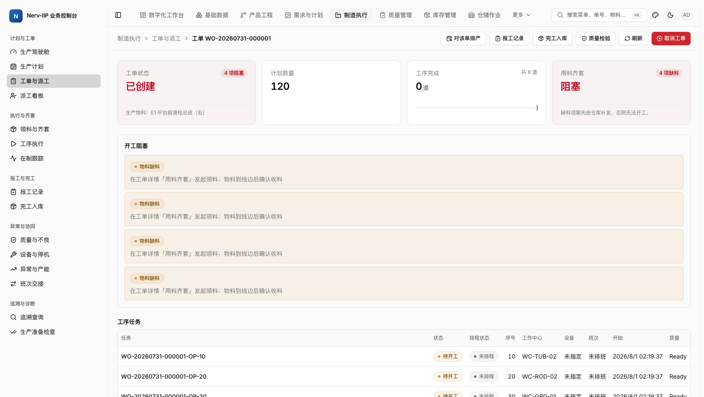
2. **看用料齐套表**：表头有口径自解释（齐套=线边可用+已备料+已收料，与 MRP 全厂口径不同属正常）；「开工阻塞」区逐条给出**原因+下一步**：「物料缺料 / 在工单详情『用料齐套』发起领料；物料到线边后确认收料」。工序任务区 8 道 OP-10~OP-80 全部「待开工」。

### 5b. 再讲「能开工的单」——齐套的种子工单（#1373 的正题）

3. **回工单列表，状态筛选选「已开工」**，挑一张 `WO-2026-*`（第三轮用 WO-2026-03002；演示时另挑一张，因为这张已被消耗）。进详情页，齐套区显示 **「可开工 · 已齐套 · 用料已备齐，可按工序顺序开工。」**
   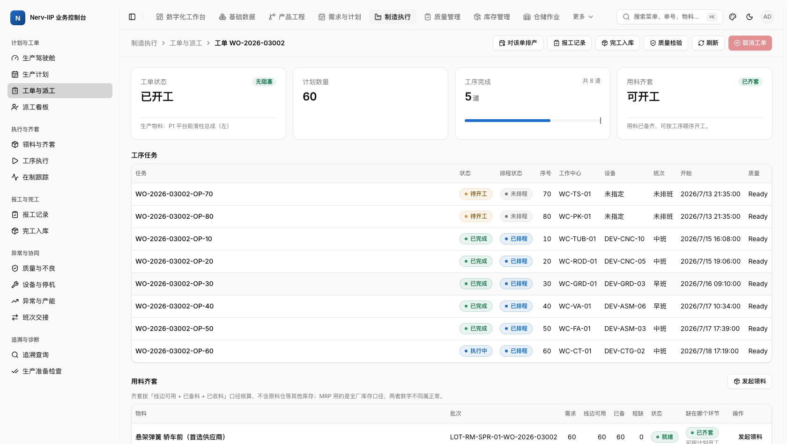
4. **制造执行 → 工序执行（工序任务）**，搜索框输入该工单号。**这里是 #1373 的看点**：列表里**每一道工序都有「可执行」列**——包括还没开工的 OP-70、OP-80。为什么重要：过去只有首序带这个证明位，导致「总览说不缺料、逐工序按钮却全被拦」；现在证明位逐序都在，后面的工序轮到了就能开。
   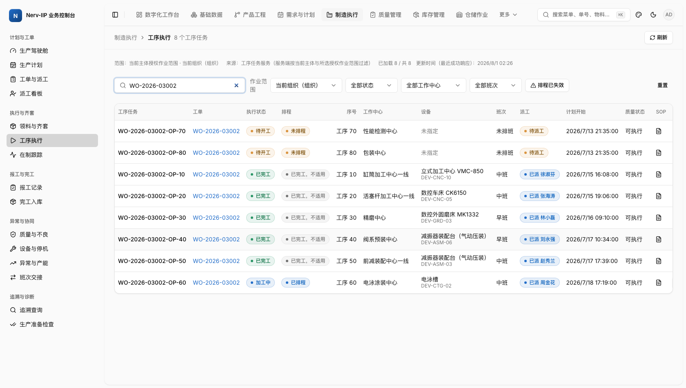
5. **先演示「顺序门」（推荐的开场）**：找到当前「加工中」那道工序的**下一道**（第三轮是 OP-60 加工中、OP-70 待开工），点 OP-70 行尾菜单 →「开工」。系统中文透传拒绝：**「开工失败：前序工序尚未完成（WO-2026-03002-OP-60）」**。为什么值得演：这说明拦截是**按工艺顺序**判的，理由说得出口、点得到名——不是笼统的"操作失败"。
   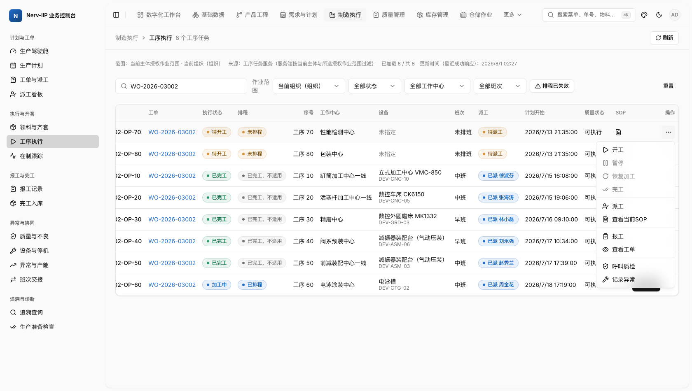
   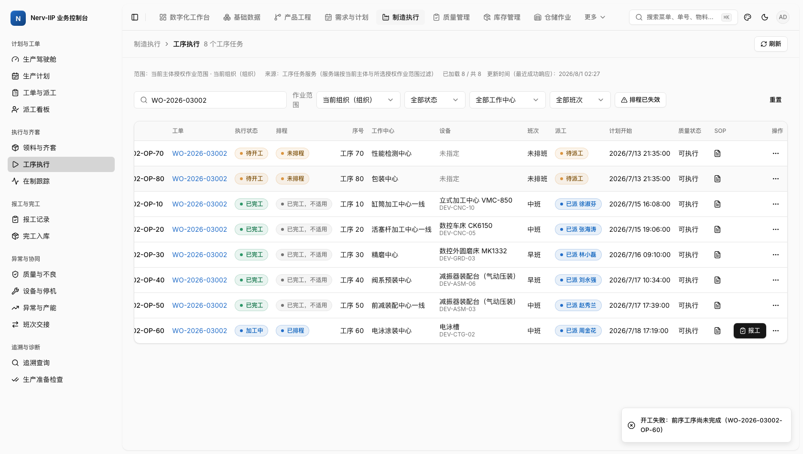
6. **报工**：在「加工中」那道工序（OP-60）行尾点**「报工」**。弹框带出报工对象（工单/工序/工作中心），填 合格数量（第三轮填 30）、不合格数量。提交 → 200，生成报工单（第三轮 **PRPT-20260731-000001**）。
   ⚠️ 弹框里的「本工序已完成」勾选**第三轮实测没让工序转完工**（台账 #88）——别指望它收尾。
   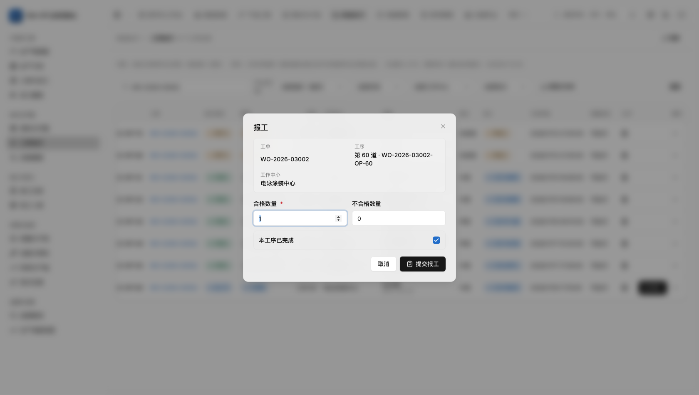
7. **完工**：走 OP-60 行尾菜单 →**「完工」**（此时菜单里「开工」是灰的、「完工」可用，语义自洽）。提交 → 200，行状态转 **「已完工」**。
   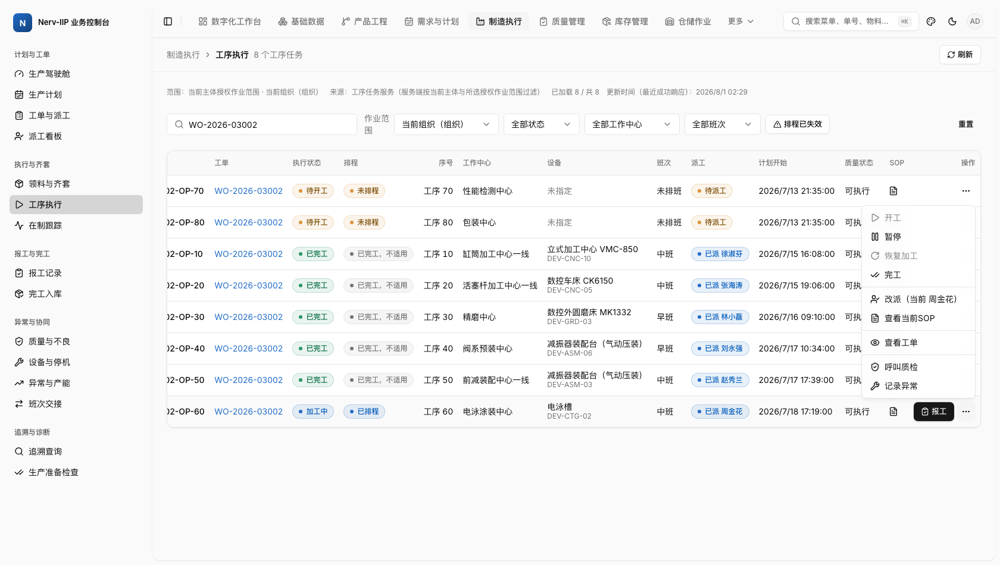
8. **开工下一道工序 —— 本章的高潮，也是 #1373 的证据**：OP-60 一转「已完工」，OP-70 立刻可开工。点 OP-70 行尾菜单 →「开工」→ **200，行状态转「加工中」**。
   为什么这一步是重点：**OP-70 是第 7 道工序，不是首序**。旧版本里非首序拿不到齐套证明位，会被误判缺料而全部拦死；现在按工艺顺序一道接一道往下走，走得通。
   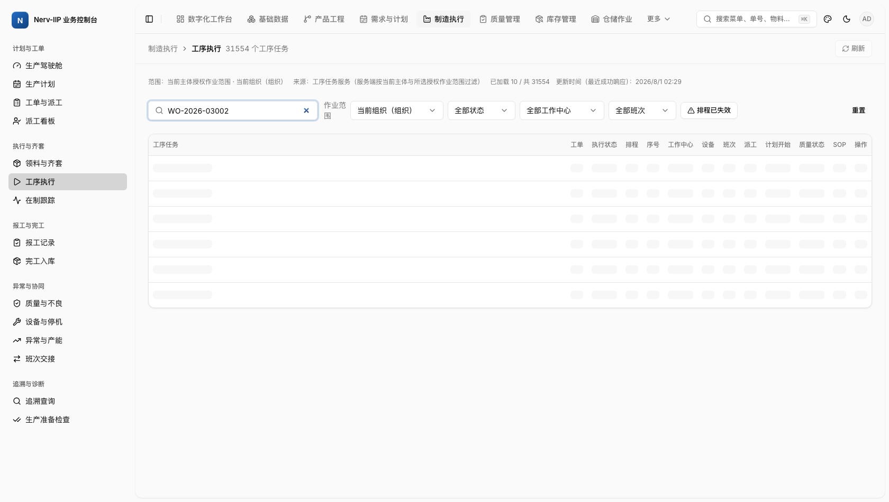
   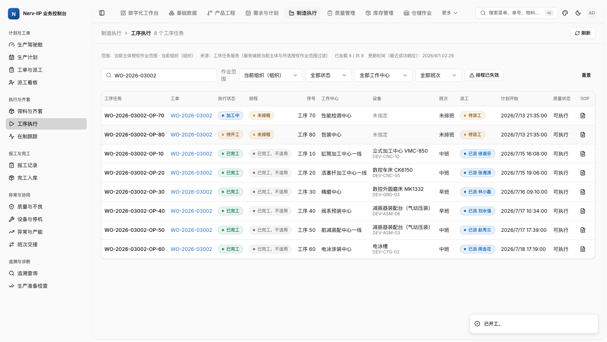
   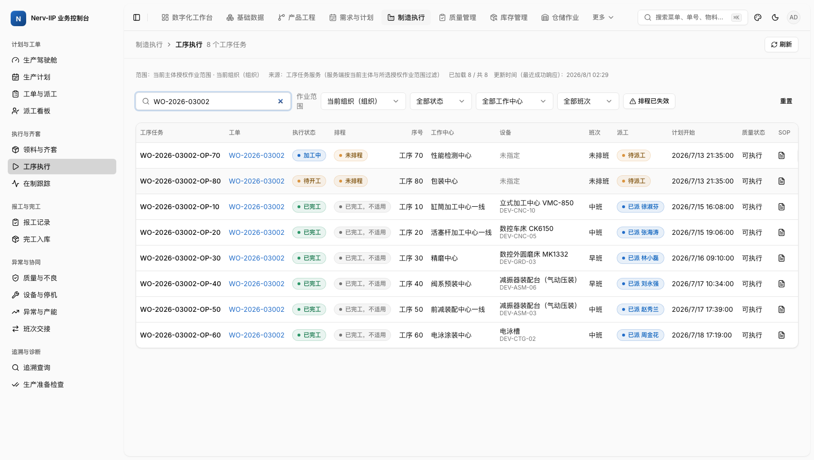
9. **派工**（可选，讲人机匹配）：工序行菜单「派工」→ 候选范围（本工作中心班组/全部在岗）+ 技能筛选，操作员带技能标签（如 刘立新 · EMP-004 · CNC 操作、设备维护），设备默认"沿用排程设备"。工序任务列表本身也带「已派 周金花」这类派工信息。
10. **领料（PC 仍无发起入口，台账 #42，第三轮未复验）**：齐套页提示"先发起领料"，但 PC 端没有发起按钮，入口在 PDA（mes/issue）。若演示需要展示领料，请提前用 PDA 建好，或跳过这一段直接用已齐套的种子工单讲执行（本章 5b 的走法）。

交接：第三轮在齐套种子工单上跑通了「顺序门拦截 → 报工 → 完工 → 下一序开工」完整一圈（#1373 回证通过）。主链工单 WO-20260731-000001 因 4 项缺料仍停在全部工序待开工——这是**正确的业务拦截**，演示时按 5a 讲「料没到所以开不了」即可，不必当成缺陷。二轮的三个阻断（#43 收料过账位置 / #44 回滚幂等 / #46 停机恢复）本轮未复验，因为本章改走「已齐套种子工单」这条不依赖领料的路线。

## 6. 质检：待检清单 → 录检验结果 → NCR 处置闭环 → 追溯

> **第三轮已真机重走，结论是坏消息 ❌ 本章 PC 端断头**（2026-08-01）：
> **「提交检验记录」按钮恒为禁用，一条检验结果都录不进去**（台账 #79）。第三轮把三项实测值
> （阻尼力 1210 / 渗漏 无渗漏 / 行程 180.1）全部填满、三个「单位」也全部选上、全表无任何校验红字，
> 按钮依然是灰的，页面也不说缺什么；`fill()` 与真人逐字键入两种方式都复现。
> 二轮的 #51「提交必 500」变成了「根本提交不了」——**形态变了，PC 录检验结果这件事仍然做不成**。
> 附带 **台账 #80**：单位候选只有 5 个基础单位（分钟/件/克/千克/升），而本方案要求 **N** 和 **mm**，
> 两个都不在候选里——规格文案写着「1080–1320 N」却选不出 N。
>
> **因此 #1357（Quality 中文消息）本轮「够不到」**：请求发不出去，服务端消息无从上屏，不是"未通过"而是没测到。
>
> **演示怎么办**：本章**只讲读面**——待检工作台的清单/时限/超期、检验方案的特性与规格；
> **现场不要点「提交检验记录」**。要演录入请走 PDA。下面 NCR 及以后的步骤是第二轮结论，第三轮未复验。
> ⚠️ 还有个观感问题（台账 #86）：103 个待检任务里 **65 个已超期**，首屏一片红，讲"质检把关"时不好看。

角色背景：过程/终检质检员，早上打开待检工作台清任务，遇不合格开 NCR 走处置。

1. **质量管理 → 质检待检工作台**：三张 KPI（待检任务/已超期/时限内完成率）+ 来源筛选（来料/过程/终检）+ SKU 筛选。第三轮实测 **103 个任务、其中 65 个已超期**；列表按时限排序、超期行置顶标红（「已超期 · 2026/7/31 16:25」）。注意页面自述：列表是**组织范围**任务、不支持按检验员过滤（"我的待检"视角不存在）。
   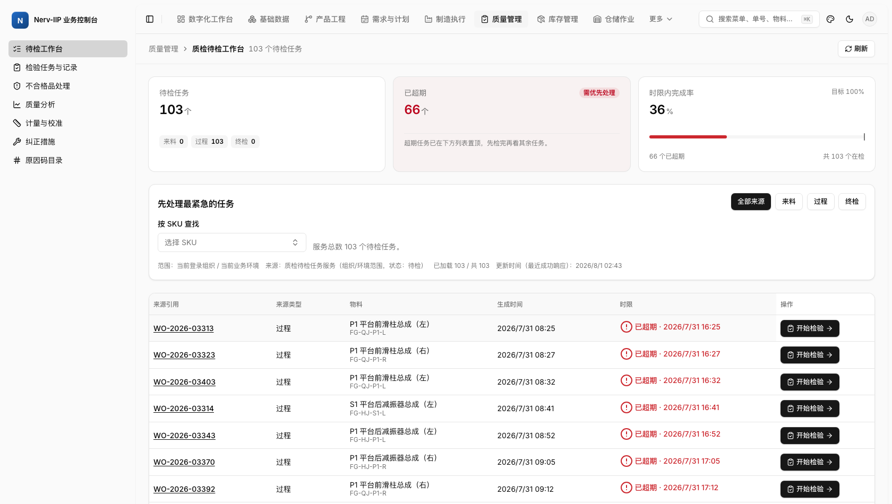
2. **看检验方案**（质量管理 → 检验任务与记录）：全库仅 4 个方案（演示工序检 / 来料检 IP-WB-RCV-001 / 工序检 IP-WB-OP-001 / 终检 IP-WB-FIN-001），后三个是不挂 SKU、不挂工艺路线工序的通用方案（台账 #60）——别在演示里承诺"按工序布点检验"。工序检特性：阻尼力 1080–1320 N / 渗漏检查 / 行程 179.5–180.5 mm。
   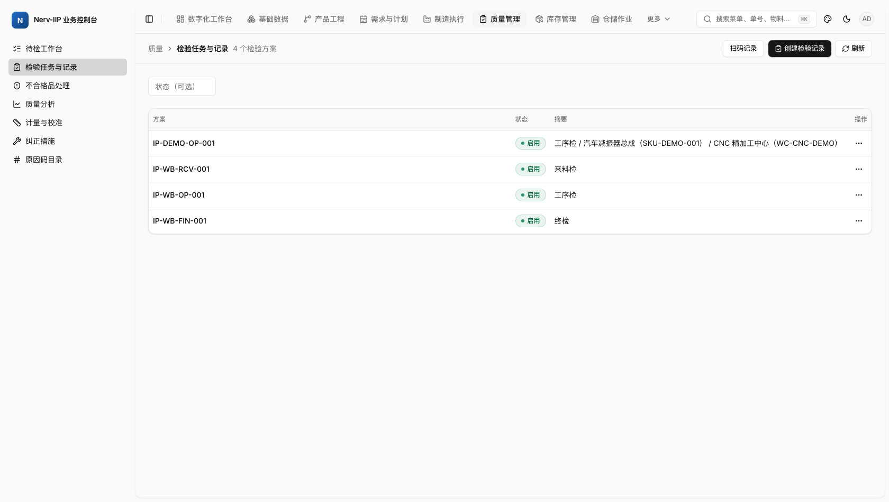
3. **开始检验（只演示到这一步）**：待检行点「开始检验」→ 跳到检验任务与记录页并自动开「创建检验记录」弹框。**这个弹框本身很好看、值得讲**：检验对象（检验方案/来源类型 工序/来源单据/物料/检验数量/批次）只读带出，3 行特性按方案预填并把规格写在行内——阻尼力 `1080–1320 N`、渗漏检查、行程 `179.5–180.5 mm`，每行还有 结果/单位/缺陷原因/缺陷数量。
   ⚠️ 弹框高度超出视口，「提交检验记录」在折叠线以下需滚动才看得到（台账 #85）。
   
4. **⛔ 到此为止，不要提交（台账 #79/#80，第三轮实测阻断）**：把三项实测值填满、单位全选之后，
   **「提交检验记录」按钮仍然是灰的**，页面不给任何原因；单位候选里也没有 N 和 mm。
   演示话术建议：讲完"检验方案把规格和特性带到了检验员面前"就收，录入环节说明走 PDA。
   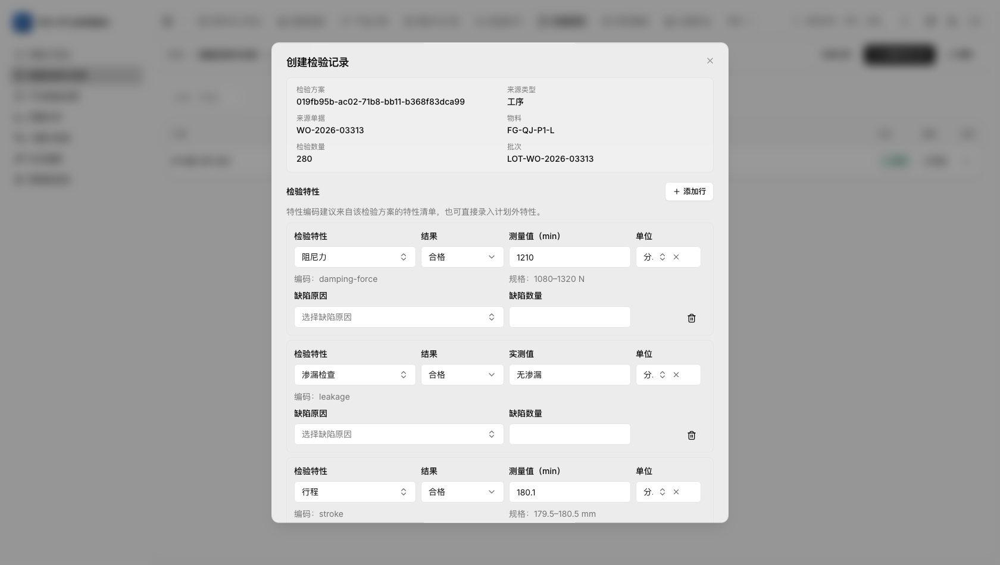
5. **不合格自动开 NCR**：不合格记录提交即返回 NCR 单号并出现在「不合格品处理」列表（状态 待处置）。注意运行时单号是机器码（台账 #53），种子单号才是 NCR-2026-XXXX。
   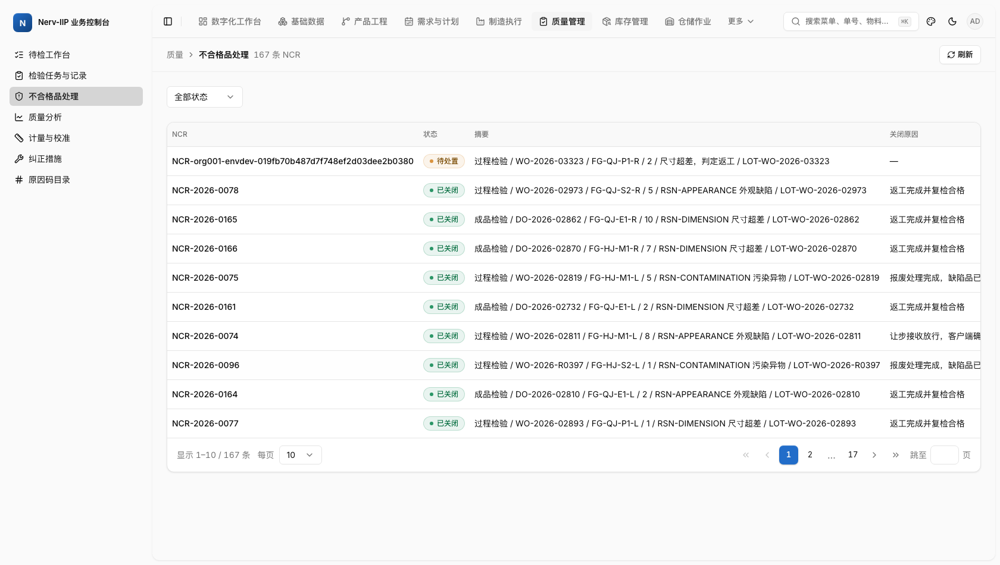
   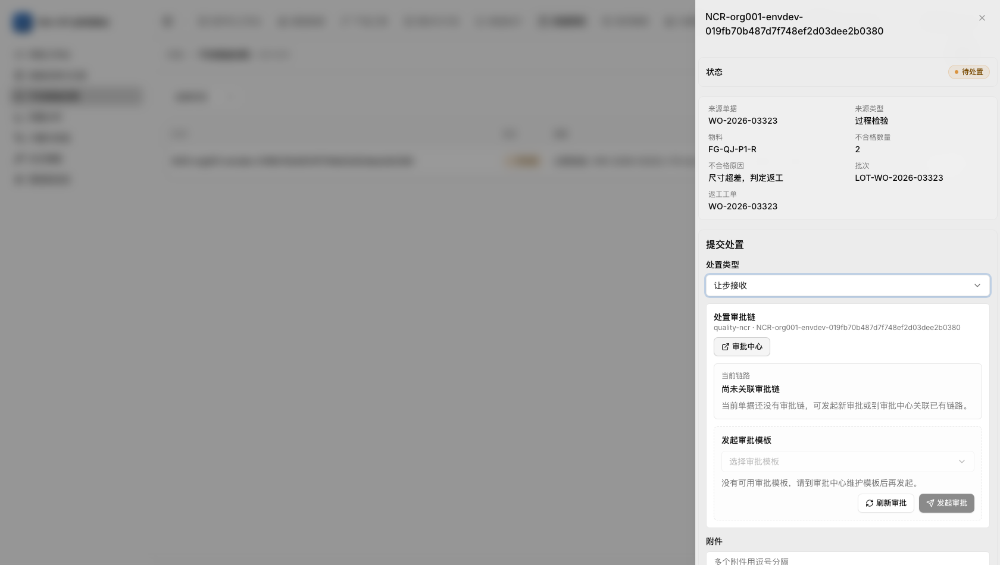
6. **处置审批（先修词表再演示，台账 #54）**：抽屉「处置审批链」面板按 `quality-ncr` 找模板，而种子模板登记为 `ncr-disposition` → 面板显示"没有可用审批模板"。**演示前置**：审批中心建模板（documentType=quality-ncr，审批人=admin）。之后：选处置类型「返工」→ 面板选模板 →「发起审批」→ toast「审批链已发起」。
   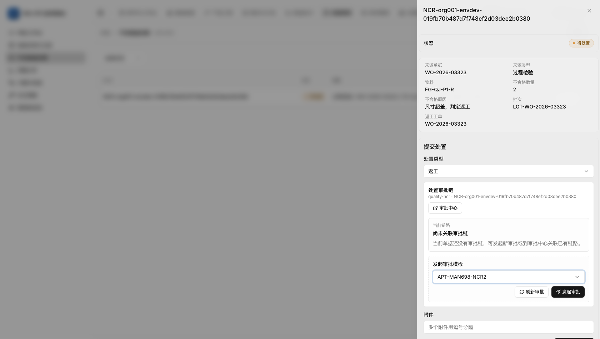
   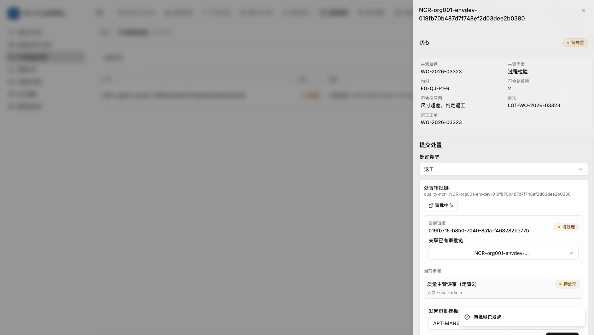
7. **审批中心裁决（#1313 已修，真机验证过）**：审批中心「我的任务」出现 NCR 评审任务，行操作「通过」一键裁决（驳回/退回走弹框附意见）——通过与驳回实测均 200 落决策记录。
   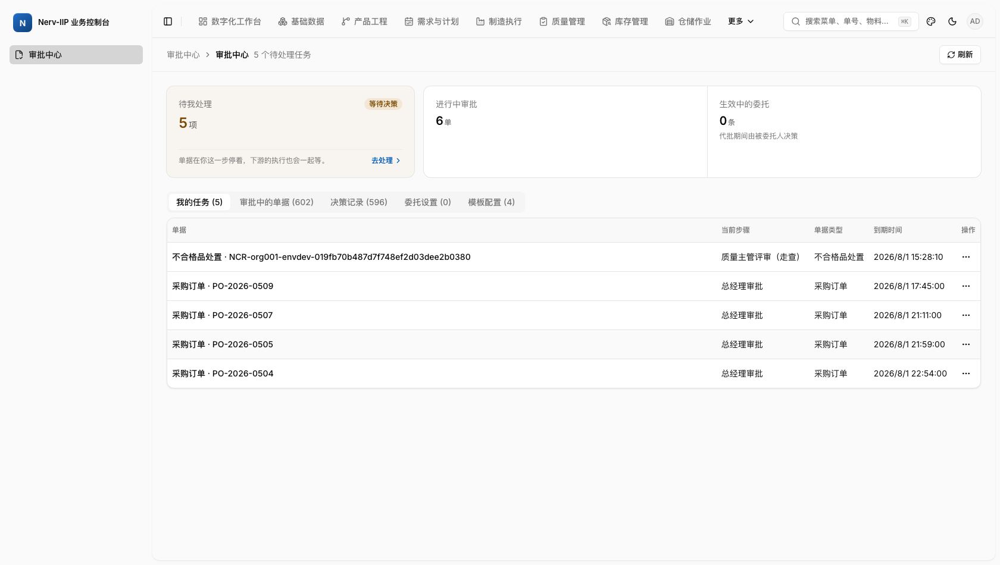
   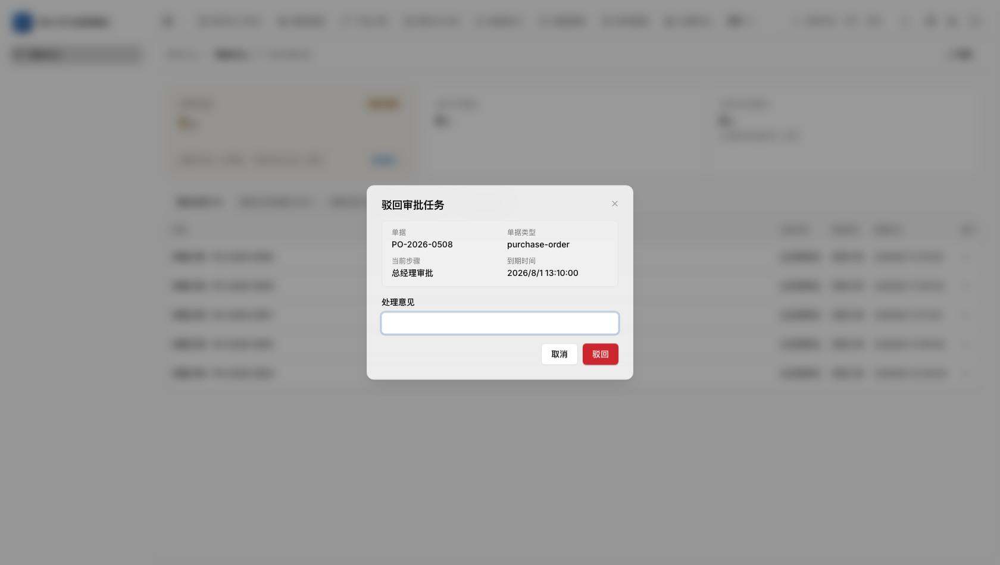
8. **提交处置（当前须 API 带 MRB 评审，台账 #56）**：UI 表单没有 MRB 评审录入位，直接提交会 400「MRB review is required」。经 API 附 `mrbReviews:[{reviewerId, decision:'approved', …}]` 后 200，NCR 转「处置中」。
   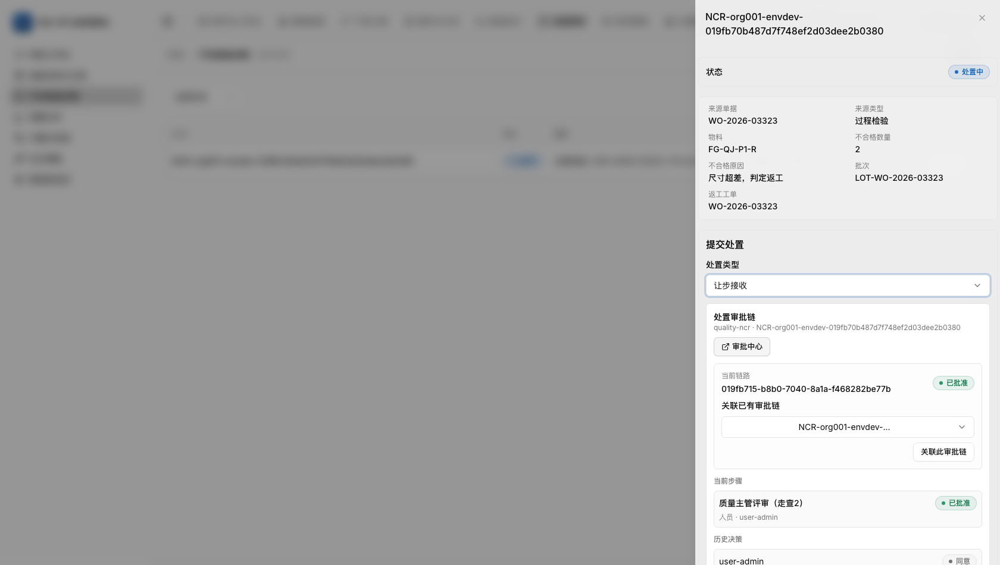
9. **关闭 NCR**：抽屉「关闭不合格品」区填关闭原因（返工单号已从来源工单带出）→ 确认弹框「关闭后该不合格品不再进入待处理队列」→ 确认关闭 → 列表状态「已关闭」且关闭原因直接可见。
   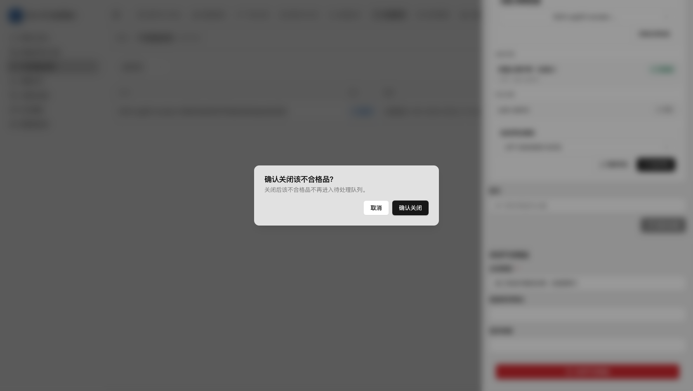
   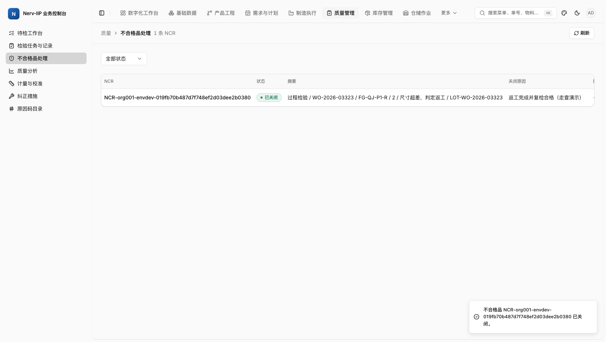
10. **追溯**：反向——检验记录只读详情（来源工单/批次/特性实测值/关联 NCR 俱全，但全是纯文本无互链，台账 #57，反查工单要复制单号去 MES 搜）；正向——工单详情「质量检验」按钮会带错物料（默认 SKU-001，台账 #58）且只开"补录"弹框，**不要**用它查已检记录。质量分析页可看处置构成/缺陷 Pareto/SPC（窗口口径自述清楚），但"我的班组今天检得怎样"仍无视角。
    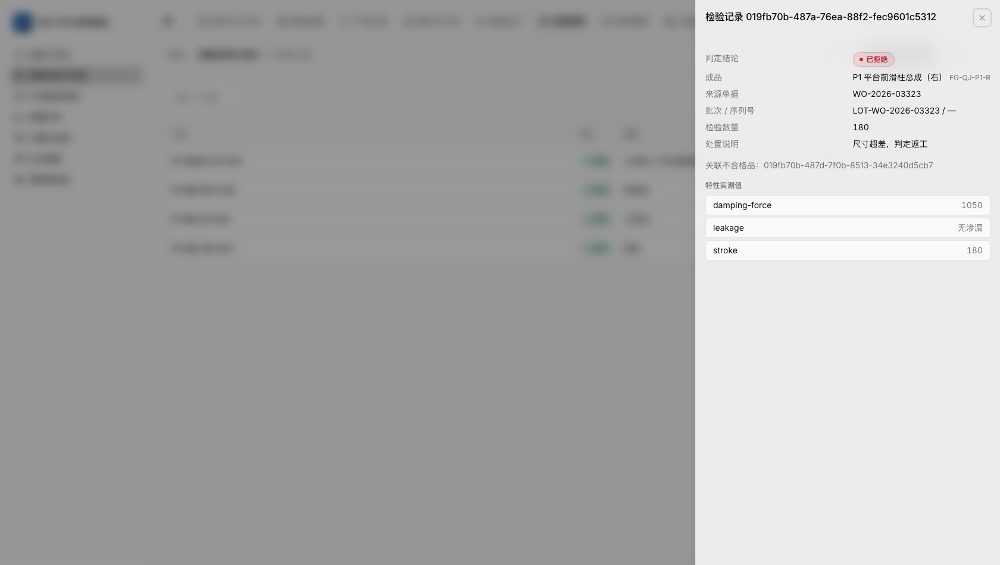
    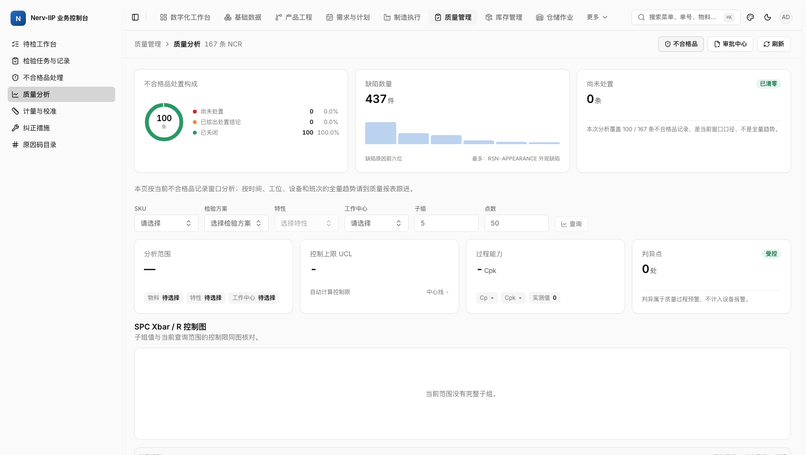

交接：**第三轮质检棒 PC 端断头在第 4 步**（#79 提交按钮恒禁用 + #80 单位缺 N/mm，两条都是阻断）。
上面第 5 步及以后（NCR→审批→处置→关闭）是第二轮在四代栈上走通的结论，**第三轮未复验**，
且其前置（录入一条不合格记录）在 PC 上已经做不到——演示若要完整讲 NCR 闭环，需要先用 PDA 或 API 造出不合格记录。

## 7. 仓储：采购支线（请购 → 采购订单 → 收货）＋ 盘点与库存查询

> **第三轮已真机重走 · 好消息为主 ✅**（2026-08-01）：
> ✅ **台账 #61（WMS 六页 admin 全 403 全空）已修复**——六个页面**全部渲染真实数据**：
> 收货入库 3806 张 / 上架任务 3804 个 / 出库发货 23593 张 / 拣货任务 23593 个 / WCS 3312 个 / 盘点单 168 张。
> 二轮"PC 端别点进仓储作业菜单"的禁令**作废，现在可以放心点**。
> ✅ **台账 #66（盘点任务一出生即死单）已修复**：168 张盘点单状态是「待盘点」并带账面数
> （1,700 / 2,000 / 2,900…），KPI「本页待实盘录入 6 张」，不再全部提示"须重盘"。
> ✅ **发货链确实有可操作对象**：2 张待执行拣货任务 + 2 张待出库出库单（`OB-WQ-B-PICK-MIR-20260731-01/02`）。
>
> ⚠️ **但发货链在 PC 上推不动，演示只能讲到"有活等着干"为止**：
> - 「完成复核」点下去 **必 422**，toast 只说"提交内容未通过校验，请检查填写项后重试"，不给字段级原因（台账 #81）；
> - 拣货任务行**没有任何操作按钮**，PC 端无法执行拣货（台账 #82）——这很可能就是上面 422 的真因。
> - 另有一批 `take=300` 预取接口仍 403（台账 #83），不影响页面数据，但控制台会刷错误。
>
> 采购支线（转单审批模板 #63、采购收货 qualityStatus #65）第三轮未复验，沿用第二轮结论。

角色背景：成品仓/原料仓仓管员，今天处理采购件到货与例行盘点。

1. **经营管理 → 采购（采购工作台）**：左侧采购子导航（采购申请/询价 RFQ/供应商报价/采购订单/采购收货）。采购申请列表 524 张，「待转采购订单」卡显示 10 张待处理（注意 KPI 有「尚未加载 514」桶，讲数字时忽略它）。MRP 采购建议承接生成的请购单也落在这里（来源列带 MRP-SUG-* 建议号）。
   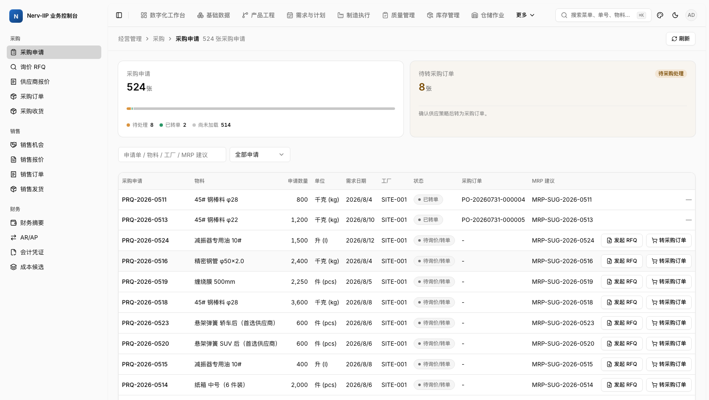
2. **发起询价**：待处理申请行点「发起 RFQ」→ 弹框带出申请上下文（单号/物料/数量/需求日期/工厂），勾选供应商（注意候选是全部 10 家伙伴、不按物料过滤，自己认准对口供应商如钢棒料选 SUP-WB-BAR-01/02）。
   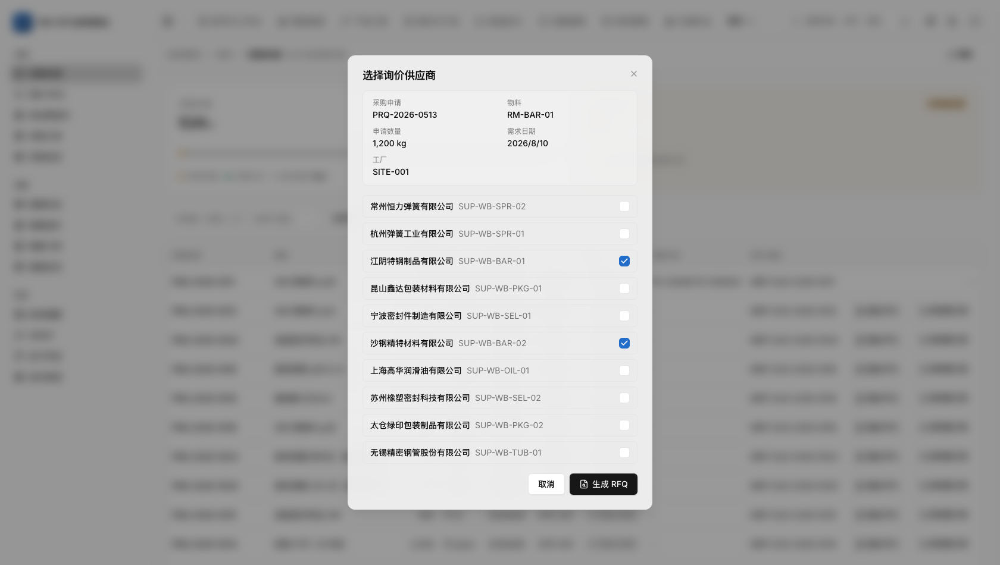
3. **⚠️ 点「生成 RFQ」的两种结果**：系统若已有该物料的有效价源（历史供应商报价），会**直接生成采购订单**并 toast 单号（本轮 PRQ-2026-0513 就是这样直接得到 PO-20260731-000005，供应商自动选了最优价 沙钢 @¥10.50）；没有价源才真正生成 RFQ 进入询价流程。演示口径：讲"系统自动比价，有价直接转单，无价发起询价"。
   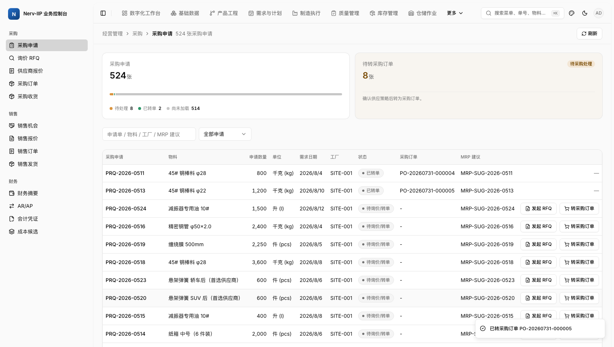
4. **采购订单审批**：新采购订单状态「待审批」。审批中心 → 我的任务：出现「采购订单 · PO-20260731-000005（采购主管审批）」，行操作菜单（查看步骤/通过/驳回/退回）点「通过」→ 200；几秒后回采购订单列表，状态自动变「**已下达**」（审批事件驱动下达，无需手工操作）。
   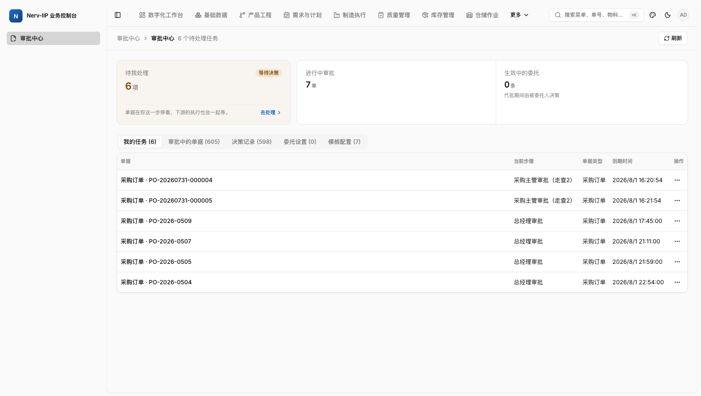
   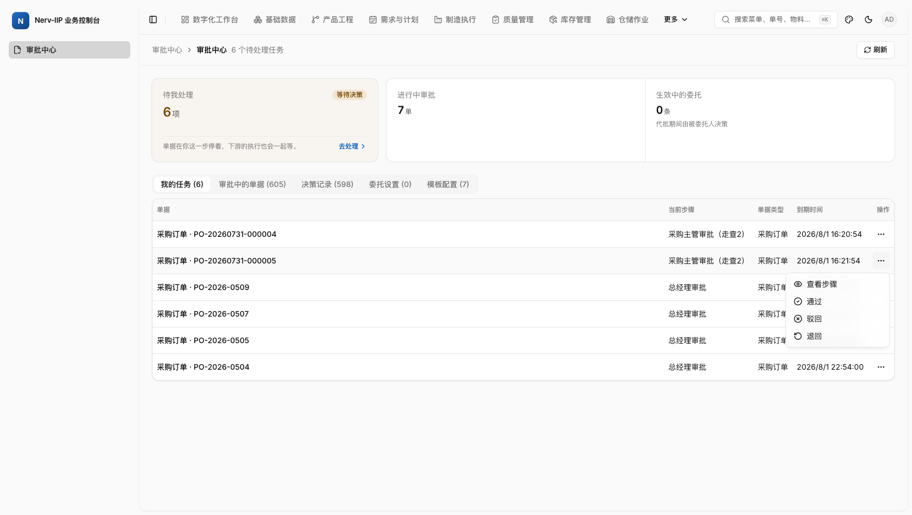
   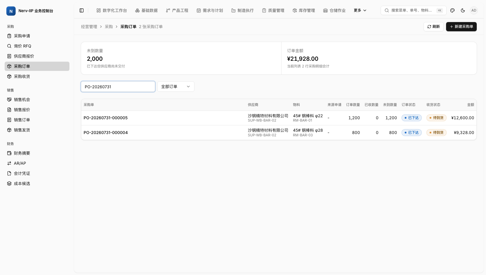
5. **⚠️ 采购收货（当前断头，台账 #65）**：采购收货页按待收数量默认整单收货、支持部分到货与送货单号——但提交必 400「'quality Status' 不能为空」（弹框根本没有质量状态输入）。演示到「待到货」画面为止。超收拦截（收 1300/订 1200）也因此无法验证。
   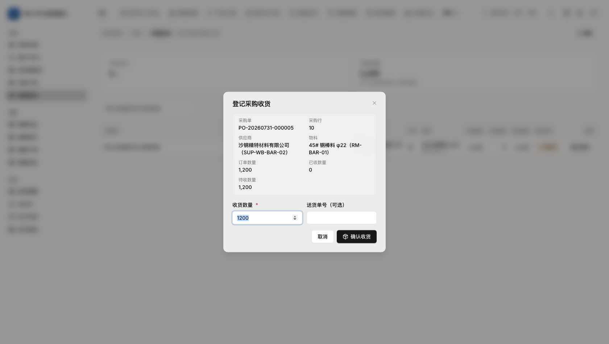
   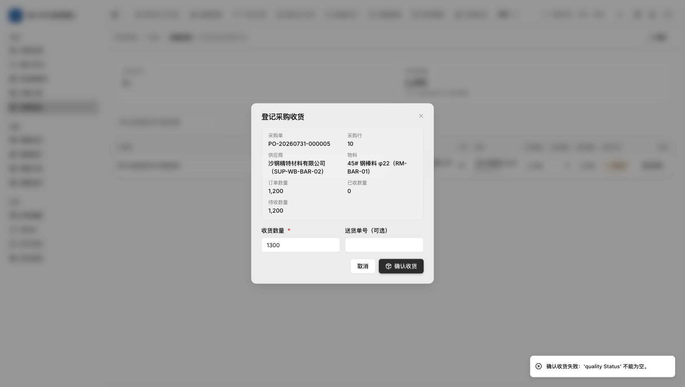
6. **库存盘点（库存管理 → 库存盘点，不要走仓储作业·盘点执行）**：⚠️ 种子盘点任务全部提示"须重盘"（账本版本漂移，台账 #66），演示直接点「创建盘点任务」现场建单。物料选择器可搜编码（RM-OIL-01 带出名称与单位）；**库位下拉不认种子库位（#70），需手工键入编码 WH-WB-RM-01**；批次选实际在库批次（如 LOT-PO-2026-0011，账面 1,200L）。
   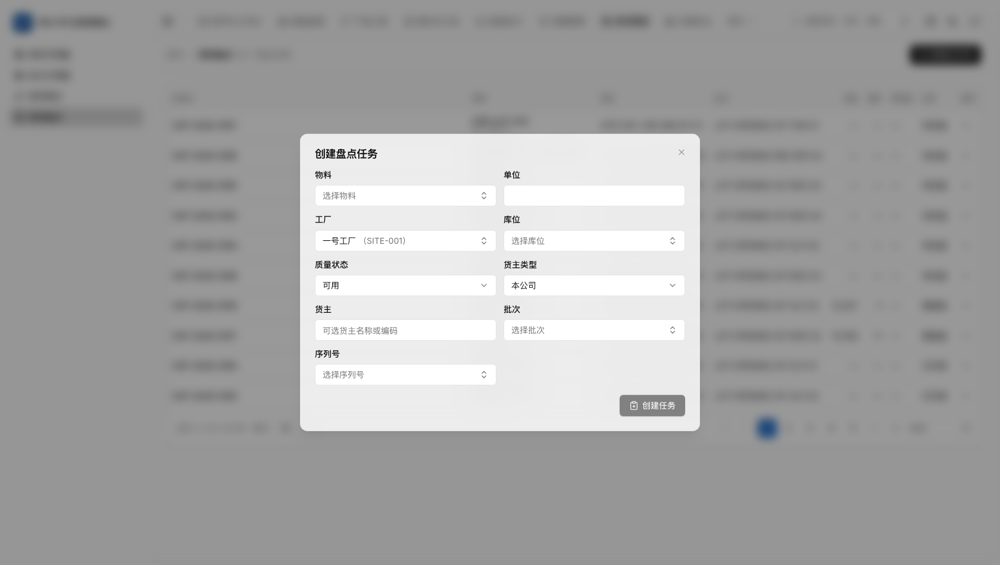
7. **差异确认**：新任务行操作「确认差异」→ 弹框只读带出任务上下文，录实盘数（演示录 1,195 制造 -5L 差异）→「确认调整」→ 200：差异 -5 直接过账（movement 生成、现存量同步 1,195），列表状态闭合。小差异无审批链；大差异是否触发审批本轮未验。
   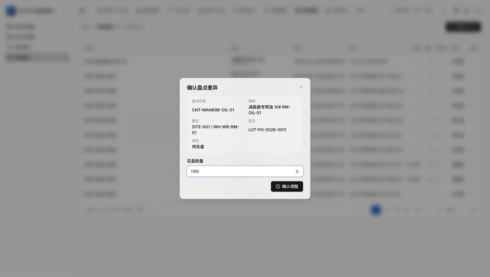
   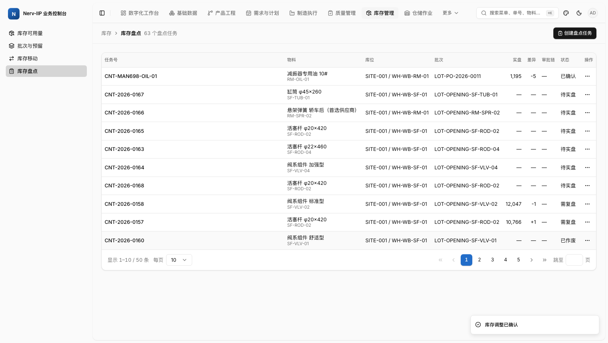
8. **库存三维查询**（库存管理）：①物料维——库存可用量页选物料 RM-OIL-01：全厂 26,100L、全在 WH-WB-RM-01、按批次分行（盘点后含 -5L 差异）；②批次维——批次与预留页 3,811 条批次，行尾带 MES追溯/扫码/WMS/质量 联动入口；③库位/流水维——库存移动页按库位看流水（盘点差异、收货、领料都在这本账上）。
   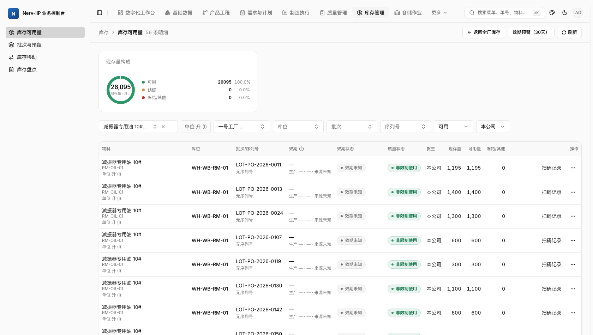
   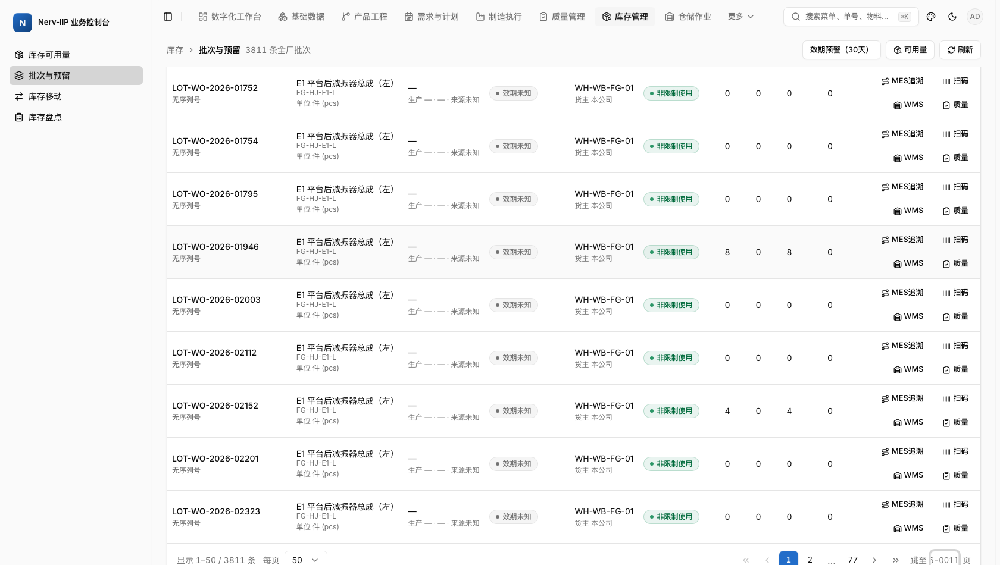
9. **⚠️ 手工补录库存移动**：新建移动弹框默认类型「入库」，但提交必被后端拒绝（receipt 不允许走外部补录命令，台账 #49 二轮复现）；确需补录用「调拨/发料」等类型——但注意调拨目前是单腿过账会净增库存（#68），演示别现场演这个弹框。
10. **销售发货**：发货单列表 2,933 张全部「已完成」（种子无在途单）；已完成行的「释放发货」按钮是坏的（#67）不要点。

### 7a. 仓储作业（WMS）——第三轮新增，这一段现在可以讲了

11. **仓储作业 → 收货入库 / 上架任务 / 出库发货 / 拣货任务 / WCS 任务 / 盘点执行**，六个页面逐个点开，**每一页都有真实数据**（3806 / 3804 / 23593 / 23593 / 3312 / 168）。为什么值得讲：这是仓库一天的真实作业量，说明系统里的仓储不是空壳。二轮这六页在 admin 下全是空的，现在修好了。
    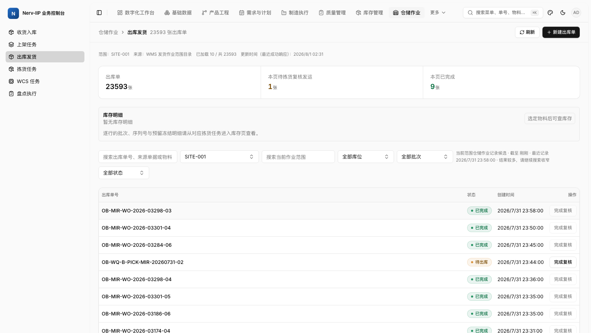
    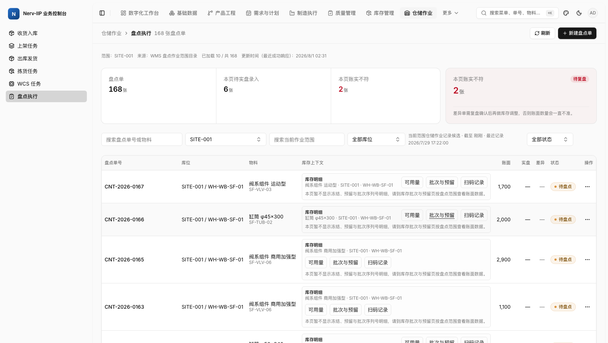
12. **讲"有活等着干"**：出库发货页搜 `WQ-B-PICK`，能看到 2 张**待出库**的出库单，行尾「完成复核」按钮可点；拣货任务页搜同样关键字，能看到 2 张**待执行**拣货任务。这就是发货链上真实待办的样子。
    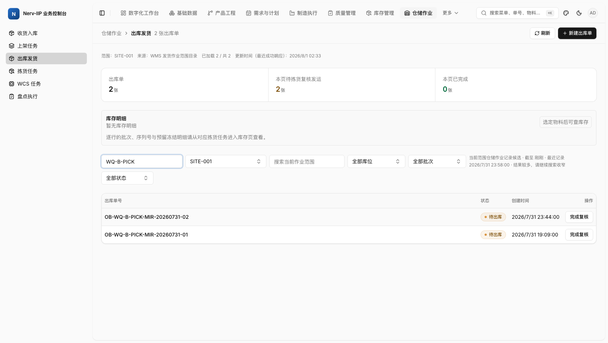
13. **⛔ 到此为止，不要点「完成复核」**（台账 #81）：第三轮实测填齐复核单号并勾「复核通过」后提交，
    返回 **422**，界面只说"提交内容未通过校验，请检查填写项后重试"，不告诉你哪一项有问题，单据状态不变。
    拣货任务那边 PC 又没有执行按钮（台账 #82），所以这条链在 PC 上目前推不到底。
    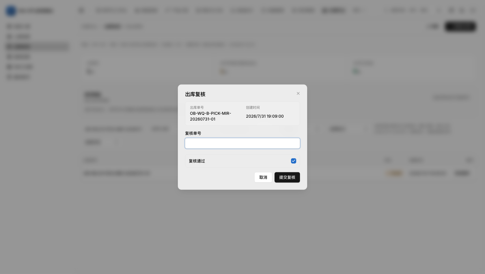

交接：**#61 已修复，WMS 六页全部可看可讲**，盘点单也不再是死单（#66 已修）。发货链有真实待办对象，但 PC 端推不动（#81 复核 422 / #82 拣货无操作按钮，两条都是阻断，已入台账）。采购支线（#63/#65）第三轮未复验。

## 8. 财务：AR/AP 对账 → 凭证 → 成本（月底对账视角）

> **第三轮部分重走 ✅**（2026-08-01）：AR/AP 页与「登记应付」写面真机验过（登记 200）。
> ✅ **#1360 回证通过 · 这是本轮最值得加进演示的一段**：二轮台账 #76「服务端零校验、可以把应付
> 挂在根本不存在的单据上凭空造账」**已根治**，而且拒绝消息是中文、点名对象、还给出路：
> - 虚构采购单 → **400**「来源单据『PO-…-FAKE-001』在 ERP 中不存在（既不是采购收货单、采购订单，
>   也不是供应商发票），应付不能凭空登记。**确需无来源手工入账，请前往财务 › 会计凭证 › 过账凭证。**」
> - 真单挂错供应商 → **400**「来源单据『PO-2026-0509』的供应商是『SUP-WB-SPR-02』，与登记的供应商
>   『SUP-WB-BAR-01』不一致，应付登记已拒绝。」
> 演示话术：**"系统不让你把钱记在不存在的单子上，而且告诉你正确的路该怎么走。"**
> 注：UI 的来源/供应商都是带出式选择器，正常操作构造不出这两种错误——上面两条是用接口重放验证的，
> 现场演示讲"有这道校验"即可，不必也无法在界面上复现。
> 其余各条为第二轮结论，第三轮未复验：
> ① 财务只有 4 个页面（财务摘要 / AR/AP / 会计凭证 / 成本候选）——**期间关账、月结清单、试算平衡、回款、付款、成本率没有页面**（台账 #74），月结故事讲到"凭证与两清册"为止；
> ② **总账只有销售两类凭证**（台账 #71）：讲"发货确认收入+货款回收"的闭环很漂亮，**别现场翻采购/成本的凭证**——一张都没有；
> ③ 凭证列表看不到分录明细（#73），借贷科目细节别答应现场展开。

角色背景：财务会计，月底对账——销售发货要见应收，应收要见凭证，收款要核销。

1. **经营管理 → 财务（财务摘要）**：四张卡是全厂全量口径——应收未结 ¥15,061,760 / 应付未结 ¥3,539,866.25 / 待入账成本 ¥1,387,052.50 / 已过账凭证 5,593 张。这是唯一能看到全量数的页面。
   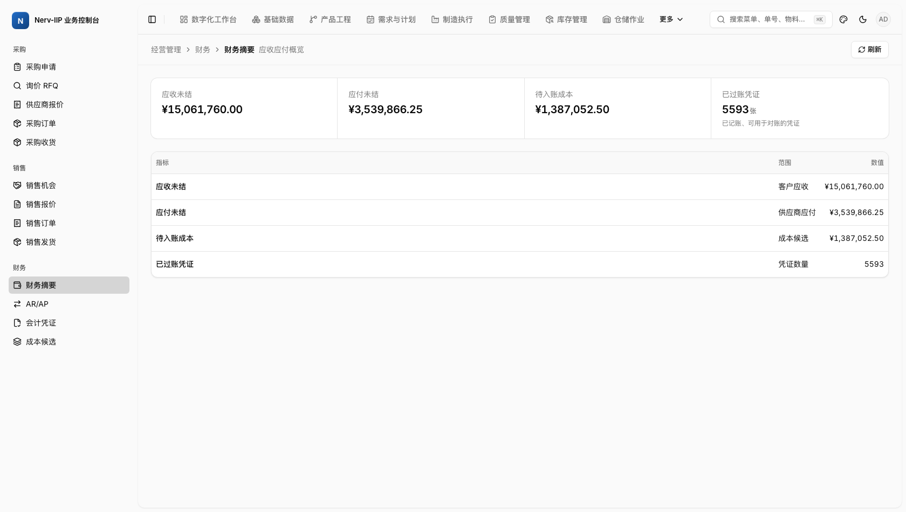
2. **AR/AP 页**：上下两张清册——应收 2,933 笔（=2,933 张已完成发货 1:1 生成，单号同序：AR-2026-02985↔SO-2026-02985），应付 451 笔。注意顶部金额卡只合计**当前页 10 笔**，讲全量数回摘要页。
   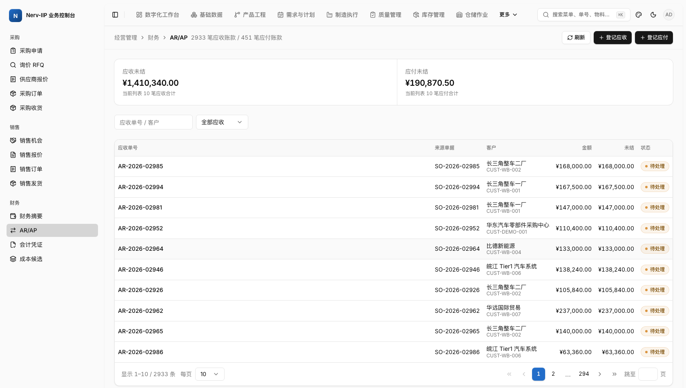
3. **对账样本（销售链）**：应收搜索框输订单号 SO-2026-02985 → AR-2026-02985 金额=未结=¥168,000。换到 销售→销售订单 搜同号验证订单金额 ¥168,000；销售→销售发货 搜同号见 DO-2026-02985（480 pcs 全量发运、已完成）。**订单=发货=应收 三面等值**（来源单据列不可点，只能这样换页人肉查——#75）。
   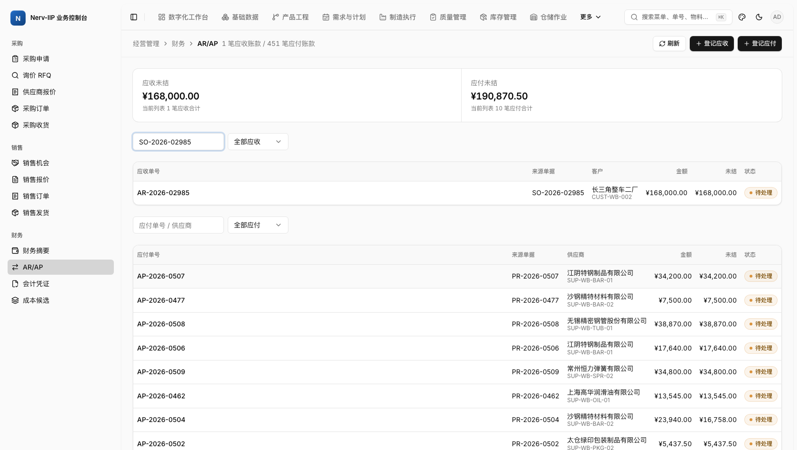
4. **会计凭证**：列表 5,593 张全部「已过账」。搜索框输 SO-2026-02985 → 命中 JV-2026-S02985：借 ¥168,000 = 贷 ¥168,000，卡片提示「与借方平衡」。（搜索实际按摘要匹配，placeholder 写"凭证号"是文案缺陷；分录科目 1122/6001 只在 API 里，页面不展示。）**至此四面闭环：订单=发货=应收=凭证=¥168,000。**
   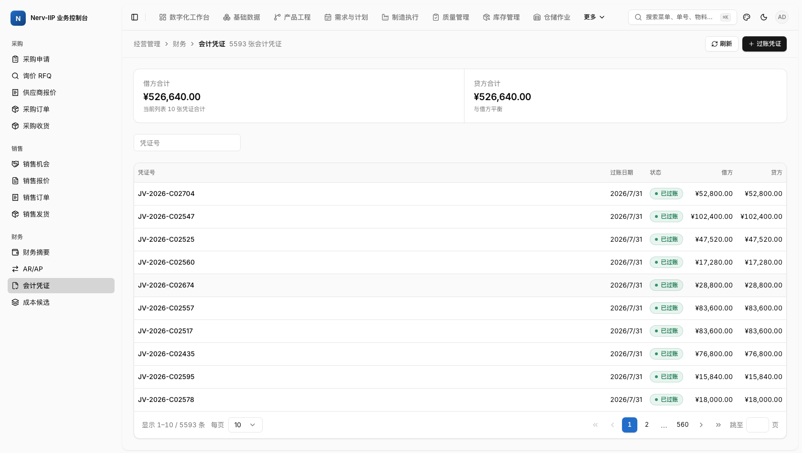
   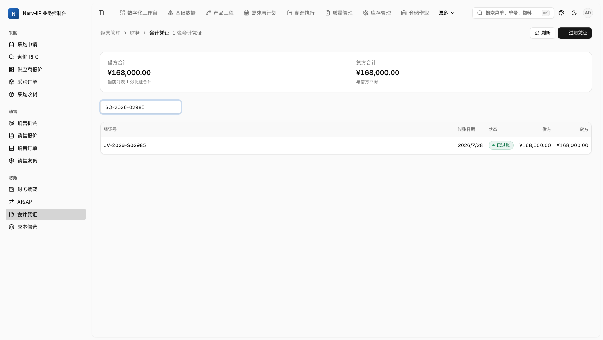
5. **收款核销**：AR/AP 页应收状态筛「已结清」→ 2,660 笔（未结 273 笔）。任挑一笔（如 AR-2026-02704 ¥52,800 未结 0）到凭证页搜其订单号，能找到对应「货款回收」凭证 JV-2026-C02704 ¥52,800——**收入-回款=未结** 在全量上也成立（155,129,820-140,068,060=15,061,760=摘要卡）。
   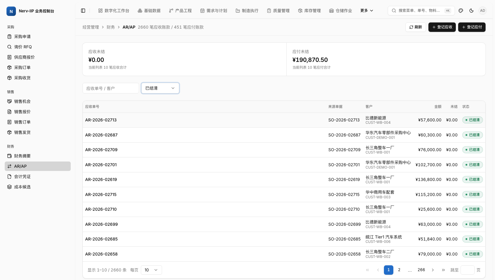
6. **对账样本（采购链）**：成本候选页第一行 COST-2026-0504（采购收货 PR-2026-0504，¥23,940）；采购→采购订单 搜 0504 → PO-2026-0504：3,800kg RM-BAR-03 × ¥6.3 = ¥23,940、已全收；AR/AP 页应付搜 0504 → AP-2026-0504 ¥23,940（未结 16,758=部分已付）。**采购订单=收货成本=应付 三面等值**。⚠️ 那笔 7,182 的付款没有任何凭证或流水可看（#72），别被问住。
   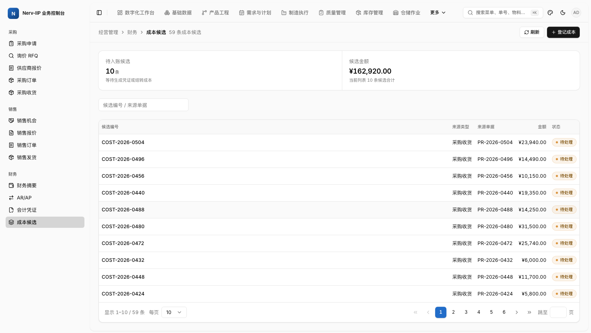
7. **手工凭证（写面演示）**：凭证页「过账凭证」→ 弹窗填 过账日期(默认今天)/金额/借方科目/贷方科目/摘要 → 提交 200，列表即刻可搜到（本轮 JV-20260731-000001 ¥1 演示凭证），摘要页凭证数 +1。一借一贷强制等额，天生平衡。
   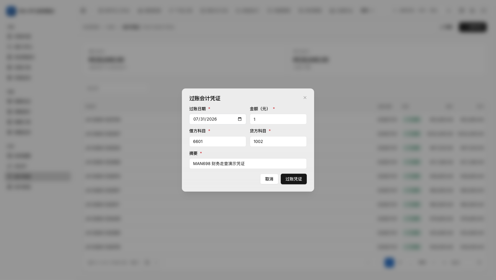
   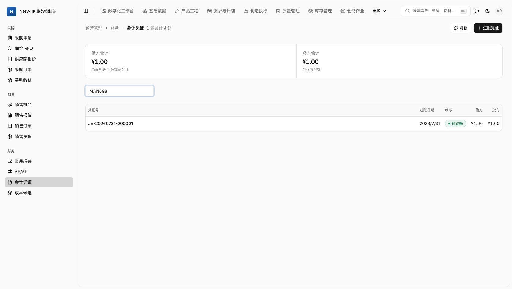
8. **登记应收/应付（写面，第三轮已重走）**：AR/AP 页两个登记按钮。以「登记应付」为例，弹窗三个字段：
   **来源单据**（选择采购订单，候选带出真实 PO 并直接显示该单的供应商，如「PO-2026-0509 · SUP-WB-SPR-02」）、
   **供应商**（选择供应商）、**金额**。选真单真供应商 → 提交 200，toast「应付已登记」。
   为什么这样设计：选择器先把"这张 PO 是谁家的"摆出来，再由服务端做一致性校验兜底（见本章开头 #1360），
   前端引导 + 后端把关两层都在。二轮 #76「凭空造账」已根治。
   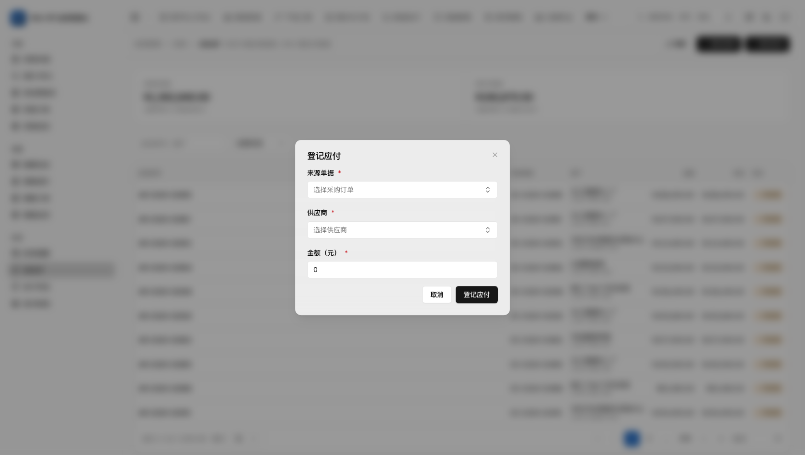
   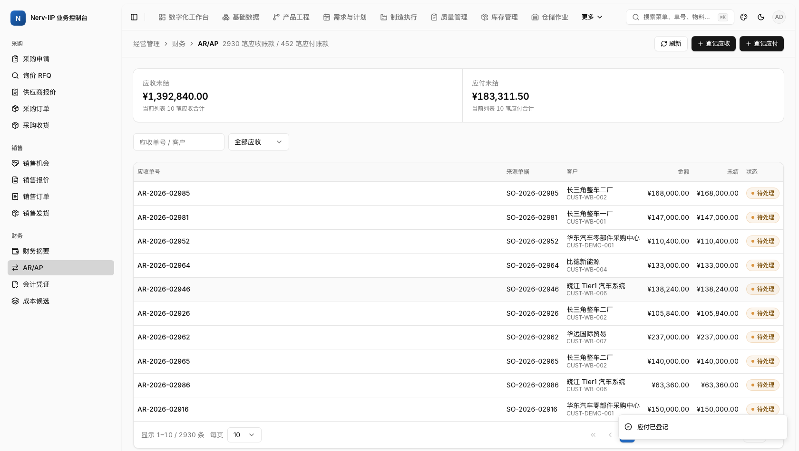
9. **成本故事的边界**：成本候选 59 条全是采购收货类、全部"待处理"（没有结转动作，#71）；FG-QJ-E1-R 的真实成本在 库存管理→库存移动 上看（每笔出入库带单价 ¥284.4/金额）——讲"存货计价在库存台账、收入在总账"即可，**别讲"成本结转利润表"**，那条路不存在。⚠️ 若现场有人算毛利：种子售价 395/pc 毛利 28% 正常；主链演示单价若仍按任务书 ¥85 会是 -70%（#78），建议演示单价改 ≥395。

交接（回证专场）：主链断头修复后需回证——新发货完成后 AR/凭证是否实时生成（#67 联动的"活水"验证）；采购收货修通（#65）后 成本候选/应付是否自动新增。财务侧修复建议聚焦 #71（采购/成本/付款过账）与 #72（回款/付款读面）。
