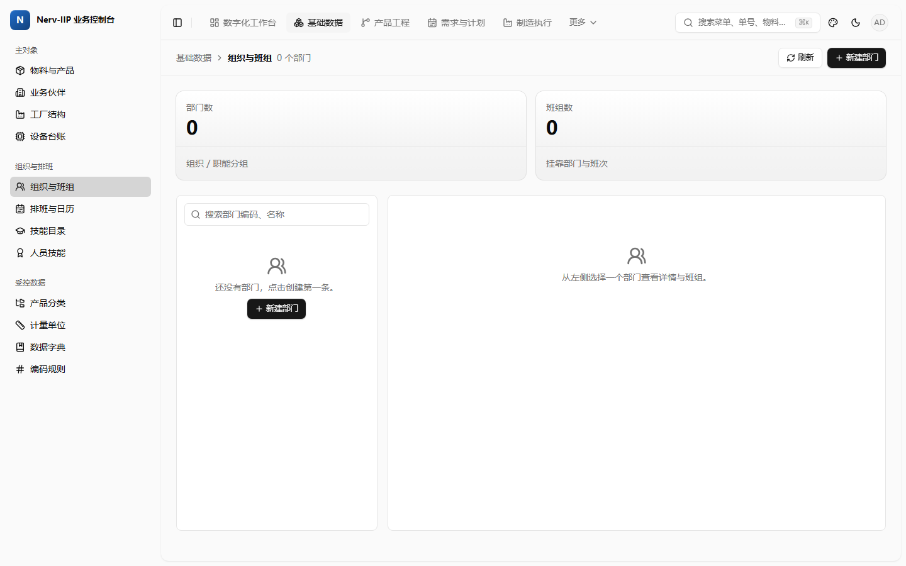
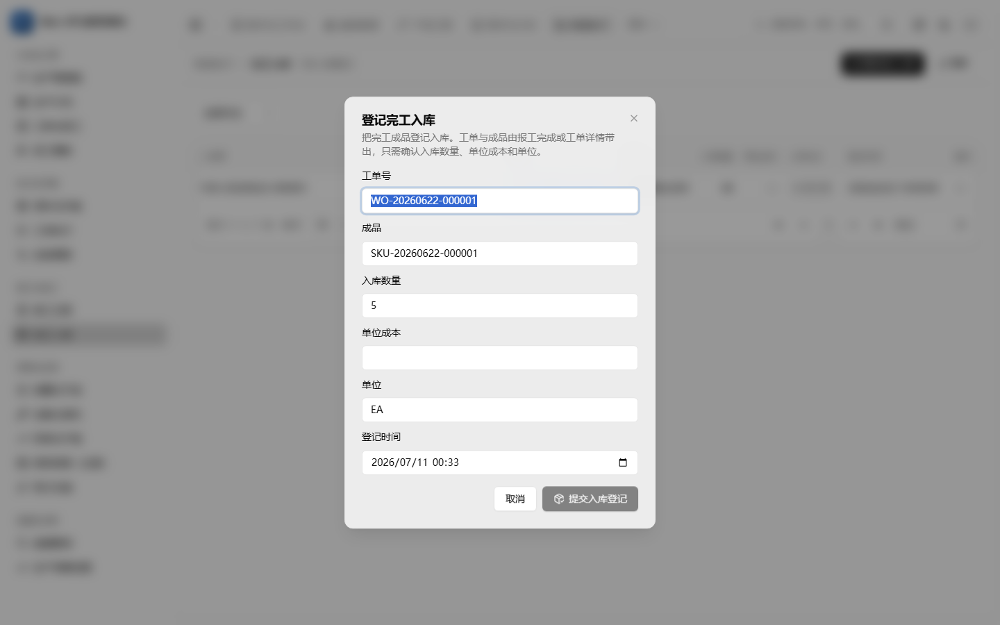
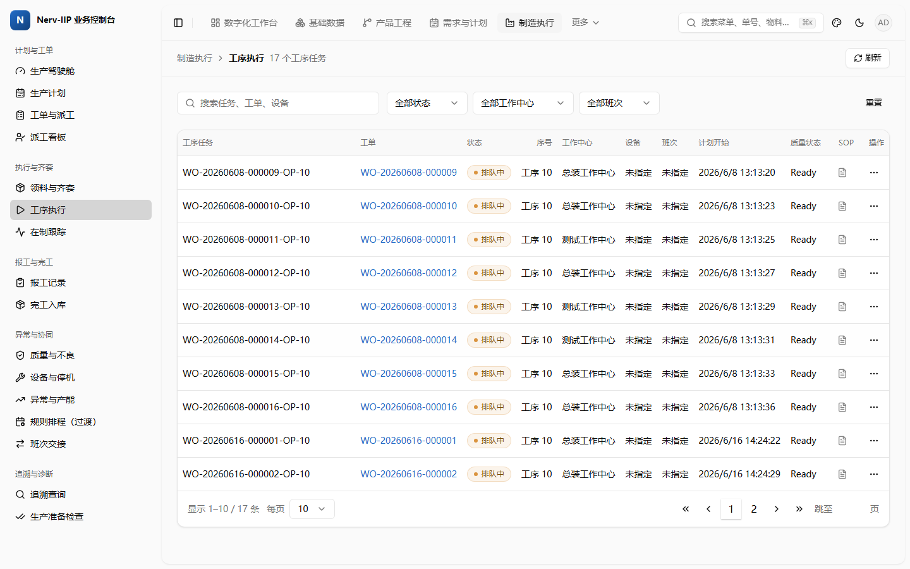
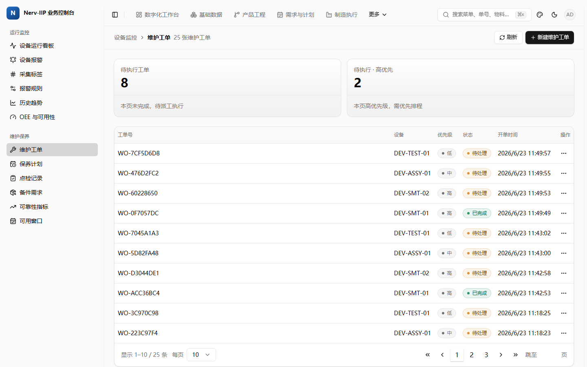
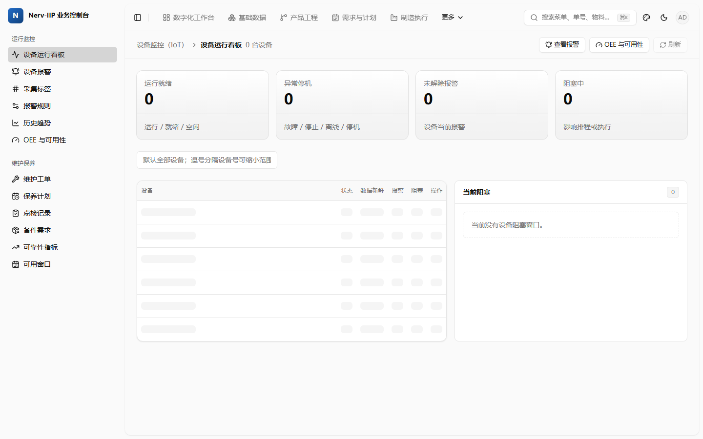
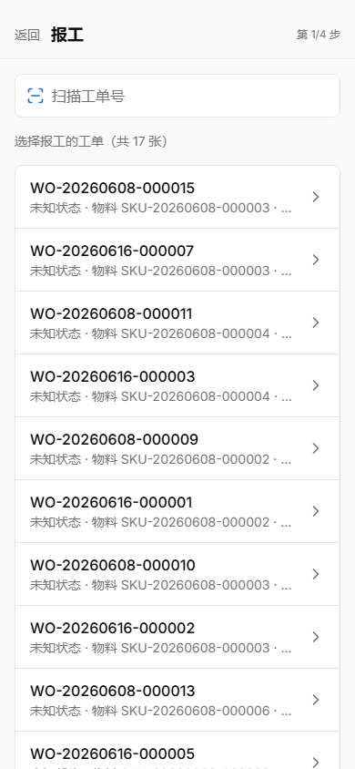

# 实机全景 UX 走查发现（console + PDA）

> 2026-07-11。MAN-461 / #815（前端第二波 W2 独立走查）。
> 依据：`frontend/DESIGN/patterns/interaction-patterns.md`（A1 交互规范 v1，#785）的六项标准。
> 方法：`nerv.ps1 dev` 起整栈（真实后端 + PostgreSQL 种子数据），以种子管理员登录，用 Playwright（Chromium）实机逐页导航；console 桌面视口 1440×900、PDA 移动视口 390×844。**本任务只读走查 + 写文档，不改任何业务页面代码。**
> 证据：截图作为 DESIGN 资产提交在 `assets/2026-07-11-ux-walkthrough/`，逐条问题内联链接（实机截图，非占位）。每条问题给复现路径 + 违反条款 + 证据 + 建议 + 严重度（阻断作业 / 低效 / 观感）。
> 关联：追踪 bug #868（P0-1）、修复中 PR #867（未合并）、本走查 PR #865。文中 P0-1 标"修复中"而非"已修复"——待 #867 门禁通过并合并进基线后再改。

## 0. 覆盖范围与走查结论

- **console**：10 个业务域共 74 条路由全部实机打开（MES/质量/库存/WMS/计划/工程/设备/维护/审批/主数据，另附 ERP/条码）。全部渲染成功，登录、路由守卫、真实数据贯通正常。
- **PDA**：首页 + 12 个作业页全部实机打开（共 13 条路由：首页 `index.vue`，WMS 收货/上架/拣货/复核/盘点 5 页，MES 领料/工序/报工/完工 4 页，设备 报警/点检/维修 3 页）。登录与鉴权正常，多页有真实种子数据或规范空态。
- **数据真实性**：种子数据丰富（MES 17 条工序任务、真实工单号 `WO-20260608-*`、完工入库 `FGR-*`、盘点 `CNT-*`、SKU 智能网关G200 等），足以观察真实密度下的交互表现。设备/审批两域运行时无种子数据（0 记录），其交互结论以源码为准并已在 §3.4 标注。
- **一句话结论**：视觉基线（dashboard-01 黑/亮主题、导航、密度）已相当成熟；**系统性欠账集中在交互层**——"一切皆 Dialog"、破坏性动作无原因、重对象塞抽屉、筛选状态不进 URL、批量能力业务页零使用、PDA 步骤/数字键盘未接入。此外实机暴露 1 个门禁未拦住的真实契约 bug（见 §4，修复中 PR #867 未合并 / 追踪 #868）。

## 1. 起栈与方法学要点（供后续走查复用）

1. **MAX_PATH 构建阻断（已定位并绕过）**：本 worktree 路径含中文且极深（前缀 89 字符）。`Nerv.IIP.Business.IndustrialTelemetry.Infrastructure` 是解决方案里名字最长的工程，其 `obj\Debug\net10.0\*.dll` 路径达 **272 字符 > MAX_PATH(260)**，且机器 `LongPathsEnabled=0` → 该工程稳定 `MSB3030：找不到该文件`（DLL 已编译出但拷贝步骤存在性检查失败）。**绕过方式**：`subst N: <worktree>` 建短盘符（前缀降到 3 字符），经 `N:\` 构建与 `N:\nerv.ps1 dev`。构建即通过。后续在此机器起栈务必走短盘符。
2. **dev-server 抖动辨识（勿误判为 bug）**：首次访问页面的 Vite 冷编译会偶发 `page.goto` 45s 超时（`/wms/inbound`、`/barcode/print-batches` 命中，重试即正常）；PDA 首启出现 `504 Outdated Optimize Dep`（依赖预打包过程态）。二者均为开发服务器瞬态，**非产品缺陷**。
3. **误报排除**：正文只保留可复现的真实问题；机器初判的 `/planning`、`/erp/sales/orders` "错误文案"经核实是种子数据里的数字 `500 EA` / `500 台`，非 HTTP 500，已剔除。
4. **PDA 未纳入 AppHost**：`business-pda` 不在平台 AppHost 的 `AddViteApp` 列表（仅 console/business-console/screen）。走查时单独起 `vp dev --port 5126` 并注入真实网关 URL（`NERV_IIP_BUSINESS_GATEWAY_URL` / `NERV_IIP_PLATFORM_GATEWAY_URL`）。

## 2. 逐域打分表

评分：✅ 合规 / ⚠️ 部分合规或轻问题 / ❌ 系统性不合规。§6 仅适用 PDA（console 域记 —）。每个 ⚠️/❌ 域在 §3 有对应可执行问题条目或"未发现专有问题"结论。

> 批量（§5.2）说明：**`apps/business-console/src` 与 `apps/business-pda/src` 业务页面零使用** `selectable`/`#bulk-actions`（检索这两目录源码，排除 `node_modules`）。设计系统展厅 `apps/design-system/src/pages/design-system.vue:1188/1198` 与其文档有示例用法，属组件演示、非业务页面。因此各域 §5 若无批量诉求以筛选/空态为主评。

| 域          | §1 表单承载           | §2 行操作                    | §3 列表-详情        | §4 引导+失效         | §5 空态/批量/筛选            | 关键证据（截图 / 源码）                                                                                                                                                                                                      |
| ----------- | --------------------- | ---------------------------- | ------------------- | -------------------- | ---------------------------- | ---------------------------------------------------------------------------------------------------------------------------------------------------------------------------------------------------------------------------- |
| **MES**     | ❌ 6/7 字段塞Dialog   | ✅ 工序执行金标准            | ✅ 工单独立页+速览  | ❌ 死文案+失效漏库存 | ⚠️ 筛选部分进URL/批量缺      | §3.1–3.3；[mes-operation-tasks-goldstandard.png](assets/2026-07-11-ux-walkthrough/mes-operation-tasks-goldstandard.png)、[mes-receipts-dialog-6fields.png](assets/2026-07-11-ux-walkthrough/mes-receipts-dialog-6fields.png) |
| **质量**    | ⚠️ Sheet容器对但超载  | ❌ 唯一动作收菜单+关闭无原因 | ❌ NCR重对象塞Sheet | ⚠️                   | ⚠️ 筛选进URL/无批量          | §3.1/3.2/3.3；[quality-ncrs-empty-no-cta.png](assets/2026-07-11-ux-walkthrough/quality-ncrs-empty-no-cta.png)、`quality/ncrs.vue:259/267/341`                                                                                |
| **库存**    | ⚠️ 1 Dialog           | ⚠️                           | ✅ 轻对象           | ⚠️                   | ✅ 筛选进URL/批量缺          | §3.4；[inventory-availability.png](assets/2026-07-11-ux-walkthrough/inventory-availability.png)；availability/counts/lots/movements 用 `route.query`                                                                         |
| **WMS**     | ⚠️ 1 Dialog           | ✅ 复核行内直达              | ⚠️ 后端缺口已标注   | ⚠️                   | ⚠️ 仅 picking 进URL/批量缺   | §3.4；[wms-outbound.png](assets/2026-07-11-ux-walkthrough/wms-outbound.png)、[wms-picking.png](assets/2026-07-11-ux-walkthrough/wms-picking.png)                                                                             |
| **计划**    | ✅ 工作台无重表单     | ✅ 运行MRP/转工单行内        | ✅ tabs 分区        | ⚠️                   | ⚠️ tab 未进URL               | §3.4（未发现专有问题）；[planning-workbench.png](assets/2026-07-11-ux-walkthrough/planning-workbench.png)                                                                                                                    |
| **工程**    | ❌ ECO动态行塞Dialog  | ⚠️                           | ❌ ECO无详情载体    | ⚠️                   | ✅ bom-analysis 进URL(正例)  | §3.2；[engineering-eco.png](assets/2026-07-11-ux-walkthrough/engineering-eco.png)、`engineering/eco.vue:312`                                                                                                                 |
| **设备**    | ⚠️ 1 Dialog           | ⚠️ 报警批量确认缺            | ✅ 设备独立页       | ⚠️                   | ⚠️ 0设备呈骨架态/批量缺      | §3.4；[equipment-board.png](assets/2026-07-11-ux-walkthrough/equipment-board.png)、[equipment-alarms.png](assets/2026-07-11-ux-walkthrough/equipment-alarms.png)（运行时 0 设备）                                            |
| **维护**    | ✅ 0 重表单           | ❌ 操作列仅"..."无行内动作   | ⚠️                  | ⚠️                   | ✅ work-orders等进URL        | §3.4；[maintenance-work-orders.png](assets/2026-07-11-ux-walkthrough/maintenance-work-orders.png)                                                                                                                            |
| **审批**    | ✅ 单页               | ⚠️ 运行时空态                | ⚠️ 运行时空态       | ⚠️                   | ⚠️ 0待办呈骨架态             | §3.4；[approval-center.png](assets/2026-07-11-ux-walkthrough/approval-center.png)（运行时 0 待办）                                                                                                                           |
| **主数据**  | ❌ 5–6字段塞Dialog×多 | ❌ 三动作全下拉+停用无原因   | ✅ 轻详情Dialog合规 | ⚠️                   | ✅ 空态带CTA/批量缺          | §3.1/3.3；[masterdata-organization-empty-cta.png](assets/2026-07-11-ux-walkthrough/masterdata-organization-empty-cta.png)、[masterdata-units.png](assets/2026-07-11-ux-walkthrough/masterdata-units.png)                     |
| **PDA(§6)** | ⚠️ Sheet字段可能超3   | —                            | —                   | —                    | —（§6.1数字键盘/§6.3步骤缺） | §3.3；[pda-mes-report-step-text.png](assets/2026-07-11-ux-walkthrough/pda-mes-report-step-text.png)、[pda-wms-count.png](assets/2026-07-11-ux-walkthrough/pda-wms-count.png)                                                 |

## 3. 问题清单（三级严重度）

各条问题的截图证据以可点击链接内联在条目里（相对 `assets/2026-07-11-ux-walkthrough/`，GitHub 上可直接打开）。下面先给 6 张关键证据的内联图：

**P0-1 人员目录 400，组织与班组人员选择器空（并见空态 CTA 样板）**

**P1-1 完工入库 6 字段塞居中 Dialog（运行时 inputCount=6）**

**§2 正例 — MES 工序执行行操作金标准（对照组）**

**P2-6 维护工单操作列仅 "..."，高频动作未提行内**

**P2-7 设备域 0 数据时设备表呈骨架态而非空态 CTA**

**P2-4 PDA 报工步骤裸文案"第 1/4 步"**

其余截图（质量/工程/库存/WMS/计划/审批/主数据单位/PDA 盘点等）以链接内联在下方各条。

### 3.1 阻断作业 / 高优

- **P0-1 主数据人员目录接口 400，人员选择器全空**（门禁未拦，见 §4；修复中 PR #867 未合并 / 追踪 #868）。复现：登录 → `/master-data/organization`（或 `/master-data/skills`、`/mes/dispatch`）。前端 `useBusinessMasterData.ts:600` 发 `pageIndex: 0`，网关 `BusinessConsoleWorkerDirectoryRequestValidator`（`BusinessConsoleMasterDataEndpoints.cs:585`）`RuleFor(x => x.PageIndex).GreaterThan(0)`（1-based）→ **HTTP 400**，人员/班组选择器静默空。违反：功能正确性（非 A1 条款，但直接阻断派工/技能登记）。证据：运行时抓包 body `{"errors":{"pageIndex":["'pageIndex' 必须大于 '0'"]}}`；页面见 [masterdata-organization-empty-cta.png](assets/2026-07-11-ux-walkthrough/masterdata-organization-empty-cta.png)。建议（修复中，PR #867 未合并）：前端改 1-based（`pageIndex: 1`）+ 前后端各一条契约测试。
- **P0-2 破坏性动作无原因、原因不入审计**。复现：主数据行操作 → 停用；质量 → 关闭不合格品。确认框仅说明文案、无原因输入即可提交。违反 **§2 破坏性条款**（`AlertDialogPro` + 原因必填 + 随请求进审计）。证据：`components/masterData/MasterDataRowActions.vue:120`、`quality/ncrs.vue:341`。建议：按 §2 目标写法补原因输入 + `disabled` 门禁 + 提交入审计。

### 3.2 低效 / 中优

- **P1-1 完工入库 6 字段塞居中 Dialog**（运行时确认弹窗 6 个输入）。复现：`/mes/receipts?workOrderId=…` → "登记完工入库"。违反 **§1**（4~8 字段应 Sheet 侧滑）。证据：[mes-receipts-dialog-6fields.png](assets/2026-07-11-ux-walkthrough/mes-receipts-dialog-6fields.png)（inputCount=6）、`mes/receipts.vue:290`（开关变量已叫 `receiptSheetOpen`）。建议：改 `SheetPro`。
- **P1-2 工单报工 7 字段塞 Dialog**。复现：`/mes/work-orders` → 报工。违反 §1。证据：`mes/work-orders/index.vue:558`（变量 `reportSheetOpen`）。建议：改 Sheet。
- **P1-3 工程变更 ECO：动态行塞 Dialog，且重对象无详情载体**。复现：`/engineering/eco` → 发布工程变更（受影响版本动态行组）。违反 **§1**（动态行至少 Sheet）+ **§3**（ECO 有状态机/审批链/多段，应独立页 `/engineering/eco/[id]`）。证据：[engineering-eco.png](assets/2026-07-11-ux-walkthrough/engineering-eco.png)、`engineering/eco.vue:312`、`:509`。建议：创建/编辑改独立页或 Sheet；补 ECO 详情独立页。
- **P1-4 NCR 重对象塞 Sheet、唯一动作收菜单**。复现：`/quality/ncrs`（当前种子为空，源码为准）。违反 **§3**（NCR 有状态机+处置+关闭+审批链+附件，应独立页 `/quality/ncrs/[id]`）+ **§2**（整行唯一"打开处置"仍收 `RowActions`）。证据：[quality-ncrs-empty-no-cta.png](assets/2026-07-11-ux-walkthrough/quality-ncrs-empty-no-cta.png)、`quality/ncrs.vue:267`、`:259`。建议：NCR 独立页；"打开处置"提为行内按钮或由 ID 列承担。
- **P1-5 完工入库成功态是"死文案"，跨域失效漏库存**。违反 **§4.1**（创建成功须给"继续/查看/返回"至少两项）+ **§4.2**（入库改库存，`onSuccess` 未失效库存键）。证据：[mes-receipts-list.png](assets/2026-07-11-ux-walkthrough/mes-receipts-list.png)、`mes/receipts.vue:298` 常驻 `
`；`useBusinessMes.ts:856` 只失效 MES 两键。建议：容器内成功态 + 出路按钮；失效链补 `getBusinessConsoleInventoryAvailability` 等库存 operationId。
- **P1-6 MES 工序执行筛选状态不进 URL**（运行时确认）。复现：`/mes/operation-tasks` → 选"状态=待开工" → URL 仍为 `/mes/operation-tasks`（无 `?status`）；进详情返回即丢。违反 **§5.3**。证据：运行时 `URL_CHANGED=false`；[mes-operation-tasks-goldstandard.png](assets/2026-07-11-ux-walkthrough/mes-operation-tasks-goldstandard.png)（同页 §2 正例）；`mes/operation-tasks.vue:64` 筛选存 `ref`。建议：筛选/搜索/页码 `router.replace({query})` 双向同步（库存/质量/条码域已有先例可抄）。
- **P1-7 批量能力在业务页零使用**。`DataTablePro` 已内建 `selectable` + `#bulk-actions`，但 `apps/business-console/src` 与 `apps/business-pda/src` 业务页面**零接入**（设计系统展厅 `design-system.vue:1188/1198` 有演示用法，非业务页）。违反 **§5.2**。需批量的场景（工单批量下达、报警批量确认、主数据批量停用）现均逐行操作。建议：按 §5.2 形态接入业务页，破坏性批量带条数复述 + 原因。

### 3.3 观感 / 低优

- **P2-1 主数据 5–6 字段建档普遍塞 Dialog**。`units.vue:471`（新建计量单位 5 字段）、`:565`（换算 6 字段）、`quality/reason-codes.vue:241`（5 字段）。违反 §1（主数据域整改以 A1 §1 取代 `master-data-templates.md` §5 的"Dialog 默认"）。证据：[masterdata-units.png](assets/2026-07-11-ux-walkthrough/masterdata-units.png)、[quality-reason-codes.png](assets/2026-07-11-ux-walkthrough/quality-reason-codes.png)。
- **P2-2 主数据行操作三动作全收下拉、行内零按钮**。`MasterDataRowActions.vue:80`（查看/编辑/停用全下拉）。违反 §2（查看详情由 ID 列承担，编辑/停用按频率提行内）。
- **P2-3 NCR 空态无 CTA 出路**。运行时：`/quality/ncrs` 空态"未返回不合格报告…"仅解释、无"去检验 →"链接。违反 **§5.1**（只读生成页应给"去 {上游页} 维护 →"）。证据：[quality-ncrs-empty-no-cta.png](assets/2026-07-11-ux-walkthrough/quality-ncrs-empty-no-cta.png)。建议：补跳检验记录的链接。
- **P2-4 PDA 报工步骤裸文案"第 1/4 步"**（运行时确认）。违反 **§6.3**（应挂 `Steps` 组件，全程可见步骤名 + 当前位置）。证据：[pda-mes-report-step-text.png](assets/2026-07-11-ux-walkthrough/pda-mes-report-step-text.png)；`business-pda mes/report.vue:245`、`mes/receipt.vue:323`。
- **P2-5 PDA 数量/测量值用原生 `<input type=number>`**。违反 **§6.1**（应用 `NumberKeyboard`，已导出零接入）。证据：[pda-wms-count.png](assets/2026-07-11-ux-walkthrough/pda-wms-count.png)；`business-pda wms/count.vue:211`、`mes/report.vue:365`。

### 3.4 其余域逐项（补齐 WMS / 计划 / 设备 / 维护 / 审批 / 库存 / 工程 的可执行结论）

- **维护（❌ §2）— P2-6 维护工单操作列仅"...", 高频动作未提行内**。复现：`/maintenance/work-orders`，25 张真实工单（`WO-7CF5D6D8` 等），操作列每行只有 `RowActions` 下拉。违反 §2（一线高频"派工/开始/完成"应 1 次点击直达）。证据：[maintenance-work-orders.png](assets/2026-07-11-ux-walkthrough/maintenance-work-orders.png)。建议：按状态把主动作提行内。附带轻观察：工单号呈 `WO-{hex}` 疑非人读序列，请核对编号规则是否符合 `ui-no-manual-text` 的"真实人读编号"。
- **WMS（⚠️）— 未发现阻断/低效级 UX bug**。复现：`/wms/outbound` 等，真实出库单（`SO-SCR-001`、`OUT-2026-*`），操作列"完成复核"**行内直达**（§2 ✓）；"出库库存上下文"以说明卡明确标注后端缺口（列表暂无 SKU/批次/预留字段）并禁用"库存链接"，**不空跳、不伪造余额**（符合"别伪造"原则）。证据：[wms-outbound.png](assets/2026-07-11-ux-walkthrough/wms-outbound.png)。遗留：状态筛选未进 URL（§5.3，随横切 P1-6 一并处理）、无批量（§5.2，随 P1-7）。
- **计划（✅）— 未发现专有问题**。复现：`/planning`，KPI hero（MPS/待评审建议 62/需求覆盖 5·5/最近 MRP 已完成）+ 四 tab（需求池/MPS/MRP 运行/计划建议）+ 真实需求（`SO-2026-*`、逾期徽章）+ 头部 `运行MRP/新建MPS/新建需求` 行内动作，承载与行操作均合规。证据：[planning-workbench.png](assets/2026-07-11-ux-walkthrough/planning-workbench.png)。唯一轻项：tab 选择未进 URL（§5.3，非阻断）。
- **设备（⚠️ §5.1）— P2-7 0 设备时列表呈骨架态而非空态 CTA**。复现：`/equipment`，运行时 IIoT 无种子数据（运行就绪/异常停机/未解除报警/阻塞中 均 0），左侧设备表长期显示骨架占位行；右侧"当前阻塞"有规范空态"当前没有设备阻塞窗口"。违反 §5.1（列表空态应给可点下一步，如"去注册设备/去主数据设备台账")。证据：[equipment-board.png](assets/2026-07-11-ux-walkthrough/equipment-board.png)。其余设备页（报警/OEE/趋势/标签）运行时无数据，交互结论以源码为准（详情独立页 `equipment/[deviceAssetId].vue` §3 合规）。
- **审批（⚠️）— 运行时空态，专有交互未获行级证据**。复现：`/approval`，运行时 0 待办（无种子），我的任务/流程实例/决策记录/委托/模板 各 tab 均空，列表呈骨架占位。与设备域同类：建议 0 数据时给明确空态而非骨架。证据：[approval-center.png](assets/2026-07-11-ux-walkthrough/approval-center.png)。审批的行操作/详情承载结论待有种子数据后补，或以源码为准。
- **库存（⚠️）— 未发现阻断/低效级 UX bug**。复现：`/inventory/availability` 等，筛选进 URL（availability/counts/lots/movements 均用 `route.query`，§5.3 ✓），轻对象无重表单。证据：[inventory-availability.png](assets/2026-07-11-ux-walkthrough/inventory-availability.png)。遗留：无批量（§5.2，随 P1-7）。
- **工程（❌ 见 P1-3）**：ECO 问题已在 §3.2 P1-3 列出（动态行塞 Dialog + 无详情载体）；`bom-analysis` 筛选进 URL 是 §5.3 正例。

## 4. 门禁绿 ≠ 真机无 bug（运行时专有发现）

教训复盘：单测桩掉了真实 HTTP，导致以下问题不被门禁拦截，只有实机能暴露——

1. **人员目录分页 0-based/1-based 契约错位（P0-1）**：前端发 `pageIndex=0`，网关 `PageIndex > 0` 校验器拒为 400。三处消费页（组织与班组、人员技能、派工看板）的人员选择器静默空。前端单测 mock 了 `workers` 响应且未校验取值，故 `pnpm test` 全绿。**修复中（PR #867，未合并）**：前端改 1-based + 前端回归用例（断言发 1）+ 网关契约边界测试（钉住 `PageIndex > 0`）+ 实机 `/master-data/organization` workers 请求 200 复验；追踪 bug #868。待 #867 门禁通过并合并后再改标"已修复"。
2. **PDA 工单状态显示"未知状态"**：`business-pda mes/report.vue` 工单列表 17 条全部渲染"未知状态"，疑似状态枚举未映射/字段缺失（真机数据是 `released` 等）。观感级但影响一线判断。证据：[pda-mes-report-step-text.png](assets/2026-07-11-ux-walkthrough/pda-mes-report-step-text.png)。→ 建议核对 PDA 侧状态映射与 facade 字段（去向见 §6）。

> 说明：本次未发现 reka 运行时抛错类问题（如 `SelectItem` 空值崩溃）——74 + 13 页导航 console/pageerror 干净（除上述 400 与开发瞬态）。可作为 MAN-435 codemod 后运行时稳定性的一个正面数据点。

## 5. 正面确认（避免整改误伤）

- **MES 工序执行 = 行操作金标准**：高频"报工"按状态条件行内直达，其余收 `RowActions`（`mes/operation-tasks.vue:331`）。§2 正例，勿动。证据 [mes-operation-tasks-goldstandard.png](assets/2026-07-11-ux-walkthrough/mes-operation-tasks-goldstandard.png)。
- **MES 工单 = 列表-详情正例**：独立页 `work-orders/[id]` + 列表处 `WorkOrderQuickView` 只读速览带"进完整页"出口。§3 正例。
- **设备 = 独立页正例**：`equipment/[deviceAssetId].vue`。
- **WMS 诚实降级**：出库列表明示后端字段缺口、禁用库存链接、不伪造余额（[wms-outbound.png](assets/2026-07-11-ux-walkthrough/wms-outbound.png)）。
- **筛选进 URL 已在多域落地**：库存（availability/counts/lots/movements）、质量（inspections/ncrs）、条码、设备 telemetry、维护、工程 bom-analysis 均用 `route.query`——比 A1 立标时更普及，MES operation-tasks 是明显缺口。
- **空态带 CTA 已有样板**：主数据组织与班组"还没有部门，点击创建第一条 + 新建部门"按钮（[masterdata-organization-empty-cta.png](assets/2026-07-11-ux-walkthrough/masterdata-organization-empty-cta.png)）。
- **视觉与密度成熟**：真实 17 行工序任务、25 行维护工单下表格、分页、状态徽章、暗色主题表现良好。

## 6. Top 问题 → issue 去向（草案标题 + 归属批次 + 验收）

| #            | 草案标题                                                | 严重度 | 归属批次 / 链接                                      | 验收要点                                                              |
| ------------ | ------------------------------------------------------- | ------ | ---------------------------------------------------- | --------------------------------------------------------------------- |
| P0-1         | 人员目录分页 pageIndex 0/1-based 契约错位致 workers 400 | 阻断   | **已建 bug #868 / 修复中 PR #867（未合并）**         | 前端发 1-based；三处人员选择器实机可见数据；前后端各一契约测试        |
| P0-2         | 破坏性动作补原因必填 + 入审计（主数据/质量优先）        | 阻断   | 并入各域 W2/W3（`type:enhancement` `area:frontend`） | 停用/关闭确认框含原因输入，空则 `disabled`，原因随请求进审计          |
| P1-1/1-2/1-5 | MES 表单承载分级 + 完工入库成功引导 + 跨域失效链        | 低效   | 并入 MES W2 交互重设计                               | receipts/report 改 Sheet；成功态给出路≥2；入库 `onSuccess` 失效库存键 |
| P1-3         | 工程 ECO 改独立页 + 承载分级                            | 低效   | 并入工程 W2                                          | ECO 详情独立页 `/engineering/eco/[id]`；创建改 Sheet/独立页           |
| P1-4         | 质量 NCR 改独立页 + 行内动作                            | 低效   | 并入质量 W2                                          | NCR 独立页 `/quality/ncrs/[id]`；处置提行内                           |
| P1-6         | MES 工序执行筛选进 URL                                  | 低效   | 并入 MES W2（照抄库存域先例）                        | 新标签同结果、返回不丢                                                |
| P1-7         | 批量形态在业务页接入（横切）                            | 低效   | **横切 issue**（样板 1 个 + 各域跟进）               | `selectable` + `#bulk-actions`；破坏性批量条数复述 + 原因             |
| P2-6         | 维护工单高频动作提行内                                  | 观感   | 并入维护 W2                                          | 派工/执行/完成按状态行内 1 次直达                                     |
| P2-7         | 设备/审批 0 数据空态 CTA（替换骨架态）                  | 观感   | 并入设备/审批 W2                                     | 0 记录时显空态 + 下一步链接，不显长期骨架                             |
| P2-4/2-5     | PDA 步骤条 + 数字键盘接入                               | 观感   | 并入 PDA W2/W3                                       | `Steps` 全程可见步骤名；数量/测量走 `NumberKeyboard`                  |
| PDA-状态     | PDA 工单"未知状态"映射修正                              | 观感   | 并入 PDA W2                                          | 工单状态正确显示（released 等），核对 facade 字段                     |

> 说明：除 P0-1 已有独立 bug（#868）+ 修复 PR（#867）外，其余为交互重设计条目，按上表归属各域 W2/W3 或横切 issue。本走查文档（#815 / PR #865）作为这些 issue 的验收事实来源被引用。

## 7. 覆盖边界与未走查项（如实记录）

- **创建成功态的完整闭环**未逐一提交真实写操作（走查以只读 + 打开表单为主，不改数据）。§4.1"成功后出路"多以源码 + 容器形态判定；receipts 死文案经源码 + 截图确认，未真正提交入库。
- **NCR / 审批中心 / 设备域运行时为空**（种子无不合格品 / 待办 / IIoT 设备），§2/§3 的 NCR、审批行级交互结论以源码 `路径:行号` 为准，未获运行时行级交互证据；设备/审批的骨架-空态问题已在 §3.4 以运行时截图记录。
- **PDA 深层交互**（数字键盘弹出、多步 Sheet 字段数）未逐一进入作业详情态；§6.1/§6.2 以源码 + 列表态截图判定，§6.3 已获运行时截图证据。
- **ERP/条码**不在 #815 十域清单内，仅顺带确认可打开，未逐项按六标准打分。
- **截图**：已提交 18 张关键实机截图至 `assets/2026-07-11-ux-walkthrough/`（每域关键问题覆盖）；未逐一提交全部 74 + 13 页截图，需要补充某页可再截。
