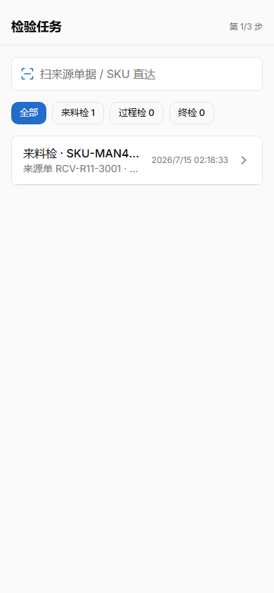
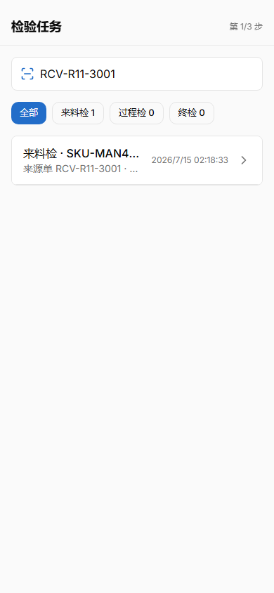
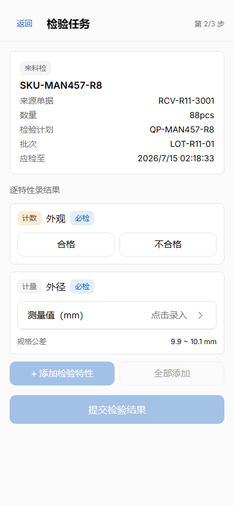
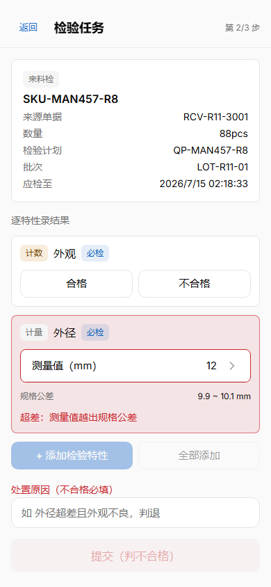
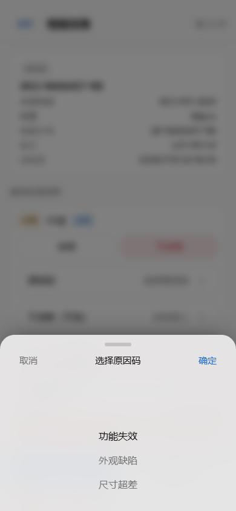
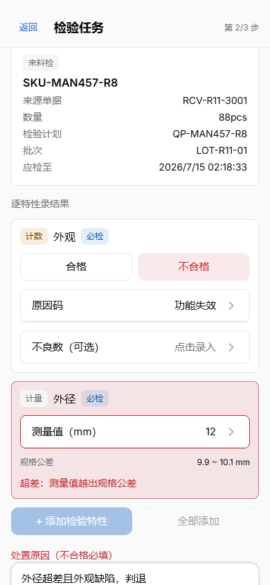
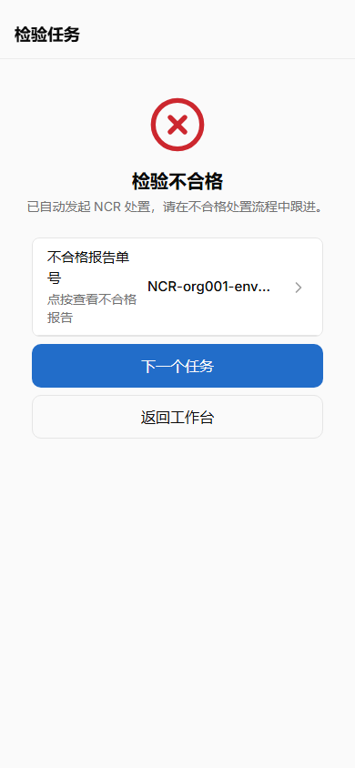
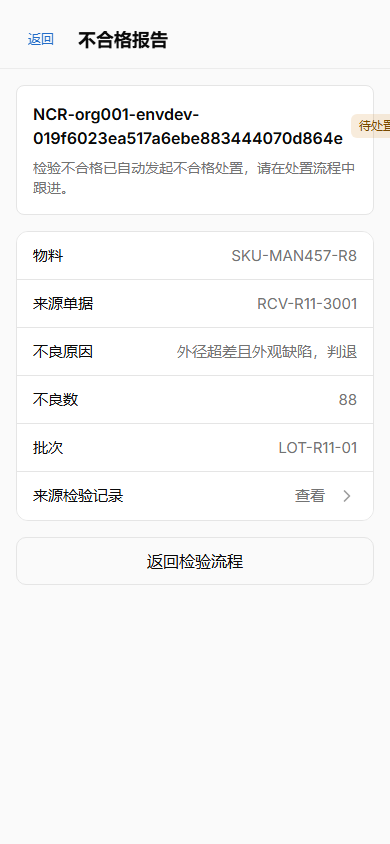
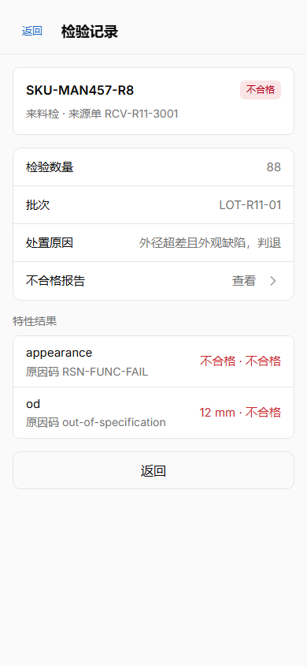

# MAN-457 #811 扫码 → 执行 → NCR 互链 浏览器端 e2e 走查记录

> 证据口径声明：本走查按 `docs/architecture/mobile-pda-testing-and-smoke.md` 的分层口径，属
> **浏览器端 e2e**（Playwright `input.fill()+Enter` 为键盘楔入**近似**）。该文档明确：硬件扫码枪
> 键盘楔入的真实时序 / 焦点常驻 / 失焦回抢 **不在 e2e 覆盖范围内**，属「真机手动冒烟清单」
> 第 2 条，须**发版前在目标 PDA（APK）+ 实体扫码枪上人工勾验**。本记录不替代该冒烟项。

## 环境

| 项          | 值                                                                                                     |
| ----------- | ------------------------------------------------------------------------------------------------------ |
| 日期        | 2026-07-14（16:00–18:20 +08:00）                                                                       |
| 分支 / head | `man-457-pda-inspection-task-execution` @ `de20265`（分支后端叠加至 main `21911d0` 主仓栈运行）        |
| 后端栈      | Aspire 全栈（IAM 5100 / Quality 5110 / BusinessGateway 5119 / Postgres 容器），`nerv.ps1 dev`          |
| 前端        | worktree PDA vite `127.0.0.1:5126` → 网关 5119                                                         |
| 浏览器      | Playwright Chromium，viewport 390×844（移动仿真），admin 真实登录（IAM 真实 token）                    |
| 数据        | 计划 `QP-MAN457-R8`（active，外径 9.9~10.1mm 计量 + 外观计数，均必检）；任务 `RCV-R11-3001`（pending） |

## 连续操作步骤与截图（同一浏览器会话，顺序执行）

| #   | 操作                                                    | 断言（脚本输出）                                | 截图                                                                 |
| --- | ------------------------------------------------------- | ----------------------------------------------- | -------------------------------------------------------------------- |
| 1   | 打开 `/quality/tasks` 待检列表                          | 列表含 RCV-R11-3001                             |      |
| 2   | ScanBar 键入 `RCV-R11-3001`（键盘楔入近似）             | 输入框回显 + chips 来料检 1                     |        |
| 3   | Enter → 精确命中自动直达执行页                          | `scan→直达执行页: true`                         |         |
| 4   | 外径数字键盘录 12 → 超差即时红显                        | `超差红显: true`（红框 + 公差 9.9~10.1 + 红字） |  |
| 5   | 外观判不合格 → 原因码 Picker（QualitySeedService 目录） | Picker 弹出含 seed 原因码                       |  |
| 6   | 处置原因填写完成（提交解禁）                            | —                                               |           |
| 7   | 提交 → 结果页                                           | `检验不合格+NCR入口: true`                      |   |
| 8   | 点 NCR 入口 → `/quality/ncr/019f6023-ea55-…`            | 真实路由 + 待处置 + 元数据                      |            |
| 9   | 点「来源检验记录」→ `/quality/record/019f6023-ea0f-…`   | 服务端权威回链（非 query）                      |         |
| 10  | 记录页点「不合格报告」→ 回 NCR                          | `closed loop back at NCR: true`                 |         |

## 已覆盖 / 未覆盖

- **已覆盖（e2e 层）**：扫码输入路径（键盘楔入近似）→ 精确命中直达 → 计划驱动必检 → 超差即时红显 →
  原因码目录（seed）→ 提交（后端权威判定 + 自动 NCR）→ NCR ↔ 检验记录双向真实路由互链闭环。
- **未覆盖（留待目标 PDA 冒烟，发版前人工勾验）**：实体扫码枪时序 / 焦点常驻 / 失焦回抢；
  真机 `env(safe-area-inset-*)`；Capacitor APK 内 WebView 行为（冒烟前提：按
  `mobile-pda-deployment.md` 构建能连网关的 APK）。
