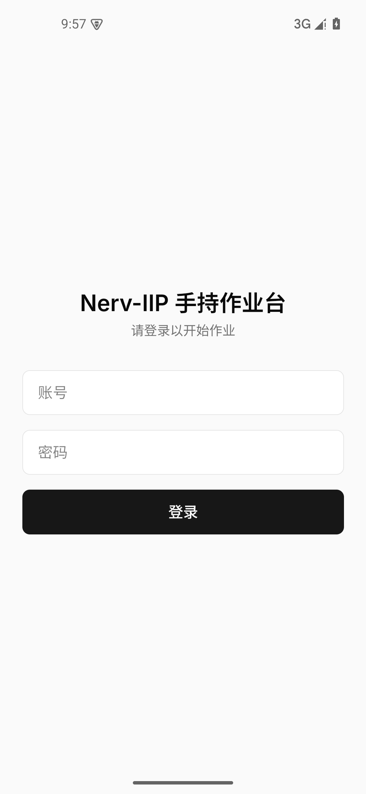
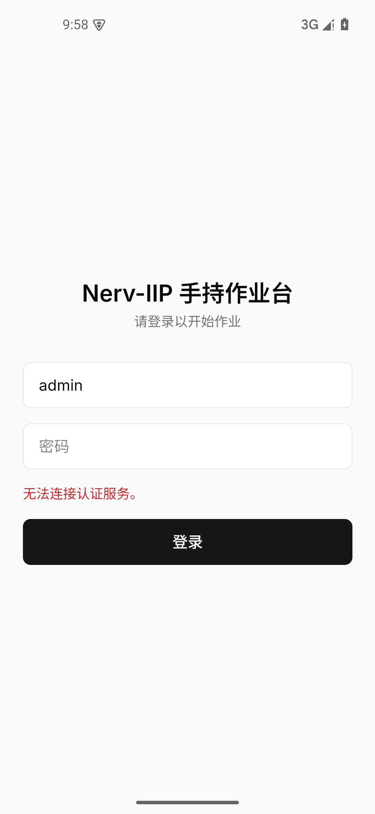
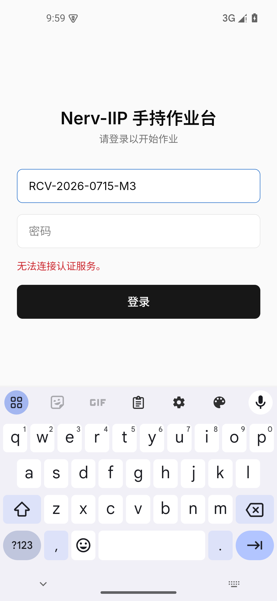

# PDA M3 首次 AVD + debug APK 冒烟走查记录

> 证据口径声明：本走查属方案（`2026-07-15-pda-device-sim-detection-plan.md` §5）的 **L3 层
> （Android 模拟器 + APK）**首跑——真实 WebView / Capacitor Android 宿主装载 + 网络管道 /
> Android 输入栈（业务代码尚无消费 `isNativePlatform` 的分支，本走查不声称「原生路径已验证」），
> 仍非实体 PDA + 实体扫码枪（L4 口径不变）。本次**无后端栈**（Docker 内无 Nerv 栈），
> 覆盖到「APK → 统一入口网络管道」为止；联栈业务链路（登录成功 → 扫码作业）留待
> 栈可用时按 `pda-live-walkthrough.ps1` + L3 清单补跑。

## 环境

| 项         | 值                                                                                                                                          |
| ---------- | ------------------------------------------------------------------------------------------------------------------------------------------- |
| 日期       | 2026-07-15（17:5x +08:00）                                                                                                                  |
| 分支       | `pda-sim-m3-avd-apk` @ `048ab87`（main 含 M1+M2）                                                                                           |
| 工作树状态 | 首跑基于 `048ab87` + 当时未提交的 M3 变更（内容即后来提交的 `3270dad` tree）                                                                |
| APK        | `app-debug.apk` 4,564,206 B，SHA256 `E7334B87…F80B41`（双次构建一致；首跑值，修复后重跑见下），基址 `http://10.0.2.2:5126`，profile=dev-apk |
| AVD        | `nerv-pda`（pixel_5 / system-images;android-35;google_apis;x86_64），WHPX 加速，headless，boot 60s                                          |
| WebView    | 124.0.6367.219（镜像内置，随镜像固定）                                                                                                      |
| 统一入口   | 宿主 vite dev `127.0.0.1:5126`（双代理 `/api/console`→5100、`/api/business-console`→5119）                                                  |
| 后端栈     | **未运行**（本走查的有意边界）                                                                                                              |

**复审修复后重跑（证据绑定干净 commit）**：在复审修复 commit `42632c2`（工作树 clean）上重跑
`pda-apk-build.ps1`——SHA256 **仍为 `E7334B87…F80B41`**（与首跑逐字节一致，脚本改动不影响
bundle 输入，可复现性三次成立）；新增的 aapt2 fail-closed 校验真实执行通过
（`manifest usesCleartextTraffic=true / androidScheme=http / cleartext=true` 与 dev profile 一致，
三项写入 build-fingerprint.txt，`commit=42632c2…`）；重装该 APK 至 `nerv-pda` 并启动，
登录页正常渲染（见截图 4）。

## 步骤与证据

| #   | 操作                                                                  | 断言（真实输出）                                                                                                                                                                                                                                   | 截图                                                             |
| --- | --------------------------------------------------------------------- | -------------------------------------------------------------------------------------------------------------------------------------------------------------------------------------------------------------------------------------------------- | ---------------------------------------------------------------- |
| 1   | `pda-avd.ps1 -Action start -Headless` → `adb install -r` → `am start` | boot_completed=1；install Success；应用启动渲染登录页（中文字体/布局/手势条区域正常）                                                                                                                                                              |       |
| 2   | adb 填 admin → 点「登录」                                             | 应用透出类型化错误「无法连接认证服务。」（非白屏非裸堆栈）；**宿主 vite 日志同刻记录** `http proxy error: /api/console/v1/auth/login → ECONNREFUSED 127.0.0.1:5100`——请求真实穿过 APK WebView → 10.0.2.2 → 宿主统一入口 → 代理，仅因网关未起而失败 |    |
| 3   | `pda-adb-scan.ps1 -Code 'RCV-2026-0715-M3'`（焦点在账号输入框）       | 码值完整进入 WebView 真实 input（Android 输入栈注入经 IME/焦点系统生效）                                                                                                                                                                           |  |
| 4   | 复审修复 commit `42632c2` 重建（SHA 同）→ 重装 → 重启动               | install Success；登录页正常渲染（重跑冒烟，证据绑定干净 commit）                                                                                                                                                                                   |   |

## 已覆盖 / 未覆盖

- **已覆盖（L3 首跑）**：可复现 debug APK 构建（SHA 一致）；Capacitor Android 宿主装载 +
  真实 WebView 渲染 + 网络管道（业务代码尚无消费 `isNativePlatform` 的分支，不据此声称
  原生分支已验证）；cleartext/scheme/基址/统一入口整条网络管道
  （vite 代理日志为证）；OS 级 adb 注码进真实 input；`pda-avd.ps1`/`pda-adb-scan.ps1`/
  `pda-apk-build.ps1` 三脚本全部真跑验证。
- **未覆盖（如实声明）**：联栈登录成功后的业务链路（扫码直达/执行/提交）——需 `nerv.ps1 dev`
  完整栈；真实 `env(safe-area-inset-*)` 非零断言（本 AVD 无挖孔，冒烟仅记录 WebView 版本，
  按 L3 口径报「环境不具备该能力」）；ScanBar 的 `inputmode="none"` 在 APK 内不弹系统键盘的
  行为（登录页普通 input 弹键盘属预期，见截图 3）；实体扫码枪/厂商 ROM（L4）。
