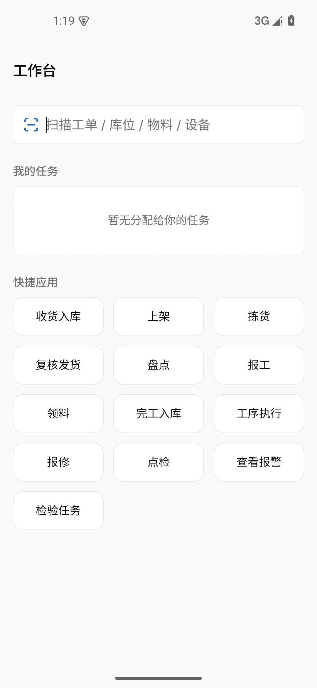
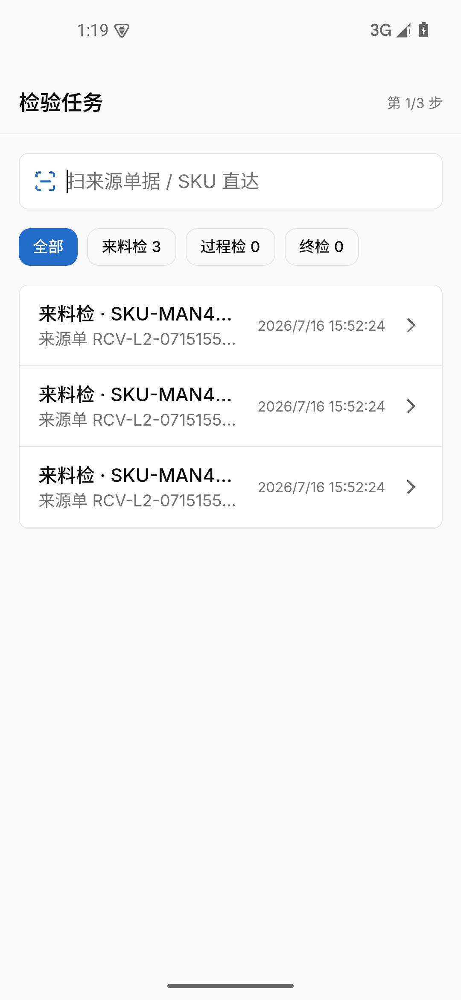
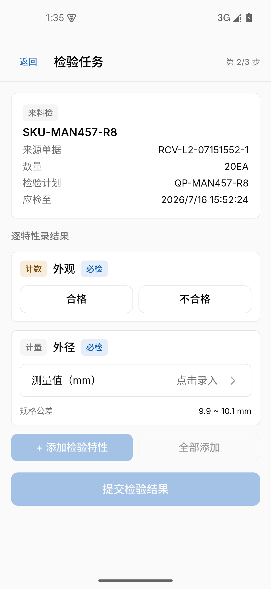

# PDA 真机模拟检测 L2+L3 联栈收官走查记录

> 定位：方案（`2026-07-15-pda-device-sim-detection-plan.md`）落地后（#930/#936/#937/#938/#939
> 全部合入 main）的首次**完整联栈**走查——补上此前各 PR 如实声明的「联栈业务链路未跑」缺口。
> L2 = 真实栈仿真走查（桌面 Chromium）；L3 = Android 模拟器 + debug APK。均非实体硬件，
> L4 口径不变。

## 环境

| 项      | 值                                                                                                                                                |
| ------- | ------------------------------------------------------------------------------------------------------------------------------------------------- |
| 日期    | 2026-07-15 深夜 – 07-16（跨机器重启，数据经 Postgres 卷持久化存活）                                                                               |
| 代码    | L2 @ `beb353a`（pda-sim-m3-avd-apk，后全部合入 main `dfc7df6d`）                                                                                  |
| 后端栈  | 主仓 `nerv.ps1 dev` + **`Messaging__Provider=Redis`**（见下方关键环境结论）                                                                       |
| 造数    | 全真实业务链：BusinessGateway 创建并完成 WMS 入库单 → CAP 集成事件（Redis）→ Quality 消费者自动开检验任务（匹配既有 active 计划 QP-MAN457-R8/R2） |
| L3 设备 | AVD `nerv-pda`（Android 15 / WebView 124），debug APK SHA `E7334B87…F80B41`，统一入口 `10.0.2.2:5126`                                             |

## 关键环境结论（务必记录）

**AppHost 默认 `Messaging:Provider=InMemory` 时，本地栈跨服务 CAP 事件完全不通**（InMemory
是进程内队列，WMS→Quality 的检验任务派生、采购收货入库等所有跨服务链路都物理不可达；
WMS 侧表现为 `PublisherSentFailedException: Cannot find the corresponding group`）。联栈走查
必须以 `Messaging__Provider=Redis`（Redis 容器本就在栈内）启动：
`$env:Messaging__Provider='Redis'; .\nerv.ps1 dev`。本次实测 Redis 传输下事件 ~3 秒送达。

## L2 真实栈仿真走查（5/5 全绿，run 20260715-235248）

标准入口 `pda-live-walkthrough.ps1`（worktree 归属检查 → 端口守卫 → 短超时默认注入 2000ms →
e2e:live → 证据归集）。指纹见 [l2-run-fingerprint](./assets/2026-07-16-pda-full-stack-walkthrough/l2-run-fingerprint.txt)。

| spec                              | 结果     | 要点                                                                                                               |
| --------------------------------- | -------- | ------------------------------------------------------------------------------------------------------------------ |
| 只读链路（真实登录→列表→S1 直扫） | ok 5.4s  | 真实 IAM 登录；扫 `RCV-L2-07151543-*` 直达/筛选                                                                    |
| 写路径（提交→幂等→回读）          | ok 6.7s  | 提交 200 passed 无 NCR；**同请求重放返回同一 `inspectionRecordId=019f667b-a569-…`**；网关侧独立回读 completed 一致 |
| 离线预检                          | ok 14.9s | 类型化离线文案透出 + 恢复重载                                                                                      |
| 挂起 + 短超时 2000ms              | ok 6.6s  | 超时文案数秒透出，不真等 30s                                                                                       |
| 慢网 CDP 节流                     | ok 5.2s  | loading 不闪断、同 URL 恰一次                                                                                      |

- 前两轮失败均非产品 bug：①恢复辅助的容错点击无超时在 `refetchOnReconnect` 自愈后悬挂——
  **spec bug，最小修复随本 PR**（`network-resilience.spec.ts` 容错点击加 `{ timeout: 2_000 }`）；
  ②宿主网络接口瞬态 `ERR_NETWORK_CHANGED`，重跑即绿。
- trace 证据包（5 条 trace.zip，~5MB，且含超长中文路径有 MAX_PATH 风险）**本地留存不入库**：
  `frontend/DESIGN/roadmaps/assets/2026-07-15-235248-889-beb353a-pda-live-5e2c/`（run-fingerprint
  副本已入库）。失败轮证据同目录前缀 `…-0cc3/…-5506/…-c73f` 本地留存。

## L3 模拟器业务链路（真 APK + 真后端）

| #   | 操作                                                                                | 断言                                                                                                                                          | 截图                                                                           |
| --- | ----------------------------------------------------------------------------------- | --------------------------------------------------------------------------------------------------------------------------------------------- | ------------------------------------------------------------------------------ |
| 1   | AVD 启动 → 装 APK → **真实 admin 登录**（经 CDP 填真实 DOM 表单，登录请求真实发出） | 登录成功 → 工作台渲染（我的任务/快捷应用墙全量入口）                                                                                          |  |
| 2   | 应用墙点「检验任务」                                                                | `/quality/tasks` 真实数据：来料检 3 条（`RCV-L2-07151552-*`，Redis 事件链自动派生）；ScanBar 焦点常驻                                         |        |
| 3   | `pda-adb-scan.ps1 -Code 'RCV-L2-07151552-1'`（OS 级注码）                           | **全局唯一命中直达执行步（第 2/3 步）**：任务卡（SKU/数量 20EA/计划 QP-MAN457-R8/应检至）+ 必检特性（计数外观 + 计量外径 9.9~10.1mm）完整渲染 |      |

- 附带实测结论：`adb shell input text` 对含特殊字符的密码不可靠（登录密码注入失败、服务端
  返回真实认证错误）——L3 登录改经 **WebView CDP**（debug APK 调试口）在真实 DOM 填表单，
  登录请求仍为真实网络请求；`pda-adb-scan.ps1` 的白名单码值注码不受影响（本次直达即为其实证）。
- 未覆盖（口径不变）：实体扫码枪/厂商 ROM（L4）；safe-area 非零（无挖孔镜像）；
  执行步提交在 L3 未重复做（L2 写路径已覆盖，L3 保留 2 条 pending 任务供后续走查复用）。

## 结论

方案落地后的分层设施**全链路实证可用**：L2 五 spec 全绿（含写路径幂等与后端回读），
L3 从 APK 启动到扫码直达执行步的完整业务路径在真实后端上走通。此前所有 PR 的
「联栈业务链路未跑」如实声明就此关闭。
