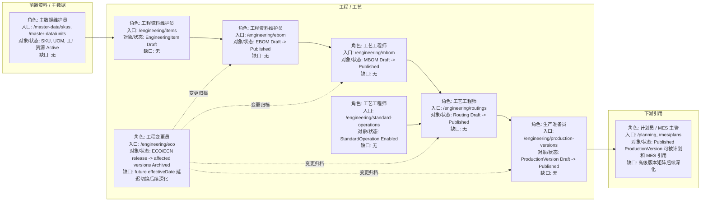
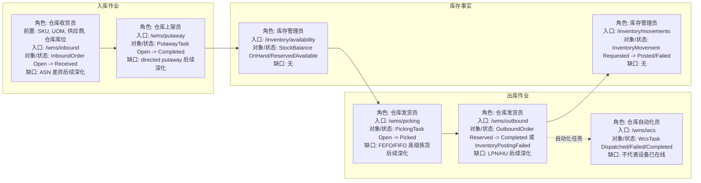
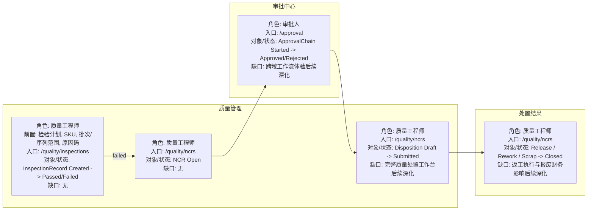
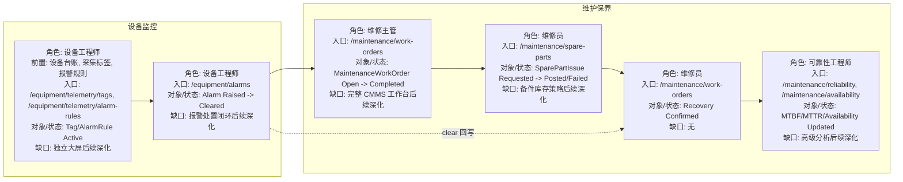
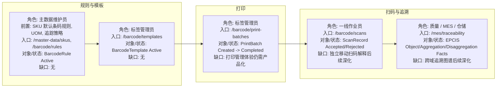

# 核心业务流程图

本页用六张 Mermaid 图概览当前产品主线。每个节点都把角色、前置资料、业务对象或状态、系统入口和当前缺口放在同一张图里；节点下方的映射表再列出对应 BusinessGateway facade。页面入口只表示当前有可访问或窄化工作台的业务表面，不代表每个高级子能力都已完整交付。

## 工程资料

工程资料：EBOM -> MBOM -> 工艺路线 -> 生产版本。

| 节点 | Business Console 页面 | BusinessGateway facade | 当前事实或缺口 |
| --- | --- | --- | --- |
| SKU / UOM / 工厂资源 | `/master-data/skus`, `/master-data/units`, `/master-data/facilities`, `/master-data/devices` | `/api/business-console/v1/master-data/**` | 作为 EBOM、MBOM、Routing 和 ProductionVersion 的前置资料。 |
| EngineeringItem | `/engineering/items` | `/api/business-console/v1/engineering/items` | 当前 ItemCode 语义冻结为 MasterData SKU code。 |
| EBOM | `/engineering/ebom` | `/api/business-console/v1/engineering/engineering-boms`, `/api/business-console/v1/engineering/engineering-boms/release` | 已有 list、explosion、where-used 和 release facade。 |
| MBOM | `/engineering/mbom` | `/api/business-console/v1/engineering/manufacturing-boms`, `/api/business-console/v1/engineering/manufacturing-boms/release` | 发布时校验 EBOM parent SKU 与 MBOM 产出 SKU 连续性。 |
| 标准工序 / 工艺路线 | `/engineering/standard-operations`, `/engineering/routings` | `/api/business-console/v1/engineering/standard-operations`, `/api/business-console/v1/engineering/routings/release` | Routing 发布保存标准工序快照。 |
| 生产版本 | `/engineering/production-versions` | `/api/business-console/v1/engineering/production-versions` | 绑定 SKU、MBOM、Routing 和有效期；同一 SKU active 有效窗不能重叠。 |
| ECO/ECN | `/engineering/eco` | `/api/business-console/v1/engineering/engineering-changes/**` | 当前 release 即时归档受影响版本；future effectiveDate 延迟切换仍是缺口。 |

## 计划生产

计划生产：需求 -> MRP -> APS -> 生产计划 -> 工单 -> 报工 -> 入库。

```mermaid
flowchart LR
  subgraph Plan["计划 / 排程"]
    P0["角色: 计划员<br/>前置: Published ProductionVersion, 可用物料范围<br/>入口: /planning<br/>对象/状态: Demand Active<br/>缺口: 无"]
    P1["角色: 计划员<br/>入口: /planning<br/>对象/状态: MRP Run Completed, Suggestion Pending<br/>缺口: 无"]
    P2["角色: 排程员<br/>入口: /scheduling<br/>对象/状态: SchedulePlan Draft -> Released<br/>缺口: 高级优化器和甘特后续深化"]
  end
  subgraph MES["制造执行"]
    M1["角色: 生产主管<br/>入口: /mes/plans<br/>对象/状态: ProductionPlan Ready -> Converted<br/>缺口: 无"]
    M2["角色: 生产主管<br/>入口: /mes/work-orders<br/>对象/状态: WorkOrder Created -> Released<br/>缺口: 无"]
    M3["角色: 班组长<br/>入口: /mes/dispatch<br/>对象/状态: Dispatch Pending -> Assigned<br/>缺口: 无"]
    M4["角色: 操作员<br/>入口: /mes/operation-tasks<br/>对象/状态: OperationTask Running -> Completed<br/>缺口: 无"]
    M5["角色: 操作员<br/>入口: /mes/production-reports<br/>对象/状态: ProductionReport Submitted<br/>缺口: 无"]
    M6["角色: 仓储员<br/>入口: /mes/receipts<br/>对象/状态: FinishedGoodsReceipt Requested -> Posted/Failed<br/>缺口: 失败诊断仍需更直达"]
  end
  subgraph Inventory["库存回写"]
    I1["角色: 库存管理员<br/>入口: /inventory/movements<br/>对象/状态: InventoryMovement Posted 或 Failed<br/>缺口: 无"]
  end

  P0 --> P1 --> P2 --> M1 --> M2 --> M3 --> M4 --> M5 --> M6 --> I1
```

| 节点 | Business Console 页面 | BusinessGateway facade | 当前事实或缺口 |
| --- | --- | --- | --- |
| 需求 / MRP / 建议 | `/planning` | `/api/business-console/v1/planning/demands`, `/api/business-console/v1/planning/mrp-runs`, `/api/business-console/v1/planning/suggestions` | 支持需求、MRP、pegging 和计划建议处理。 |
| APS lite / 排程 | `/scheduling` | `/api/business-console/v1/scheduling/**` | 当前是 deterministic finite-capacity heuristic；不包含全局优化器、仿真或自动重排。 |
| 生产计划 | `/mes/plans` | `/api/business-console/v1/mes/production-plans` | MES 可回显来源计划和转工单状态。 |
| 工单 / 工单详情 | `/mes/work-orders`, `/mes/work-orders/:workOrderId` | `/api/business-console/v1/mes/work-orders/**` | 工单详情页存在，但不是常驻菜单入口。 |
| 派工 / 工序执行 | `/mes/dispatch`, `/mes/operation-tasks` | `/api/business-console/v1/mes/dispatch/**`, `/api/business-console/v1/mes/operation-tasks/**` | 支撑派工、开工、暂停、恢复和完工的执行视图。 |
| 报工 / 完工入库 | `/mes/production-reports`, `/mes/receipts` | `/api/business-console/v1/mes/production-reports`, `/api/business-console/v1/mes/finished-goods-receipts` | 完工入库等待 Inventory/WMS 过账事实回写。 |
| 库存移动 | `/inventory/movements` | `/api/business-console/v1/inventory/movements` | 可解释 posted 或 failed 的库存过账结果。 |

## 仓储库存

仓储库存：收货 -> 上架 -> 库存 -> 拣货 -> 出库。

| 节点 | Business Console 页面 | BusinessGateway facade | 当前事实或缺口 |
| --- | --- | --- | --- |
| 收货 | `/wms/inbound` | `/api/business-console/v1/wms/inbound-orders` | 收货列表可融合 Inventory availability context/sourceStatus。 |
| 上架 | `/wms/putaway` | `/api/business-console/v1/wms/putaway-tasks` | 已有分页、状态和库位过滤；directed putaway 仍未完整交付。 |
| 库存可用量 | `/inventory/availability` | `/api/business-console/v1/inventory/availability` | 可解释现有量、预留量和可用量。 |
| 拣货 | `/wms/picking` | `/api/business-console/v1/wms/picking-tasks` | 出库拣货通过 Inventory 预留库存；FEFO/FIFO 高级拣货仍是缺口。 |
| 出库 | `/wms/outbound` | `/api/business-console/v1/wms/outbound-orders` | 出库完成后 Inventory 按 reservation id 分配预留并过账。 |
| WCS 任务 | `/wms/wcs` | `/api/business-console/v1/wms/wcs-tasks` | 当前是任务状态和 dispatch/fail/complete 事实，不表示真实设备在线。 |

## 质量审批

质量审批：检验 -> NCR -> 审批 -> 处置 -> 放行/返工/报废。

| 节点 | Business Console 页面 | BusinessGateway facade | 当前事实或缺口 |
| --- | --- | --- | --- |
| 检验记录 | `/quality/inspections` | `/api/business-console/v1/quality/inspection-records` | 检验失败可打开 NCR。 |
| NCR | `/quality/ncrs` | `/api/business-console/v1/quality/ncrs` | 支持 NCR 列表、处置提交和关闭 facade。 |
| 原因码 | `/quality/reason-codes` | `/api/business-console/v1/quality/reason-codes` | 已有独立原因码目录页面和 facade。 |
| 审批 | `/approval` | `/api/business-console/v1/approval/**` | 审批中心已有模板、流程实例、待办、决策记录和委托 facade。 |
| 放行 / 返工 / 报废 | `/quality/ncrs` | `/api/business-console/v1/quality/ncrs/{ncrId}/disposition`, `/api/business-console/v1/quality/ncrs/{ncrId}/close` | 处置结果可提交并关闭；完整质量处置工作台仍需后续产品化。 |

## 设备维护

设备维护：报警 -> 维修工单 -> 备件出库 -> 恢复 -> 可靠性指标。

| 节点 | Business Console 页面 | BusinessGateway facade | 当前事实或缺口 |
| --- | --- | --- | --- |
| 设备台账 / 标签 / 报警规则 | `/master-data/devices`, `/equipment/telemetry/tags`, `/equipment/telemetry/alarm-rules` | `/api/business-console/v1/master-data/device-assets`, `/api/business-console/v1/equipment/telemetry/**` | 已有设备资产、采集标签和报警规则入口。 |
| 设备报警 | `/equipment/alarms` | `/api/business-console/v1/equipment/alarms` | IndustrialTelemetry alarm 事实已暴露；报警处置闭环仍后续深化。 |
| 维修工单 | `/maintenance/work-orders` | `/api/business-console/v1/maintenance/work-orders` | Maintenance 可消费报警 raised/cleared 并形成工单上下文。 |
| 备件需求 | `/maintenance/spare-parts` | `/api/business-console/v1/maintenance/spare-parts` | 完工备件出库请求事件已存在；备件库存策略体验仍需深化。 |
| 恢复与可靠性 | `/maintenance/reliability`, `/maintenance/availability` | `/api/business-console/v1/maintenance/reliability`, `/api/business-console/v1/maintenance/availability-windows` | MTBF/MTTR 无样本返回空值，不伪造指标。 |

## 条码追溯

条码追溯：条码规则 -> 标签打印 -> 扫码 -> 追溯。

| 节点 | Business Console 页面 | BusinessGateway facade | 当前事实或缺口 |
| --- | --- | --- | --- |
| SKU 默认条码规则 | `/master-data/skus`, `/barcode/rules` | `/api/business-console/v1/master-data/skus`, `/api/business-console/v1/barcode/rules` | SKU 页面可维护 defaultBarcodeRuleCode；BarcodeLabel 提供规则分页 facade。 |
| 标签模板 | `/barcode/templates` | `/api/business-console/v1/barcode/templates` | 已有标签模板页面和 facade。 |
| 打印批次 | `/barcode/print-batches` | `/api/business-console/v1/barcode/print-batches` | 已有打印批次分页和详情 facade；完整打印管理体验仍需产品化。 |
| 扫码记录 | `/barcode/scans` | `/api/business-console/v1/barcode/scans` | 已有扫码记录分页和 record facade。 |
| 追溯 | `/mes/traceability` | `/api/business-console/v1/mes/traceability` | BarcodeLabel 已记录 GS1/EPCIS 追溯事实；跨域可视化追溯图谱仍是缺口。 |

## 当前限制

- APS lite 与 MES 规则排程已经可解释计划到执行的基础链路；高级优化器、仿真、自动重排和甘特展示仍后置。
- 质量审批图表达当前 Quality NCR 与 BusinessApproval 的已暴露业务链路；完整质量处置工作台和跨域工作流体验仍需继续产品化。
- 设备维护图覆盖报警、维修工单、备件请求和可靠性指标；报警处置闭环、独立大屏和完整 CMMS 工作台仍需深化。
- 条码追溯图覆盖规则、模板、打印批次、扫码记录和 MES 追溯入口；独立移动扫码解释、离线同步和跨域追溯图谱仍后置。

[内部缺口记录](/internal/gaps/core-processes)
