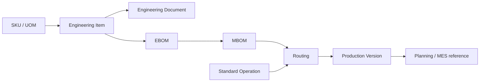
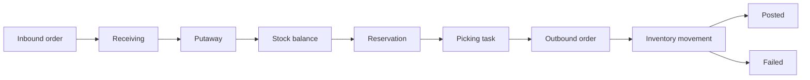
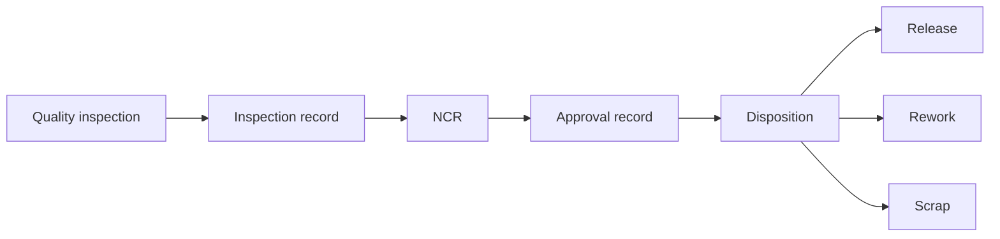
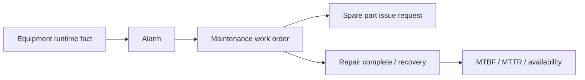

# 核心业务流程图

本页用五张流程图概览当前产品主线。图中的页面入口只表示当前有可访问或窄化工作台的业务表面，不代表每个高级子能力都已完整交付。

## 工程资料

工程资料：EBOM -> MBOM -> 工艺路线 -> 生产版本。

## 计划生产

计划生产：需求 -> MRP -> APS -> 生产计划 -> 工单 -> 报工 -> 入库。

## 仓储库存

仓储库存：收货 -> 上架 -> 库存 -> 拣货 -> 出库。

## 质量审批

质量审批：检验 -> NCR -> 审批 -> 处置 -> 放行/返工/报废。

## 设备维护

设备维护：报警 -> 维修工单 -> 备件 -> 恢复 -> 可靠性指标。

## 当前限制

- APS lite 与 MES 规则排程已经可解释计划到执行的基础链路；高级 APS 优化器和正式甘特展示仍后置。
- 质量审批图表达当前 Quality NCR 与 BusinessApproval 的目标业务链路；具体页面仍以 `/quality/inspections`、`/quality/ncrs` 和审批中心已暴露能力为准。
- 设备维护图覆盖报警、维修工单、备件请求和可靠性指标；完整 CMMS 工作台和高级点检/保养计划体验仍需继续深化。

[内部缺口记录](/internal/gaps/core-processes)
